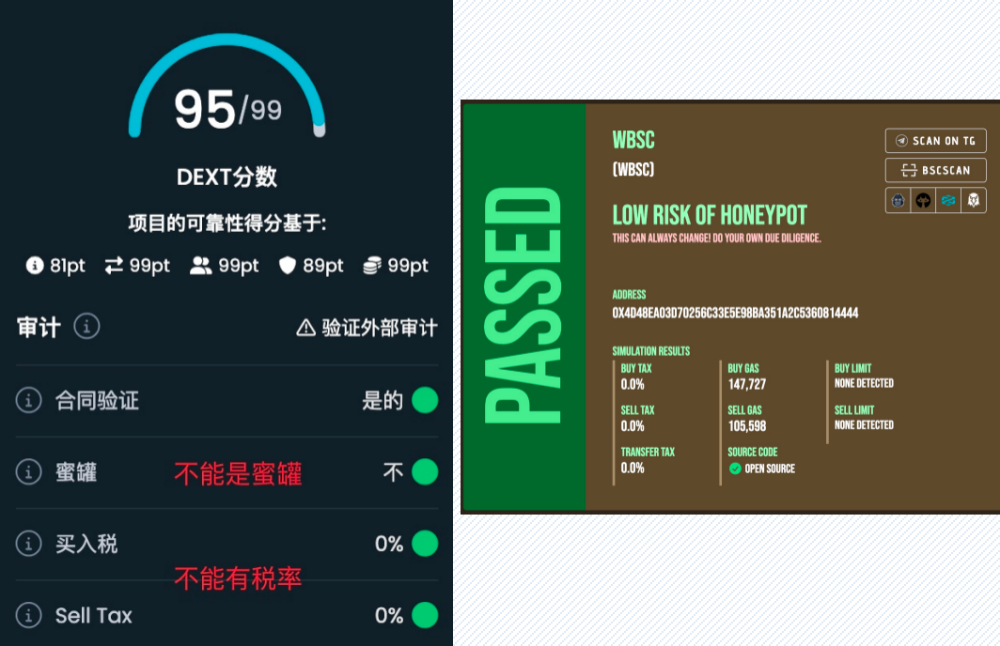

# Best（抢跑）

运营工作内容

* 活跃交易对推送及确认
* 竞争者新开token观察
* bsc活跃token观察
* meme活跃token查看、安全性检查

安全性判断：

- https://honeypot.is/
  
- 链上确认是否刷量或过多隐私订单
  **刷量**主要特征：交易笔数多但地址数少；流动性池子浅（TVL只有几万或几十万$）或已被锁定
  隐私订单：又称不现实订单，在交易所中不向公众显示其价格和数量，可以让大额交易者在不暴露交易意图和市场影响力的情况下交易，主要服务于大型机构投资者或“鲸鱼”

