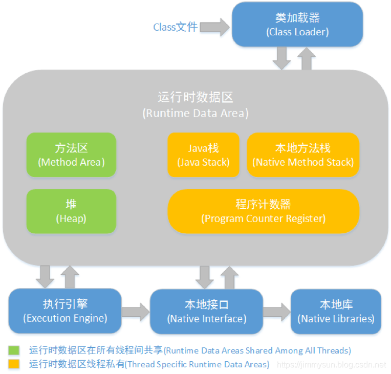
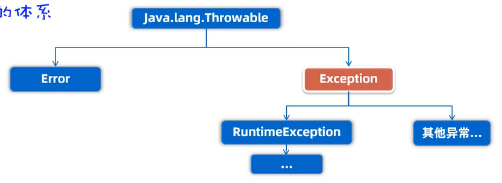
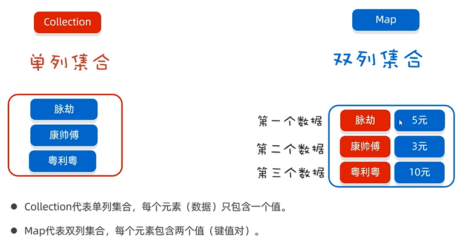
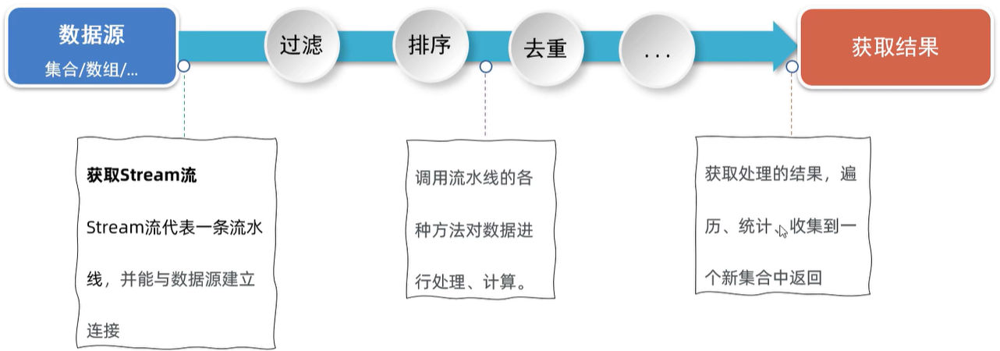

# Java内存分配

JVM时java所有方法、类的上层

- 方法区
  **所有线程共享**，存储已被虚拟机加载的**类信息**、**常量**、**静态变量**和**即时编译器编译后的代码**等数据。
- 堆
  被**所有线程共享**，虚拟机启动时创建，**存放对象实例**，
- 栈
  java虚拟机栈是**线程私有**的，它的生命周期与线程相同。描述的是Java方法执行的内存模型：每个方法在执行的时候都会同时创建一个栈帧用于存储**局部变量表**、**操作栈**、**动态链接**、**方法返回地址**等信息。每一个方法从被调用直至执行完成的过程，就对应着一个栈帧在虚拟机栈中从入栈到出栈的过程。
- 本地方法栈
  虚拟机栈为虚拟机执行Java方法（也就是字节码）服务，而本地方法栈则**为虚拟机使用到的Native方法服务**。
- 程序计数器
  可以看作是当前线程所执行的字节码的**行号指示器**。字节码解释器工作时就是通过改变这个计数器的值来选取下一条需要执行的字节码指令，分支、循环、跳转、异常处理和线程恢复等基础功能都需要依赖这个计数器来完成。



# Java变量

## 变量的有效范围

**成员变量**：在类体中定义的变量，分为静态变量和实例变量

- 静态变量：
  java的静态变量与C++中类中定义的静态变量定义和功能相似（java是纯面向对象语言，所以不存在C++中所说的全局变量），静态变量只属于类不属于类的实例。会在程序运行期间一直有效
- 实例变量
  属于对象的变量，这个变量在类中、方法外定义。每个对象都有自己的实例变量（这个该类中有定义的话），在对象存在期间有效

**局部变量**：在类的方法体中定义的变量，只在这个方法内部大括号之间的代码块中有效。

## Final关键字

可以修饰类、方法、变量

- final类：最终类，不能被**继承**
- final方法：不能被**重写**
- final变量：只能在定义时**赋值**
  final基本类型变量：存储的**数据**不能被改变
  final引用类型变量：存储的**地址**不能被改变，但是地址所指向的对象的内容是可以被改变的

# Java字符串

String(char a[])  ->  用一个字符数组a创建String对象

String(char a[], int offset, int length)  ->  对字符数组a从第offset个字符开始截取length个字符

String(char[] value)  ->  分配一个新的String对象，表示字符数组中所有元素连接的结果

## 字符串连接

运算符'+'

连接其他数据类型时会将这些数据直接转换为字符串。

## 字符串信息

### 字符串长度

String str = "hello"

str.length()


# Java面向对象

其实这么说不太准确，因为Java本身就是纯面向对象的

| 修饰符    | 本类中 | 同包其他类 | 任意包子类 | 任意包任意类 |
| --------- | ------ | ---------- | ---------- | ------------ |
| private   | √      |            |            |              |
| 缺失      | √      | √          |            |              |
| protected | √      | √          | √          |              |
| public    | √      | √          | √          | √            |

**this**引用对象本身

##  类的五大成分

成员变量、方法、构造器、代码块（初始化块）、内部类

**权限修饰**

| 修饰符    | 本类中 | 同包其他类 | 任意包子类 | 任意包任意类 |
| --------- | ------ | ---------- | ---------- | ------------ |
| private   | √      |            |            |              |
| 缺失      | √      | √          |            |              |
| protected | √      | √          | √          |              |
| public    | √      | √          | √          | √            |

**是否静态**

静态方法只能引用静态变量和静态方法。非静态方法能够引用静态变量和静态方法。
静态的方法和变量属于类，非静态的变量和方法属于类的实例——对象

### 成员变量

定义在类中、方法外

```java
public class Book {
    private String name;
    
    public String getName() {
        int id = 0;
        setNmae("Java");
        return id + this.name;
    }
    
    public void setName(String name) {
        this.name = name;
    }
    
    public Book getBook() {
        return this;  // 返回Book对象的引用
    }
}
```

### 内部类

一般内部类之间相互独立，内部类即打破了这种独立。

#### **非静态内部类**

- 成员内部类是外部类的一个成员，它可以声明为public、protected、private或默认访问级别。
- 在一个类中使用内部类，可以在内部类中直接存取其所在类的私有成员变量、方法。

```java
public class OuterClass {
    private int outerField = 10;

    public class MemberInnerClass {
        public void display() {
            System.out.println("Outer field: " + outerField);
        }
    }
}

public class Runner {
    public static void main() {
        OuterClass outer = new OuterClass();
        OuterClass.MemberInnerClass inner = outer.new InnerClass();  // 非静态内部类依赖于外部类的实例对象
    }
}
```

- 使用内部类可以隐藏细节和内部结构，封装性更好，让程序更合理

#### **静态内部类**

- 静态内部类是外部类的静态成员，它可以声明为public或private。
- 它可以包含静态和非静态成员，并且不需要外部类的实例就可以创建。
- 静态内部类不能直接访问外部类的非静态成员。

```java
public class OuterClass {
    public static class StaticInnerClass {
        public void display() {
            System.out.println("Outer class is accessed using OuterClass.class");
        }
    }
}

public class Runner {
    public static void main() {
        OuterClass outer = new OuterClass();
        OuterClass.StaticInnerClass inner = new StaticInnerClass;  // 静态内部类依赖于外部类,不依赖于其对象实例
    }
}
```

#### **局部内部类**

- 局部内部类是定义在方法或作用域内的类。
- 它只能在定义它的区域内被访问和使用。
- 可以访问其外部方法中声明为final或effectively final的局部变量。

```java
public class OuterClass {
    public void outerMethod() {
        final int localVariable = 5;
        class LocalInnerClass {
            public void display() {
                System.out.println("Local variable: " + localVariable);
            }
        }
        LocalInnerClass lic = new LocalInnerClass();
        lic.display();
    }
}
```

#### **匿名内部类**

- 匿名内部类是没有名称的局部内部类。
- 在功能中使用一个类或接口的子类、实现时使用的次数较少所以不必要为这个功能专门写一个类，这种情况下可以使用匿名内部类。
- 匿名内部类必须是子类或接口的实现，因为匿名内部类没有名字，不能直接创建这种类型的引用，所以用其父类或接口的名字来创建引用。
- 它可以访问其外部方法中声明为final或effectively final的局部变量。

```java
public class OuterClass {
    public void outerMethod() {
        Runnable r = new Runnable() {  // Runnable是一个java接口，用于创建一个线程
            @Override
            public void run() {
                System.out.println("Anonymous Inner Class");
            }
        };
        new Thread(r).start();
    }
}
```

**案例**

- 在主方法中创建匿名类对象来实现相关功能：

  ```java
  public class RunCode {
      public static void main(String[] args) {
          Animal a = new Animal() {
              @Override
              public void cry() {
                  System.out.println("猫：喵");
              }
          };
          a.cry();
      }
  }
  
  abstract class Animal {
      public abstract void cry();
  }
  ```

- 在传参时传入匿名类对象来实现相关功能：

  ```java
  public class RunCode {
      public static void main(String[] args) {
          go(new Swimming() {
              @Override
              public void swim() {
                  System.out.println("dog swiming------");
              }
          });
      }
      
      public static void go(Swimming s) {
          System.out.println("start-----");
          s.swim();
      }
  }
  
  interface Swimming {
      void swim();
  }
  ```


**使用内部类实现接口**
```java
public class Test {
    public class Inner implements MyInterface {
        // ……
    }
}
```

### 方法

- **静态方法**：属于类，不需要实例即可调用，只能调用静态方法，引用静态变量
  **工具类**不需要实例对象，只需要通过类名的引用即可调用类中的方法、变量来实现相应的功能，这样的类中的变量、方法都用static修饰（属于类并不是属于对象）

- **非静态方法**：属于对象，需要实例才能调用

- **不定长参数方法**：可以接受任意数量的参数，语法：在参数类型后面加上省略号（`...`）

  ```java
  public class VarargsExample {
      // 定义一个接受不定长参数的方法
      public static void printNumbers(int... numbers) {
          for (int number : numbers) {
              System.out.println(number);
          }
      }
  
      public static void main(String[] args) {
          // 调用方法，传递不定数量的参数
          printNumbers(1, 2, 3, 4, 5);
          printNumbers(10, 20, 30);
          printNumbers(); // 传递零个参数
      }
  }
  ```

- **局部变量**：定义在方法内、代码块内的变量

### 代码块

**静态初始化块**

- 静态初始化块在类加载时执行，且只执行一次。
- 它通常用于初始化静态成员变量或执行只需进行一次的静态代码。
- 静态初始化块在类的所有实例创建之前执行。

```java
public class ClassA {
	static {
		// 这里的代码在类加载时执行一次
	}
}
```

**实例初始化块**

- 实例初始化块在每次创建类的实例时执行。
- 它用于初始化实例成员变量或执行其他实例级别的初始化操作。
- 实例初始化块在构造函数执行之前执行。

```java
public class ClassA {
	{
		// 这里的代码在每次创建实例时执行
	}
}
```

### 构造器

C++中的构造函数，最好写上一个无参的构造器（因为不会像C++那样自动生成）

## 单例设计模式

确保类只有一个对象

- 把类的静态构造器写好
- 定义一个静态类变量用来引用类的一个对象
- 定义一个静态类方法返回这个对象的引用

```java
public class Temp {
    private static Temp a = new Temp();  // 这里已经实例化了

    private Temp() {}

    public static Temp getTemp() {
        return a;
    }
}
```

类的构造器私有之后就只能生成一个对象。

**饿汉式单例**：取对象时对象早已经创建好了（代码示例如上）

**懒汉式单例**：取对象时对象才开始创建

```java
public class Temp {
    private static Temp a;
    private Temp () {}
    private static getTemp() {
        if (Temp == null) {
            a = new Temp();
        }
        return a;
    }
}
```

## 继承

关键字为**extends**，子类可以继承父类的非私有成员

| 修饰符    | 本类中 | 同包其他类 | 任意包子类 | 任意包任意类 |
| --------- | ------ | ---------- | ---------- | ------------ |
| private   | √      |            |            |              |
| 缺失      | √      | √          |            |              |
| protected | √      | √          | √          |              |
| public    | √      | √          | √          | √            |

```java
public class A {
	public int i;
	public A() {
		this.i = 10;
	}
	public void print1() {
		System.out.println(this.i);
	}
}

public class B extends A {
    public void print1() {
        System.out.println("B::" + i);
    }
}
```

带有继承关系的类对象的创建方式：**extends**

```java
public class ClassA {
    public ClassA() {
        System.out.println("ClassA(): GO");
    }

    public void f() {
        System.out.println("ClassA.f(): GO");
    }
}

public class ClassB extends ClassA {
    public ClassB() {
        System.out.println("ClassB(): GO");
    }

    @Override
    public void f() {
        System.out.println("ClassB.f(): GO");
    }

    public void myF() {
        System.out.println("ClassB.myF(): GO");
    }
}

public class RunCode {
    public static void main(String[] args) {
        System.out.println("hello");
        ClassA b = new ClassB();
        b.f();
    }
}
```

输出结果为：
hello
ClassA(): GO
ClassB(): GO
ClassB.f(): GO

也就是说：
	创建子类对象时会先调用父类的构造器，再调用自己的构造器（或者说子类的构造器中最上方调用了父类的构造器）。如果重写了方法即使是使用父类的变量引用子类的对象来调用在子类中重写过的方法，调用的也是子类的方法。如果使用ClassA类型的变量引用ClassB类型的实例并调用只在ClassB有定义的方法那么就会报错。
	实例化子类对象时会自动调用父类的无参构造器，若需要调用有参的构造器需要使用**super**关键字。

**单继承**：不支持多继承，支持多层继承

**Object类**：java所有类的“祖宗类”

- getClass().getName() 获取类的名称
- toString() 将一个对象返回为字符串形式
- equals() 比较两个对象的实际内容是否相等。“==”比较的时两个变量引用的是不是同一个对象

### 方法重写

继承之后子类可以重写方法

子类的方法、构造器中可以使用**supre**引用父类的变量、调用父类的方法

**注意事项**：

- 重写父类方法是，修改方法的修饰权限只能从小的范围到大的范围。换句话说重写方法的权限范围需要大于等于父类的方法。
- 使用**@Override**注解，可以制定java编译器，检查方法重写的格式是否正确，提高代码可读性。
- 重写的方法返回值类型必须与被重写方法的返回值类型一样或者范围更小。
- 私有方法、静态方法不能被重写。

### 对象类型的转换

**向上转换**（子类向父类）

```java
public class A {……}

public class B extends A {……}

public void func(A a) {……}
```

上面声明的func方法的形参为A类型的对象，当传入其子类B类型的对象时会自动将对象转换为A类型

**向下转换**（父类向子类）

这种转换一般需要显示类型转换除

当在程序中执行向下转型操作时，如果父类对象不是子类对象的实例时会发生异常，所以在执行向下转型之前需要判断父类变量引用的是否为子类的实例。**instanceof**

```java
myobject instanceof MyClass
// myobject: 某个对象引用（变量）  MyClass: 某个类
// 判断变量引用的对象是否为某类的实例
```

## 多态

目标：一个方法可以供很多其他的类使用。继承就是一种方式。

**对象多态**：一个类可以有多个子类，如学生老师都是人

**行为多态**：多个类有同一种方法，但是不同类有不同的实现方式，如人两条腿走，狗四条腿走

### 抽象类与接口

#### 抽象类

解决实际问题时，一般将父类定义为抽象类，需要使用这个父类进行继承与多态处理。回想继承和多态原理，继承树中越是在上方的类越抽象，如鸽子类继承鸟类、鸟类继承动物类等。在多态机制中，并不需要将父类初始化对象，我们需要的只是子类对象，所以在Java语言中设置抽象类不可以实例化对象，因为图形类不能抽象出任何一种具体图形，但它的子类却可以。

抽象类：**不可以实例化对象**，即不可以出现在new后，但是可以出现在变量声明中，也就是说可以有这种类型的引用，但是不能有这种类型的对象。但其子类可以。关键字：**abstract**

```java
public abstract class Test {
	abstract void testAbstract();
}
```

使用abstract关键字定义的类称为抽象类，而使用这个关键字定义的方法称为**抽象方法**。抽象方法**没有方法体**，这个方法本身没有任何意义，**除非它被重写**，而承载这个抽象方法的抽象类必须被继承，实际上抽象类除了被继承之外没有任何意义。
只要类中有一个抽象方法，此类就被标记为抽象类。

- 抽象类中可以不写抽象方法，但是有抽象方法的类一定是抽象类
- 类有的成员抽象类都具备
- 抽象类不能实例对象，仅作为一种特殊的父类让自来继承并实现
- 一个类继承抽象类必须重写抽象类的所有抽象方法

被继承后需要**实现其中所有的抽象方法**。但是可能有的子类不需要父类中的某些方法，于是出现了接口。

**模板方法设计模式**：吧子类中只需要部分个性化的方法设计为非抽象方法（模板方法），这个方法中需要个性化的部分封装在另外一个抽象方法中让模板方法来调用，以后子类继承时只需要重写父类中的抽象方法。为防止子类重写模板方法可在模板方法声明前缀**final**

#### 接口

抽象类的延伸，纯粹的抽象类，所有方法都没有方法体。需要接口内方法的子类实现这个接口。
关键字：**interface**

```java
public interface drawTest {
	void draw();
}
```

一个类可使用**implements**关键字实现一个接口。实现了接口的类即该接口的实现类

在接口中，方法必须被定义为public或abstract形式，其他修饰权限不被Java编译器认可。或者说，即使不将该方法声明为public形式，它也是public。

- 接口的成员只能有成员变量和方法（构造器都不能有）
- 接口中的成员变量默认为常量
- 不能定义方法体
- 本身也是抽象类，所以同样的不能实例对象，但是能引用实现类的对象

```java
public interface A {
	String SCHOOL_NAME = "University";
	void test();  // 默认public、abstract
}
```

```java
public class ClassA implements 接口1, 接口2…… {
	// ……
}
```

**接口的好处**：

- 弥补了类单继承的不足
- 面向接口编程，可以灵活方便的切换业务实现
  一个接口可以被多个类实现

```java
// 班级操作接口
public interface Operator {
	void printInfo();
    void printScore();
}

// 班级管理员1类
public class Maniger1 implements Operator{
    @Override
    void printInfo(){
        // 输出信息方案1
    }
    
    @Override
    void printScore(){
        // 输出成绩方案1
    }
}

// 班级管理员2类
public class Maniger2 implements Operator{
    @Override
    void printInfo(){
        // 输出信息方案2
    }
    
    @Override
    void printScore(){
        // 输出成绩方案2
    }
}


// 班级类
public class Class {
    private ArrayList<Student> students = new ArrayList({
        // ……
    });
    private operator = new Maniger1();  // 后续如果需要更换解决方案是只需要更改这里
    
    public void printInfo() {
        operater.printInfo();
    }
    
    public void printScore() {
        operator.printScore();
    }
}
```


## 枚举

 一种特殊的类，用于定义一组常量,这些常量被称为枚举常量。枚举可以看作是一组命名的整数值，这些整数值是唯一的，并且可以被用来表示一组固定的选择。

如季节类的实例的值一定是春夏秋冬四个中的一个，季节类就很适合设计为枚举。

```java
enum Season {
	SPRING, SUMMER, AUTUMN, WINTER;
}
```

注意事项：

- 第一行必须是罗列的枚举常量
- 构造器私有（写不写都是），**不能创建对象**
- 可以写其他成员变量、方法

对枚举类的反编译会发现：

- 枚举是继承了lang.Enum的子类，而且是最终类→**不能被继承**
- 每个枚举常量都是本枚举类类型的常量，而且是静态的
- 新增了方法如values返回枚举的所有常量列表、valueOf返回枚举常量的索引

**案例**：季节枚举

```java
public enum Season {
    SPRING, SUMMER, AUTUMN, WINTER;

    // 获取季节描述的方法
    public String getDescription() {
        switch (this) {
            case SPRING:
                return "春天";
            case SUMMER:
                return "夏天";
            case AUTUMN:
                return "秋天";
            case WINTER:
                return "冬天";
            default:
                return "未知季节";
        }
    }

    // 计算n个季节后的季节
    public Season nextSeason(int n) {
        // 枚举值的数量
        int totalSeasons = Season.values().length;
        // 计算偏移后的索引
        int offset = (ordinal() + n) % totalSeasons;
        // 返回偏移后的枚举值
        return Season.values()[offset];
    }
}

public class SeasonExample {
    public static void main(String[] args) {
        // 获取当前季节
        Season currentSeason = Season.SUMMER;
        System.out.println("当前季节: " + currentSeason.getDescription());

        // 计算再过3个季节后的季节
        Season nextSeason = currentSeason.nextSeason(3);
        System.out.println("3个季节后是: " + nextSeason.getDescription());
    }
}
```

### 抽象枚举

```java
public enum B {
    X() {
        
    }, Y() {
        
    }
    
    B(){
        
    }
    
    private name String;
    
    public void f();
    
    public void setName(String name) {
        this.name = name;
    }
    public String getName() {
        return this.name;
    }
}
```

### 可以使用枚举来实现单例

```java
public enum A {
	a;
	
	// ……
}
```


# 泛型

定义类、接口、方法时，同时声明了一个或者多个类型变量(如:<E>)称为泛型类、泛型接口，泛型方法、它们统称为泛型。（和C++的可以类比）

**泛型类**

```java
public class ClassName<T> {
    // 类定义，其中T是类型参数
    private T data;

    public ClassName(T data) {
        this.data = data;
    }

    public T getData() {
        return data;
    }

    public void setData(T data) {
        this.data = data;
    }
}
```

**泛型方法**

```java
public class Utility {
    public static <T> void printArray(T[] array) {
        for (T element : array) {
            System.out.print(element + " ");
        }
        System.out.println();
    }
}
```

**泛型接口**


# 常用API

## Object

java中所有class的根

常用方法

| 返回类型 | 方法               | 描述                     |
| -------- | ------------------ | ------------------------ |
| Object   | clone()            | 返回对象的拷贝           |
| class<>  | getClass()         | 返回此Object的运行时类   |
| boolean  | equals(Object obj) | 判断对象“值”是否相等     |
| String   | toString()         | 返回对象的字符串表示形式 |

- <small>比较对象“值”是否相等的方法有Object类的equal方法和对象的equal方法，**优选Object类的equal**方法，这个方法不会因为空指针报错</small>

## 包装类

基本类型的数据包装为类即为包装类。

Java泛型中只支持引用数据类型不支持基本数据类型，所以需要有包装类。

toString方法可以把基本数据转为字符串。

```java
Integer num = Integer.valueOf(12);  // 推荐，Integer(int)已经过时
Integer num = 12;  // 自动包箱
int a = num;  // 自动拆箱
```

## StringBuilder

- 可以代表字符串对象，相当于一个容器，其中的字符串是可变的。
- 在做字符串的修改操作时比String高效。

```java
StringBuilder() // 不包含任何字符的构造
StringBuilder(int len) // 设置除数容量的构造
StringBuilder(String str)
StringBuilder(CharSequence seq)
```

## BigDecimal

以字符串形式存储数字，以解决精度、大小范围等问题

```java
BigDecimal a = new BigDecimal(Double.toString(1.1));
BigDecimal b = new BigDecimal.valueOf(2.2);

a.add(b); // 加法
a.subtract(b); // 减法
a.multiply(b); // 乘法
a.divide(b); // 触发

a.divide(b, 2, RoundingMode.HALF_UP);  //设定保留位数、修约方式
```

## Arrays

处理数组的一个方法类


# lambda表达式

简化匿名内部类。

```java
public class Run {
    public static void main(String[] args) {
        Animal a = new Animal () {
            @Override
            public void run() {
                
            }
        }
    }
}

abstract class Animal {
    public abstract void run();
}
```

↑ 匿名内部类的方式

Lambda表达式的使用前提：

- 只能简化函数式接口的匿名内部类：只能有一个抽样方法的接口

```java
public class Run {
    public static void main(String[] args) {
        Swiming s = () -> {
            System.out.println("Swimming: GO")
        }
    }
}

@FunctionalInterface
interface Swimming {
    void swim();
}
```

Lambda表达式的省略写法

- 参数类型可以省略不写
- 如果只有一个参数，参数类型可以省略的同时可以省略()；
- 如果其中只有一行代码，可省略大括号和分号，如果是return语句则return必须省。

```java
import java.util.Arrays;
import java.util.List;
import java.util.Collections;

public class LambdaExample {
    public static void main(String[] args) {
        // 创建一个字符串列表
        List<String> names = Arrays.asList("Apple", "Banana", "Cherry", "Date");

        // 使用Lambda表达式来定义一个比较器，按照字符串长度排序
        Collections.sort(names, (s1, s2) -> s1.length() - s2.length()); // 省略了大括号和return

        // 输出排序后的列表
        System.out.println(names);
    }
}
```


# 方法引用

Java方法引用是一种简化代码的语法特性，也就是lambda表达式的进一步简化，允许直接使用方法名来引用方法，而不是编写完整的lambda表达式。这在处理函数式接口时特别有用，因为函数式接口通常只有一个抽象方法。

方法引用这种类型的关键字为`Consumer`

方法引用主要有三种类型：

1. **静态方法引用**：用于引用类的静态方法。其语法格式为 `ClassName::staticMethodName`。 
   使用场景：某个Lambda表达式只是调用了一个静态方法而且前后的参数列表一致。

   ```java
   import java.util.Arrays;
   
   class Person {
       private int age;
       private String name;
       
       public Person(String s, int a) {
           this.name = s;
           this.age = a;
       }
       
       public int getAge() {
           return this.age;
       }
       
       public String getName() {
           return this.name;
       }
   
       public String toString() {
           return "Name: " + this.name + ", Age: " + this.age;
       }
   }
   
   class CompareByData {
       public static int compareByAge(Person s1, Person s2) {
           return s1.getAge() - s2.getAge();
       }
   }
   
   public class Runner {
       public static void main(String[] args) {
           Person[] persons = new Person[4];
           persons[0] = new Person("tom", 10);
           persons[1] = new Person("tim", 20);
           persons[2] = new Person("timi", 18);
           persons[3] = new Person("Alice", 16);
           Arrays.sort(persons, CompareByData::compareByAge);
           System.out.println(Arrays.toString(persons));
       } 
   }
   ```
   
2. **实例方法引用**：用于引用对象的实例方法。这种引用需要一个实例，语法格式为 `instance::instanceMethodName`。 使用场景：某个Lambda表达式只是调用了一个静态方法而且前后的参数列表一致。

   ```java
   MyClass obj = new MyClass();
   obj::someMethod; // 引用obj对象的someMethod实例方法
   ```

3. **类方法引用**：用于引用一个类的方法，这个方法的第一个参数是类本身，通常用于静态方法。语法格式为 `ClassName::typeNameMethodName`。 示例：

   ```
   Arrays.sort(names, (o1, o2) -> o1.cpmpareToIgnerCase(o2));
   // 简化为 ↓
   Arrays.sort(names, String::compareIgnoreCase);
   ```

```java
import java.util.Arrays;
import java.util.List;
import java.util.Collections;

public class MethodReferenceExample {
    public static void main(String[] args) {
        // 创建一个字符串列表
        List<String> fruits = Arrays.asList("banana", "apple", "cherry", "date");

        // 使用方法引用对列表进行字典顺序排序
        Collections.sort(fruits, String::compareTo);

        // 输出排序后的列表
        for (String fruit : fruits) {
            System.out.println(fruit);
        }
    }
}
```

4. **构造器引用**：直接引用一个类的构造器。

   `ClassName::new`。使用场景：如果某个lambda表达式只是在构造对象而且前后参数一致，就可以使用。

   ```java
   class Car {
       public String name;
       public double price;
       // 方法、其他属性
   }
   
   interface CreateCar {
       Car create(String name, double price);
   }
   
   public class Runner {
       public static void main(String[] args) {
           
       }
       
       public static void test1() {
           CreateCar cc = new CreatCar() {  // 局部匿名内部类
               @Override
               public Car create(String name, double price) {
                   return new Car(name, price);
               }
           }
       	Car c = cc.create('Bnez', 49.9);
       	System.out.println(c.toString());
       }
       
       public static void test2() {
           CreateCar cc = (name, price) -> new Car(name, price);  // lambda表达式
       	Car c = cc.create('Bnez', 49.9);
       	System.out.println(c.toString());
       }
       
       public static void test3() {
           CreateCar cc = Car::new;  // 构造器引用
       	Car c = cc.create('Bnez', 49.9);
       	System.out.println(c.toString());
       }
   }
   ```
   


# 异常

## **异常的体系**



Error：系统级别错误，系统出现严重问题时sun公司会将问题包装成Error。（Error是给sun公司自己用的）

**Exception**：异常，程序可能出现的问题

- **运行时异常**：RuntimeException及其子类，编译阶段不会出现错误提醒，运行时出现的异常（如：数组索引越界异常）
- **编译时异常**：编译阶段就会出现错误提醒的。（如：日期解析异常）

## 捕获异常

`try`、`catch`、`finally`、`throws`

- **`try`**：尝试运行的代码
- **`catch`**：尝试运行的代码异常时执行的代码
- **`finally`**：不论`try`运行是否异常都会运行
- **`throws`**：标注在方法后，将方法内遇到的异常抛出上一级方法
- **`throw`**：用于`try`语句代码块中或`try`所调用的方法中，抛出异常给`catch`捕获

## 自定义运行时异常

```java
public class Runner {
    public static void main(String[] args) {
        // 保存一个年龄
        try {
            saveAge(160);
            System.out.println("执行成功");
        }
        catch(Exception e) {
            System.out.println("执行失败：");
            e.printStackTrace();
        }
    }
    
    public static void saveAge(int age) {
        if (age >= 0 && age < 150) {
            System.out.println("年龄保存成功：" + age);
        } else {
            // 用一个异常对象来封装年龄非法问题
            throw new AgeIllegalRuntimeException("/age: "+age+"is illegal");
        }
    }
}

class AgeIllegalRuntimeException extends RuntimeException {
    public AgeIllegalRuntimeException () {}
    
    public AgeIllegalRuntimeException (String message) {
        super(message);  // 将message送到父类去构造，相当于C++中的委托构造
    }
}
```

## 自定义编译时异常

```java
public class Runner {
    public static void main(String[] args) {
        // 保存一个年龄
        try {
            saveAge1(278);
            System.out.println("执行成功");
        }
        catch (Exception e) {
            System.out.println("执行失败：");
            e.printStackTrace();
        }
    }
    
    public static void saveAge1(int age) throws AgeIllegalException{
        if (age >= 0 && age < 150) {
            System.out.println("年龄保存成功：" + age);
        } else {
            // 用一个异常对象来封装年龄非法问题
            throw new AgeIllegalException("\n/age: " + age + " is illegal");
        }
    }
}

class AgeIllegalException extends Exception {
    public AgeIllegalException () {}
    
    public AgeIllegalException (String message) {
        super(message);  // 将message送到父类去构造，相当于C++中的委托构造
    }
}
```

## 用户的常见处理

1. 捕获异常，记录异常并相应合适的信息给用户

2. 捕获异常，尝试重新修复

   ```java
   import java.util.Scanner;
   
   public class Runner {
       public static void main(String[] args) {
           while (true) {
               try {
                   System.out.println(getPrice());
               } catch (Exception e) {
                   System.out.println("请输入合法的数字");
               }
           }
       }
   
       public static double getPrice() {
           Scanner sc = new Scanner(System.in);
           while (true) {
               double money = sc.nextDouble();
               if (money >= 0) {
                   sc.close();
                   return money;
               } else {
                   System.out.println("输入的价格不合适");
               }
           }
       }
   }
   ```


# 常用集合（容器）



## Collection体系

所有单列集合的基类


### 遍历方式

#### 迭代器

迭代器是用来遍历集合的专用方式(数组没有迭代器)，在Java中迭代器的代表是Iterator。

Collection集合获取迭代器的方法

| 方法                  | 描述                                                 |
| --------------------- | ---------------------------------------------------- |
| `terator<E> iterator` | 返回集合中的迭代器对象，默认指向当前集合的第一个元素 |

**常用方法**

| 方法                | 描述                                             |
| ------------------- | ------------------------------------------------ |
| `boolean hasNext()` | 当前位置是否有元素存在                           |
| `E next()`          | 获取当前位置的元素，并同时将迭代器指向下一个元素 |

```java
import java.util.ArrayList;
import java.util.Collection;
import java.util.Iterator;

public class Runner {
    public static void main(String[] args) {
        Collection<String> c = new ArrayList<>();
        c.add("阿荣");
        c.add("阿洁");
        c.add("阿龙");
        c.add("阿凯");
        System.out.println(c);

        Iterator<String> it = c.iterator();
        while (it.hasNext()) {
            System.out.println(it.next());
        }
    }
}
```


#### 增强for

`for (元素的类型 变量名:数组或集合) {}`

```java
import java.util.ArrayList;
import java.util.Collection;

public class Runner {
    public static void main(String[] args) {
        Collection<String> c = new ArrayList<>();
        c.add("阿荣");
        c.add("阿洁");
        c.add("阿龙");
        c.add("阿凯");
        System.out.println(c);

        for (String string : c) {
            System.out.println(string);
        }
    }
}
```

遍历集合或接口都可，基本上只要是可迭代的都行。


#### lambda表达式

```java
可迭代对象.forEach(new Consumer<可迭代对象元素类型>（）{
    @Override
    public void accept(String s) {
        System.out.println(s);
    }
})
```

| 方法                                               | 描述                     |
| -------------------------------------------------- | ------------------------ |
| `defualt foid forEach(Sonsumer<? super T> action)` | 结合lambda表达式遍历集合 |

```java
import java.util.ArrayList;
import java.util.Collection;
import java.util.function.Consumer;

public class Runner {
    public static void main(String[] args) {
        Collection<String> c = new ArrayList<>();
        c.add("阿荣");
        c.add("阿洁");
        c.add("阿龙");
        c.add("阿凯");
        System.out.println(c);

        c.forEach(new Consumer<String>(){
            @Override
            public void accept(String s) {
                System.out.println(s);
            }
        });
    }
}
```


### List

特点：有序、可重复、有索引

**索引方法**

| 方法                             | 描述                                   |
| -------------------------------- | -------------------------------------- |
| `void add(int index, E element)` | 在此集合对象的指定位置插入指定元素     |
| `E remove(int index)`            | 删除所引处的元素，返回被删除元素       |
| `E set(int index, E element)`    | 修改指定索引出的元素，返回被修改的元素 |
| `E get(int index)`               | 返回指定索引出的元素                   |

**遍历方式**

- for循环（因为有索引）
- 迭代器
- 增强for
- lambda表达式

#### ArrayList

- 数据结构：数组
- 按位查找快
- 非尾部插入、删除慢
- 必要时会扩容（新整一个大的数组再拷贝），扩容为原本的1.5倍

#### LinkedList

- 数据结构：双链表

- 查找慢

- 增删快

- 新增方法

  | 方法                        | 描述               |
  | --------------------------- | ------------------ |
  | `public void addFirst(E e)` | 头插               |
  | `public void addLast(E e)`  | 尾插               |
  | `public E getFirst()`       | 返回第一个元素索引 |
  | `public E getLast()`        | 返回尾部元素索引   |
  | `public E removeFirst()`    | 删除并返回头部元素 |
  | `public E removeLast()`     | 删除并返回尾部元素 |


### Set

不重复；无索引

**`HashSet`**

哈希

无序，快速

**`LinkedHashSet`**

链表+哈希

有序快速，可以有索引

**`TreeSet`**

二叉树

排序比较快速，无索引


## Map体系集合

Map接口提供的是key到value的映射，不能包含相同的key，每个key只能映射一个value。

key还决定了存储对象在映射中的存储位置，但不是由key对象本身决定的，而是通过一种“散列技术”进行处理，产生一个散列码的整数值。

实现类有：`HashMap`、`TreeMap`、`LinkedHashMap`等

`Map<Ek, Ev> mapName = new HashMap<>();`

- **`HashMap`**：无序、不重复、无索引。哈希
- **`LinkedHashMap`**：有序、不重复、无索引。哈希+链表
- **`TreeMap`**：按键大小默认升序，不重复，无索引。二叉树。使用时最好给自定义的类重写一个比较规则

常用方法：

| 方法                                    | 描述                      |
| --------------------------------------- | ------------------------- |
| `public V put(K key, V value)`          | 添加元素                  |
| `public int size()`                     | 获取集合元素个数          |
| `public void clear()`                   | 清空集合                  |
| `public boolean isEmpty()`              | 判断集合是否为空          |
| `public V get(K ket)`                   | 根据键取值                |
| `public V remove(K key)`                | 根据键删除元素并返回其值  |
| `public boolean containsKey(K key)`     | 判断是否包含某个键        |
| `public boolean containsValue(V value)` | 判断是否包含某个值        |
| `public Set<K> keySet()`                | 获取全部键的集合          |
| `public Collection<V> values()`         | 获取全部值                |
| `Set<Map.Entry<K, V>> entrySet()`       | 把键和值封装之后输出为Set |

`Map.Entry`提供的方法：

| 方法           | 描述           |
| -------------- | -------------- |
| `K getKey()`   | 返回键值对的键 |
| `V getValue()` | 返回值         |


### Map的遍历

- **键找值**：先获取Map集合的全部键，再通过遍历键来找值
  
  ```java
  import java.util.HashMap;
  import java.util.Map;
  import java.util.Set;
  
  public class Runner {
      public static void main(String[] args) {
          Map<String, Double> m = new HashMap<>();
          m.put("阿青", 162.6);
          m.put("阿青", 169.8);
          m.put("阿紫", 165.8);
          m.put("阿宝", 169.8);
          System.out.println(m);
  
          Set<String> keys = m.keySet();
          for (String str : keys) {
              System.out.println(str+" ---> "+m.get(str));
          }
      }
  }
  ```
  
- **键值对**：把键值对看成一个整体进行遍历

  ```java
  Set<Map.Entry<String, Double>> s = m.entrySet();
          for (Map.Entry<String,Double> entry : s) {
              System.out.println(entry.getKey()+" ---> "+entry.getValue());
          }
  ```

- **Lambda表达式**
  `default void forEach(BiConsumer<? super K, ? siper V> action)`

  ```java
  m.forEach(new BiConsumer<String, Double>() {
      @Override
      public void accept(String k, Double v) {
          System.out.println(k+" ----> "+v);
      }
  });
  ```

  进一步简化↓

  ```java
  m.forEach((k, v) -> {
  	System.out.println(k + " ----> " + v);
  });
  ```


# Stream

- 可以用于操作集合或数组的数据的一套API
- 优势：大量结合了Lambda表达式的语法风格来编程，提供了一种更加强大、简单的方式操作集合或数组中的元素

案例：现有一列名字，要过滤留下姓张、三个字的名字

- 不适用Stream

  ```java
  List<String> list = new ArrayList<>();
  for (String name : names) {
      if (name.length() == 3 && name.charAt(0) == '张') {
          list.add(name);
      }
  }
  ```

- 使用Stream：

  ```java
  List<String> list = names.stream().filter(s -> s.startsWith("张") && s.length() == 3).collect(Collectors.toList());
  ```

Stream流使用步骤


- 获取集合的Stream流：`default Stream<E> stream()`获取当前集合对象的Stream流 
- 获取数组的Stream流：
  Arrays类提供方法：`public static <T> Srteam<T> stream(T[] array)`获取数组array的Stream流
  Stream类提供方法：`public static <T> Stream<T> of(T... values)`获取当前接收数据values的Stream流

**Stream流常见中间方法**：

| 方法                                                         | 描述                           |
| ------------------------------------------------------------ | ------------------------------ |
| `Stream<T> filter(Predicate<? super T> predicate)`           | 对流中数据进行过滤             |
| `Stream<T> sorted()`                                         | 对流中数据进行升序排序         |
| `Stream<T> sorted(Comparator<? super T> comparator)`         | 按照指定规则排序               |
| `Stream<T> limit(long maxSize)`                              | 获取前maxSize个元素            |
| `Stream<T> skip(long n)`                                     | 跳过几个元素                   |
| `Stream<T> distinct()`                                       | 取出流中的重复元素             |
| `<R> Stream<R> map(Function<? super T, ? extends R> mapper)` | 对元素进行加工并返回对应的新流 |
| `static <T> Stream<T> concat(Stream a, Stream b)`            | 合并a和b两个流                 |

**Stream流常见终结方法**

收集Stream流：把Stream中的数据转回集合或数组

| 方法                             | 描述                                   |
| -------------------------------- | -------------------------------------- |
| `R collect(Collector collector)` | 把流处理后的结果收集到一个指定的集合中 |
| `Object[] toArray()`             | 把流处理后的结果收集到一个数组         |


# File、IO

获取文件、读写数据

## File

构造器

| 构造器                              | 描述                                                   |
| ----------------------------------- | ------------------------------------------------------ |
| `File(File parent, String child)`   | 从父抽象路径名和子路径名字符串创建新的File实例         |
| **`File(String pathname)`**         | 通过将给定的路径名字转换为抽象路径名来创建新的File实例 |
| `File(String parent, String child)` | 从符路径名和子路径名创建新的File实例                   |
| `File URI uri`                      | 通过给等的file: URI转换为抽象路径来创建File实例        |

常用方法

| 方法               | 描述                             |
| ------------------ | -------------------------------- |
| `boolean delete()` | 删除此抽象路径名表示的文件或目录 |
| `boolean exists()` | 判断是否存在                     |
| `String getName()` | 返回文件名                       |
| `long length()`    | 返回文件的字节数                 |

