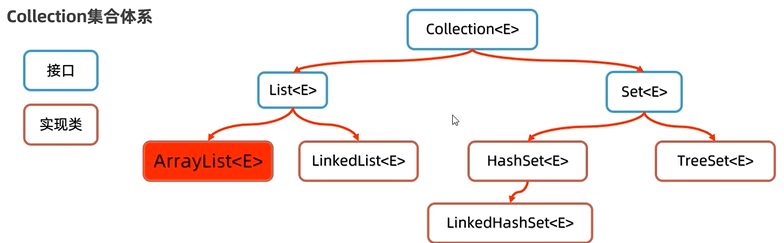

# Java内存分配

JVM时java所有方法、类的上层

- 方法区
  **所有线程共享**，存储已被虚拟机加载的**类信息**、**常量**、**静态变量**和**即时编译器编译后的代码**等数据。
- 堆
  被**所有线程共享**，虚拟机启动时创建，**存放对象实例**，
- 栈
  java虚拟机栈是**线程私有**的，它的生命周期与线程相同。描述的是Java方法执行的内存模型：每个方法在执行的时候都会同时创建一个栈帧用于存储**局部变量表**、**操作栈**、**动态链接**、**方法返回地址**等信息。每一个方法从被调用直至执行完成的过程，就对应着一个栈帧在虚拟机栈中从入栈到出栈的过程。
- 本地方法栈
  虚拟机栈为虚拟机执行Java方法（也就是字节码）服务，而本地方法栈则**为虚拟机使用到的Native方法服务**。
- 程序计数器
  可以看作是当前线程所执行的字节码的**行号指示器**。字节码解释器工作时就是通过改变这个计数器的值来选取下一条需要执行的字节码指令，分支、循环、跳转、异常处理和线程恢复等基础功能都需要依赖这个计数器来完成。


# Java变量

## 变量的有效范围

**成员变量**：在类体中定义的变量，分为静态变量和实例变量

- 静态变量：
  java的静态变量与C++中类中定义的静态变量定义和功能相似（java是纯面向对象语言，所以不存在C++中所说的全局变量），静态变量只属于类不属于类的实例。会在程序运行期间一直有效
- 实例变量
  属于对象的变量，这个变量在类中、方法外定义。每个对象都有自己的实例变量（这个该类中有定义的话），在对象存在期间有效

**局部变量**：在类的方法体中定义的变量，只在这个方法内部大括号之间的代码块中有效。

## Final关键字

可以修饰类、方法、变量

- final类：最终类，不能被**继承**
- final方法：不能被**重写**
- final变量：只能在定义时**赋值**
  final基本类型变量：存储的**数据**不能被改变
  final引用类型变量：存储的**地址**不能被改变，但是地址所指向的对象的内容是可以被改变的


# Java字符串

String(char a[])  ->  用一个字符数组a创建String对象

String(char a[], int offset, int length)  ->  对字符数组a从第offset个字符开始截取length个字符

String(char[] value)  ->  分配一个新的String对象，表示字符数组中所有元素连接的结果

## 字符串连接

运算符'+'

连接其他数据类型时会将这些数据直接转换为字符串。

## 字符串信息

### 字符串长度

String str = "hello"

str.length()


# Java面向对象

其实这么说不太准确，因为Java本身就是纯面向对象的

| 修饰符    | 本类中 | 同包其他类 | 任意包子类 | 任意包任意类 |
| --------- | ------ | ---------- | ---------- | ------------ |
| private   | √      |            |            |              |
| 缺失      | √      | √          |            |              |
| protected | √      | √          | √          |              |
| public    | √      | √          | √          | √            |

**this**引用对象本身

##  类的五大成分

成员变量、方法、构造器、代码块（初始化块）、内部类

**权限修饰**

| 修饰符    | 本类中 | 同包其他类 | 任意包子类 | 任意包任意类 |
| --------- | ------ | ---------- | ---------- | ------------ |
| private   | √      |            |            |              |
| 缺失      | √      | √          |            |              |
| protected | √      | √          | √          |              |
| public    | √      | √          | √          | √            |

**是否静态**

静态方法只能引用静态变量和静态方法。非静态方法能够引用静态变量和静态方法。
静态的方法和变量属于类，非静态的变量和方法属于类的实例——对象


### 成员变量

定义在类中、方法外

```java
public class Book {
    private String name;
    
    public String getName() {
        int id = 0;
        setNmae("Java");
        return id + this.name;
    }
    
    public void setName(String name) {
        this.name = name;
    }
    
    public Book getBook() {
        return this;  // 返回Book对象的引用
    }
}
```


### 内部类

一般内部类之间相互独立，内部类即打破了这种独立。

#### **非静态内部类**

- 成员内部类是外部类的一个成员，它可以声明为public、protected、private或默认访问级别。
- 在一个类中使用内部类，可以在内部类中直接存取其所在类的私有成员变量、方法。

```java
public class OuterClass {
    private int outerField = 10;

    public class MemberInnerClass {
        public void display() {
            System.out.println("Outer field: " + outerField);
        }
    }
}

public class Runner {
    public static void main() {
        OuterClass outer = new OuterClass();
        OuterClass.MemberInnerClass inner = outer.new InnerClass();  // 非静态内部类依赖于外部类的实例对象
    }
}
```

- 使用内部类可以隐藏细节和内部结构，封装性更好，让程序更合理

#### **静态内部类**

- 静态内部类是外部类的静态成员，它可以声明为public或private。
- 它可以包含静态和非静态成员，并且不需要外部类的实例就可以创建。
- 静态内部类不能直接访问外部类的非静态成员。

```java
public class OuterClass {
    public static class StaticInnerClass {
        public void display() {
            System.out.println("Outer class is accessed using OuterClass.class");
        }
    }
}

public class Runner {
    public static void main() {
        OuterClass outer = new OuterClass();
        OuterClass.StaticInnerClass inner = new StaticInnerClass;  // 静态内部类依赖于外部类,不依赖于其对象实例
    }
}
```

#### **局部内部类**

- 局部内部类是定义在方法或作用域内的类。
- 它只能在定义它的区域内被访问和使用。
- 可以访问其外部方法中声明为final或effectively final的局部变量。

```java
public class OuterClass {
    public void outerMethod() {
        final int localVariable = 5;
        class LocalInnerClass {
            public void display() {
                System.out.println("Local variable: " + localVariable);
            }
        }
        LocalInnerClass lic = new LocalInnerClass();
        lic.display();
    }
}
```

#### **匿名内部类**

- 匿名内部类是没有名称的局部内部类。
- 在功能中使用一个类或接口的子类、实现时使用的次数较少所以不必要为这个功能专门写一个类，这种情况下可以使用匿名内部类。
- 匿名内部类必须是子类或接口的实现，因为匿名内部类没有名字，不能直接创建这种类型的引用，所以用其父类或接口的名字来创建引用。
- 它可以访问其外部方法中声明为final或effectively final的局部变量。

```java
public class OuterClass {
    public void outerMethod() {
        Runnable r = new Runnable() {  // Runnable是一个java接口，用于创建一个线程
            @Override
            public void run() {
                System.out.println("Anonymous Inner Class");
            }
        };
        new Thread(r).start();
    }
}
```

**案例**

- 在主方法中创建匿名类对象来实现相关功能：

  ```java
  public class RunCode {
      public static void main(String[] args) {
          Animal a = new Animal() {
              @Override
              public void cry() {
                  System.out.println("猫：喵");
              }
          };
          a.cry();
      }
  }
  
  abstract class Animal {
      public abstract void cry();
  }
  ```

- 在传参时传入匿名类对象来实现相关功能：

  ```java
  public class RunCode {
      public static void main(String[] args) {
          go(new Swimming() {
              @Override
              public void swim() {
                  System.out.println("dog swiming------");
              }
          });
      }
      
      public static void go(Swimming s) {
          System.out.println("start-----");
          s.swim();
      }
  }
  
  interface Swimming {
      void swim();
  }
  ```


**使用内部类实现接口**
```java
public class Test {
    public class Inner implements MyInterface {
        // ……
    }
}
```


### 方法

- **静态方法**：属于类，不需要实例即可调用，只能调用静态方法，引用静态变量
  **工具类**不需要实例对象，只需要通过类名的引用即可调用类中的方法、变量来实现相应的功能，这样的类中的变量、方法都用static修饰（属于类并不是属于对象）

- **非静态方法**：属于对象，需要实例才能调用

- **不定长参数方法**：可以接受任意数量的参数，语法：在参数类型后面加上省略号（`...`）

  ```java
  public class VarargsExample {
      // 定义一个接受不定长参数的方法
      public static void printNumbers(int... numbers) {
          for (int number : numbers) {
              System.out.println(number);
          }
      }
  
      public static void main(String[] args) {
          // 调用方法，传递不定数量的参数
          printNumbers(1, 2, 3, 4, 5);
          printNumbers(10, 20, 30);
          printNumbers(); // 传递零个参数
      }
  }
  ```

- **局部变量**：定义在方法内、代码块内的变量


### 代码块

**静态初始化块**

- 静态初始化块在类加载时执行，且只执行一次。
- 它通常用于初始化静态成员变量或执行只需进行一次的静态代码。
- 静态初始化块在类的所有实例创建之前执行。

```java
public class ClassA {
	static {
		// 这里的代码在类加载时执行一次
	}
}
```

**实例初始化块**

- 实例初始化块在每次创建类的实例时执行。
- 它用于初始化实例成员变量或执行其他实例级别的初始化操作。
- 实例初始化块在构造函数执行之前执行。

```java
public class ClassA {
	{
		// 这里的代码在每次创建实例时执行
	}
}
```


### 构造器

C++中的构造函数，最好写上一个无参的构造器（因为不会像C++那样自动生成）


## 单例设计模式

确保类只有一个对象

- 把类的静态构造器写好
- 定义一个静态类变量用来引用类的一个对象
- 定义一个静态类方法返回这个对象的引用

```java
public class Temp {
    private static Temp a = new Temp();  // 这里已经实例化了

    private Temp() {}

    public static Temp getTemp() {
        return a;
    }
}
```

类的构造器私有之后就只能生成一个对象。

**饿汉式单例**：取对象时对象早已经创建好了（代码示例如上）

**懒汉式单例**：取对象时对象才开始创建

```java
public class Temp {
    private static Temp a;
    private Temp () {}
    private static getTemp() {
        if (Temp == null) {
            a = new Temp();
        }
        return a;
    }
}
```


## 继承

关键字为**extends**，子类可以继承父类的非私有成员

| 修饰符    | 本类中 | 同包其他类 | 任意包子类 | 任意包任意类 |
| --------- | ------ | ---------- | ---------- | ------------ |
| private   | √      |            |            |              |
| 缺失      | √      | √          |            |              |
| protected | √      | √          | √          |              |
| public    | √      | √          | √          | √            |

```java
public class A {
	public int i;
	public A() {
		this.i = 10;
	}
	public void print1() {
		System.out.println(this.i);
	}
}

public class B extends A {
    public void print1() {
        System.out.println("B::" + i);
    }
}
```

带有继承关系的类对象的创建方式：**extends**

```java
public class ClassA {
    public ClassA() {
        System.out.println("ClassA(): GO");
    }

    public void f() {
        System.out.println("ClassA.f(): GO");
    }
}

public class ClassB extends ClassA {
    public ClassB() {
        System.out.println("ClassB(): GO");
    }

    @Override
    public void f() {
        System.out.println("ClassB.f(): GO");
    }

    public void myF() {
        System.out.println("ClassB.myF(): GO");
    }
}

public class RunCode {
    public static void main(String[] args) {
        System.out.println("hello");
        ClassA b = new ClassB();
        b.f();
    }
}
```

输出结果为：
hello
ClassA(): GO
ClassB(): GO
ClassB.f(): GO

也就是说：
	创建子类对象时会先调用父类的构造器，再调用自己的构造器（或者说子类的构造器中最上方调用了父类的构造器）。如果重写了方法即使是使用父类的变量引用子类的对象来调用在子类中重写过的方法，调用的也是子类的方法。如果使用ClassA类型的变量引用ClassB类型的实例并调用只在ClassB有定义的方法那么就会报错。
	实例化子类对象时会自动调用父类的无参构造器，若需要调用有参的构造器需要使用**super**关键字。

**单继承**：不支持多继承，支持多层继承

**Object类**：java所有类的“祖宗类”

- getClass().getName() 获取类的名称
- toString() 将一个对象返回为字符串形式
- equals() 比较两个对象的实际内容是否相等。“==”比较的时两个变量引用的是不是同一个对象


### 方法重写

继承之后子类可以重写方法

子类的方法、构造器中可以使用**supre**引用父类的变量、调用父类的方法

**注意事项**：

- 重写父类方法是，修改方法的修饰权限只能从小的范围到大的范围。换句话说重写方法的权限范围需要大于等于父类的方法。
- 使用**@Override**注解，可以制定java编译器，检查方法重写的格式是否正确，提高代码可读性。
- 重写的方法返回值类型必须与被重写方法的返回值类型一样或者范围更小。
- 私有方法、静态方法不能被重写。


### 对象类型的转换

**向上转换**（子类向父类）

```java
public class A {……}

public class B extends A {……}

public void func(A a) {……}
```

上面声明的func方法的形参为A类型的对象，当传入其子类B类型的对象时会自动将对象转换为A类型

**向下转换**（父类向子类）

这种转换一般需要显示类型转换除

当在程序中执行向下转型操作时，如果父类对象不是子类对象的实例时会发生异常，所以在执行向下转型之前需要判断父类变量引用的是否为子类的实例。**instanceof**

```java
myobject instanceof MyClass
// myobject: 某个对象引用（变量）  MyClass: 某个类
// 判断变量引用的对象是否为某类的实例
```


## 多态

目标：一个方法可以供很多其他的类使用。继承就是一种方式。

**对象多态**：一个类可以有多个子类，如学生老师都是人

**行为多态**：多个类有同一种方法，但是不同类有不同的实现方式，如人两条腿走，狗四条腿走


### 抽象类与接口

#### 抽象类

解决实际问题时，一般将父类定义为抽象类，需要使用这个父类进行继承与多态处理。回想继承和多态原理，继承树中越是在上方的类越抽象，如鸽子类继承鸟类、鸟类继承动物类等。在多态机制中，并不需要将父类初始化对象，我们需要的只是子类对象，所以在Java语言中设置抽象类不可以实例化对象，因为图形类不能抽象出任何一种具体图形，但它的子类却可以。

抽象类：**不可以实例化对象**，即不可以出现在new后，但是可以出现在变量声明中，也就是说可以有这种类型的引用，但是不能有这种类型的对象。但其子类可以。关键字：**abstract**

```java
public abstract class Test {
	abstract void testAbstract();
}
```

使用abstract关键字定义的类称为抽象类，而使用这个关键字定义的方法称为**抽象方法**。抽象方法**没有方法体**，这个方法本身没有任何意义，**除非它被重写**，而承载这个抽象方法的抽象类必须被继承，实际上抽象类除了被继承之外没有任何意义。
只要类中有一个抽象方法，此类就被标记为抽象类。

- 抽象类中可以不写抽象方法，但是有抽象方法的类一定是抽象类
- 类有的成员抽象类都具备
- 抽象类不能实例对象，仅作为一种特殊的父类让自来继承并实现
- 一个类继承抽象类必须重写抽象类的所有抽象方法

被继承后需要**实现其中所有的抽象方法**。但是可能有的子类不需要父类中的某些方法，于是出现了接口。

**模板方法设计模式**：吧子类中只需要部分个性化的方法设计为非抽象方法（模板方法），这个方法中需要个性化的部分封装在另外一个抽象方法中让模板方法来调用，以后子类继承时只需要重写父类中的抽象方法。为防止子类重写模板方法可在模板方法声明前缀**final**

#### 接口

抽象类的延伸，纯粹的抽象类，所有方法都没有方法体。需要接口内方法的子类实现这个接口。
关键字：**interface**

```java
public interface drawTest {
	void draw();
}
```

一个类可使用**implements**关键字实现一个接口。实现了接口的类即该接口的实现类

在接口中，方法必须被定义为public或abstract形式，其他修饰权限不被Java编译器认可。或者说，即使不将该方法声明为public形式，它也是public。

- 接口的成员只能有成员变量和方法（构造器都不能有）
- 接口中的成员变量默认为常量
- 不能定义方法体
- 本身也是抽象类，所以同样的不能实例对象，但是能引用实现类的对象

```java
public interface A {
	String SCHOOL_NAME = "University";
	void test();  // 默认public、abstract
}
```

```java
public class ClassA implements 接口1, 接口2…… {
	// ……
}
```

**接口的好处**：

- 弥补了类单继承的不足
- 面向接口编程，可以灵活方便的切换业务实现
  一个接口可以被多个类实现

```java
// 班级操作接口
public interface Operator {
	void printInfo();
    void printScore();
}

// 班级管理员1类
public class Maniger1 implements Operator{
    @Override
    void printInfo(){
        // 输出信息方案1
    }
    
    @Override
    void printScore(){
        // 输出成绩方案1
    }
}

// 班级管理员2类
public class Maniger2 implements Operator{
    @Override
    void printInfo(){
        // 输出信息方案2
    }
    
    @Override
    void printScore(){
        // 输出成绩方案2
    }
}


// 班级类
public class Class {
    private ArrayList<Student> students = new ArrayList({
        // ……
    });
    private operator = new Maniger1();  // 后续如果需要更换解决方案是只需要更改这里
    
    public void printInfo() {
        operater.printInfo();
    }
    
    public void printScore() {
        operator.printScore();
    }
}
```


## 枚举

 一种特殊的类，用于定义一组常量,这些常量被称为枚举常量。枚举可以看作是一组命名的整数值，这些整数值是唯一的，并且可以被用来表示一组固定的选择。

如季节类的实例的值一定是春夏秋冬四个中的一个，季节类就很适合设计为枚举。

```java
enum Season {
	SPRING, SUMMER, AUTUMN, WINTER;
}
```

注意事项：

- 第一行必须是罗列的枚举常量
- 构造器私有（写不写都是），**不能创建对象**
- 可以写其他成员变量、方法

对枚举类的反编译会发现：

- 枚举是继承了lang.Enum的子类，而且是最终类→**不能被继承**
- 每个枚举常量都是本枚举类类型的常量，而且是静态的
- 新增了方法如values返回枚举的所有常量列表、valueOf返回枚举常量的索引

**案例**：季节枚举

```java
public enum Season {
    SPRING, SUMMER, AUTUMN, WINTER;

    // 获取季节描述的方法
    public String getDescription() {
        switch (this) {
            case SPRING:
                return "春天";
            case SUMMER:
                return "夏天";
            case AUTUMN:
                return "秋天";
            case WINTER:
                return "冬天";
            default:
                return "未知季节";
        }
    }

    // 计算n个季节后的季节
    public Season nextSeason(int n) {
        // 枚举值的数量
        int totalSeasons = Season.values().length;
        // 计算偏移后的索引
        int offset = (ordinal() + n) % totalSeasons;
        // 返回偏移后的枚举值
        return Season.values()[offset];
    }
}

public class SeasonExample {
    public static void main(String[] args) {
        // 获取当前季节
        Season currentSeason = Season.SUMMER;
        System.out.println("当前季节: " + currentSeason.getDescription());

        // 计算再过3个季节后的季节
        Season nextSeason = currentSeason.nextSeason(3);
        System.out.println("3个季节后是: " + nextSeason.getDescription());
    }
}
```

### 抽象枚举

```java
public enum B {
    X() {
        
    }, Y() {
        
    }
    
    B(){
        
    }
    
    private name String;
    
    public void f();
    
    public void setName(String name) {
        this.name = name;
    }
    public String getName() {
        return this.name;
    }
}
```

### 可以使用枚举来实现单例

```java
public enum A {
	a;
	
	// ……
}
```


# 泛型

定义类、接口、方法时，同时声明了一个或者多个类型变量(如:<E>)称为泛型类、泛型接口，泛型方法、它们统称为泛型。（和C++的可以类比）

**泛型类**

```java
public class ClassName<T> {
    // 类定义，其中T是类型参数
    private T data;

    public ClassName(T data) {
        this.data = data;
    }

    public T getData() {
        return data;
    }

    public void setData(T data) {
        this.data = data;
    }
}
```

**泛型方法**

```java
public class Utility {
    public static <T> void printArray(T[] array) {
        for (T element : array) {
            System.out.print(element + " ");
        }
        System.out.println();
    }
}
```

**泛型接口**


# 常用API

## Object

java中所有class的根

常用方法

| 返回类型 | 方法               | 描述                     |
| -------- | ------------------ | ------------------------ |
| Object   | clone()            | 返回对象的拷贝           |
| class<>  | getClass()         | 返回此Object的运行时类   |
| boolean  | equals(Object obj) | 判断对象“值”是否相等     |
| String   | toString()         | 返回对象的字符串表示形式 |

- <small>比较对象“值”是否相等的方法有Object类的equal方法和对象的equal方法，**优选Object类的equal**方法，这个方法不会因为空指针报错</small>

## 包装类

基本类型的数据包装为类即为包装类。

Java泛型中只支持引用数据类型不支持基本数据类型，所以需要有包装类。

toString方法可以把基本数据转为字符串。

```java
Integer num = Integer.valueOf(12);  // 推荐，Integer(int)已经过时
Integer num = 12;  // 自动包箱
int a = num;  // 自动拆箱
```

## StringBuilder

- 可以代表字符串对象，相当于一个容器，其中的字符串是可变的。
- 在做字符串的修改操作时比String高效。

```java
StringBuilder() // 不包含任何字符的构造
StringBuilder(int len) // 设置除数容量的构造
StringBuilder(String str)
StringBuilder(CharSequence seq)
```

## BigDecimal

以字符串形式存储数字，以解决精度、大小范围等问题

```java
BigDecimal a = new BigDecimal(Double.toString(1.1));
BigDecimal b = new BigDecimal.valueOf(2.2);

a.add(b); // 加法
a.subtract(b); // 减法
a.multiply(b); // 乘法
a.divide(b); // 触发

a.divide(b, 2, RoundingMode.HALF_UP);  //设定保留位数、修约方式
```

## Arrays

处理数组的一个方法类


# lambda表达式

简化匿名内部类。

```java
public class Run {
    public static void main(String[] args) {
        Animal a = new Animal () {
            @Override
            public void run() {
                
            }
        }
    }
}

abstract class Animal {
    public abstract void run();
}
```

↑ 匿名内部类的方式

Lambda表达式的使用前提：

- 只能简化函数式接口的匿名内部类：只能有一个抽样方法的接口

```java
public class Run {
    public static void main(String[] args) {
        Swiming s = () -> {
            System.out.println("Swimming: GO")
        }
    }
}

@FunctionalInterface
interface Swimming {
    void swim();
}
```

Lambda表达式的省略写法

- 参数类型可以省略不写
- 如果只有一个参数，参数类型可以省略的同时可以省略()；
- 如果其中只有一行代码，可省略大括号和分号，如果是return语句则return必须省。

```java
import java.util.Arrays;
import java.util.List;
import java.util.Collections;

public class LambdaExample {
    public static void main(String[] args) {
        // 创建一个字符串列表
        List<String> names = Arrays.asList("Apple", "Banana", "Cherry", "Date");

        // 使用Lambda表达式来定义一个比较器，按照字符串长度排序
        Collections.sort(names, (s1, s2) -> s1.length() - s2.length()); // 省略了大括号和return

        // 输出排序后的列表
        System.out.println(names);
    }
}
```


# 方法引用

Java方法引用是一种简化代码的语法特性，也就是lambda表达式的进一步简化，允许直接使用方法名来引用方法，而不是编写完整的lambda表达式。这在处理函数式接口时特别有用，因为函数式接口通常只有一个抽象方法。

方法引用这种类型的关键字为`Consumer`

方法引用主要有三种类型：

1. **静态方法引用**：用于引用类的静态方法。其语法格式为 `ClassName::staticMethodName`。 
   使用场景：某个Lambda表达式只是调用了一个静态方法而且前后的参数列表一致。

   ```java
   import java.util.Arrays;
   
   class Person {
       private int age;
       private String name;
       
       public Person(String s, int a) {
           this.name = s;
           this.age = a;
       }
       
       public int getAge() {
           return this.age;
       }
       
       public String getName() {
           return this.name;
       }
   
       public String toString() {
           return "Name: " + this.name + ", Age: " + this.age;
       }
   }
   
   class CompareByData {
       public static int compareByAge(Person s1, Person s2) {
           return s1.getAge() - s2.getAge();
       }
   }
   
   public class Runner {
       public static void main(String[] args) {
           Person[] persons = new Person[4];
           persons[0] = new Person("tom", 10);
           persons[1] = new Person("tim", 20);
           persons[2] = new Person("timi", 18);
           persons[3] = new Person("Alice", 16);
           Arrays.sort(persons, CompareByData::compareByAge);
           System.out.println(Arrays.toString(persons));
       } 
   }
   ```
   
2. **实例方法引用**：用于引用对象的实例方法。这种引用需要一个实例，语法格式为 `instance::instanceMethodName`。 使用场景：某个Lambda表达式只是调用了一个静态方法而且前后的参数列表一致。

   ```java
   MyClass obj = new MyClass();
   obj::someMethod; // 引用obj对象的someMethod实例方法
   ```

3. **类方法引用**：用于引用一个类的方法，这个方法的第一个参数是类本身，通常用于静态方法。语法格式为 `ClassName::typeNameMethodName`。 示例：

   ```
   Arrays.sort(names, (o1, o2) -> o1.cpmpareToIgnerCase(o2));
   // 简化为 ↓
   Arrays.sort(names, String::compareIgnoreCase);
   ```

```java
import java.util.Arrays;
import java.util.List;
import java.util.Collections;

public class MethodReferenceExample {
    public static void main(String[] args) {
        // 创建一个字符串列表
        List<String> fruits = Arrays.asList("banana", "apple", "cherry", "date");

        // 使用方法引用对列表进行字典顺序排序
        Collections.sort(fruits, String::compareTo);

        // 输出排序后的列表
        for (String fruit : fruits) {
            System.out.println(fruit);
        }
    }
}
```

4. **构造器引用**：直接引用一个类的构造器。

   `ClassName::new`。使用场景：如果某个lambda表达式只是在构造对象而且前后参数一致，就可以使用。

   ```java
   class Car {
       public String name;
       public double price;
       // 方法、其他属性
   }
   
   interface CreateCar {
       Car create(String name, double price);
   }
   
   public class Runner {
       public static void main(String[] args) {
           
       }
       
       public static void test1() {
           CreateCar cc = new CreatCar() {  // 局部匿名内部类
               @Override
               public Car create(String name, double price) {
                   return new Car(name, price);
               }
           }
       	Car c = cc.create('Bnez', 49.9);
       	System.out.println(c.toString());
       }
       
       public static void test2() {
           CreateCar cc = (name, price) -> new Car(name, price);  // lambda表达式
       	Car c = cc.create('Bnez', 49.9);
       	System.out.println(c.toString());
       }
       
       public static void test3() {
           CreateCar cc = Car::new;  // 构造器引用
       	Car c = cc.create('Bnez', 49.9);
       	System.out.println(c.toString());
       }
   }
   ```
   


# 异常

## **异常的体系**


Error：系统级别错误，系统出现严重问题时sun公司会将问题包装成Error。（Error是给sun公司自己用的）

**Exception**：异常，程序可能出现的问题

- **运行时异常**：RuntimeException及其子类，编译阶段不会出现错误提醒，运行时出现的异常（如：数组索引越界异常）
- **编译时异常**：编译阶段就会出现错误提醒的。（如：日期解析异常）

## 捕获异常

`try`、`catch`、`finally`、`throws`

- **`try`**：尝试运行的代码
- **`catch`**：尝试运行的代码异常时执行的代码
- **`finally`**：不论`try`运行是否异常都会运行
- **`throws`**：标注在方法后，将方法内遇到的异常抛出上一级方法
- **`throw`**：用于`try`语句代码块中或`try`所调用的方法中，抛出异常给`catch`捕获

## 自定义运行时异常

```java
public class Runner {
    public static void main(String[] args) {
        // 保存一个年龄
        try {
            saveAge(160);
            System.out.println("执行成功");
        }
        catch(Exception e) {
            System.out.println("执行失败：");
            e.printStackTrace();
        }
    }
    
    public static void saveAge(int age) {
        if (age >= 0 && age < 150) {
            System.out.println("年龄保存成功：" + age);
        } else {
            // 用一个异常对象来封装年龄非法问题
            throw new AgeIllegalRuntimeException("/age: "+age+"is illegal");
        }
    }
}

class AgeIllegalRuntimeException extends RuntimeException {
    public AgeIllegalRuntimeException () {}
    
    public AgeIllegalRuntimeException (String message) {
        super(message);  // 将message送到父类去构造，相当于C++中的委托构造
    }
}
```

## 自定义编译时异常

```java
public class Runner {
    public static void main(String[] args) {
        // 保存一个年龄
        try {
            saveAge1(278);
            System.out.println("执行成功");
        }
        catch (Exception e) {
            System.out.println("执行失败：");
            e.printStackTrace();
        }
    }
    
    public static void saveAge1(int age) throws AgeIllegalException{
        if (age >= 0 && age < 150) {
            System.out.println("年龄保存成功：" + age);
        } else {
            // 用一个异常对象来封装年龄非法问题
            throw new AgeIllegalException("\n/age: " + age + " is illegal");
        }
    }
}

class AgeIllegalException extends Exception {
    public AgeIllegalException () {}
    
    public AgeIllegalException (String message) {
        super(message);  // 将message送到父类去构造，相当于C++中的委托构造
    }
}
```

## 用户的常见处理

1. 捕获异常，记录异常并相应合适的信息给用户

2. 捕获异常，尝试重新修复

   ```java
   import java.util.Scanner;
   
   public class Runner {
       public static void main(String[] args) {
           while (true) {
               try {
                   System.out.println(getPrice());
               } catch (Exception e) {
                   System.out.println("请输入合法的数字");
               }
           }
       }
   
       public static double getPrice() {
           Scanner sc = new Scanner(System.in);
           while (true) {
               double money = sc.nextDouble();
               if (money >= 0) {
                   sc.close();
                   return money;
               } else {
                   System.out.println("输入的价格不合适");
               }
           }
       }
   }
   ```


# 常用集合（容器）


## Collection体系

所有单列集合的基类



### 遍历方式

#### 迭代器

迭代器是用来遍历集合的专用方式(数组没有迭代器)，在Java中迭代器的代表是Iterator。

Collection集合获取迭代器的方法

| 方法                  | 描述                                                 |
| --------------------- | ---------------------------------------------------- |
| `terator<E> iterator` | 返回集合中的迭代器对象，默认指向当前集合的第一个元素 |

**常用方法**

| 方法                | 描述                                             |
| ------------------- | ------------------------------------------------ |
| `boolean hasNext()` | 当前位置是否有元素存在                           |
| `E next()`          | 获取当前位置的元素，并同时将迭代器指向下一个元素 |

```java
import java.util.ArrayList;
import java.util.Collection;
import java.util.Iterator;

public class Runner {
    public static void main(String[] args) {
        Collection<String> c = new ArrayList<>();
        c.add("阿荣");
        c.add("阿洁");
        c.add("阿龙");
        c.add("阿凯");
        System.out.println(c);

        Iterator<String> it = c.iterator();
        while (it.hasNext()) {
            System.out.println(it.next());
        }
    }
}
```


#### 增强for

`for (元素的类型 变量名:数组或集合) {}`

```java
import java.util.ArrayList;
import java.util.Collection;

public class Runner {
    public static void main(String[] args) {
        Collection<String> c = new ArrayList<>();
        c.add("阿荣");
        c.add("阿洁");
        c.add("阿龙");
        c.add("阿凯");
        System.out.println(c);

        for (String string : c) {
            System.out.println(string);
        }
    }
}
```

遍历集合或接口都可，基本上只要是可迭代的都行。


#### lambda表达式

```java
可迭代对象.forEach(new Consumer<可迭代对象元素类型>（）{
    @Override
    public void accept(String s) {
        System.out.println(s);
    }
})
```

| 方法                                               | 描述                     |
| -------------------------------------------------- | ------------------------ |
| `defualt foid forEach(Sonsumer<? super T> action)` | 结合lambda表达式遍历集合 |

```java
import java.util.ArrayList;
import java.util.Collection;
import java.util.function.Consumer;

public class Runner {
    public static void main(String[] args) {
        Collection<String> c = new ArrayList<>();
        c.add("阿荣");
        c.add("阿洁");
        c.add("阿龙");
        c.add("阿凯");
        System.out.println(c);

        c.forEach(new Consumer<String>(){
            @Override
            public void accept(String s) {
                System.out.println(s);
            }
        });
    }
}
```


### List

特点：有序、可重复、有索引

**索引方法**

| 方法                             | 描述                                   |
| -------------------------------- | -------------------------------------- |
| `void add(int index, E element)` | 在此集合对象的指定位置插入指定元素     |
| `E remove(int index)`            | 删除所引处的元素，返回被删除元素       |
| `E set(int index, E element)`    | 修改指定索引出的元素，返回被修改的元素 |
| `E get(int index)`               | 返回指定索引出的元素                   |

**遍历方式**

- for循环（因为有索引）
- 迭代器
- 增强for
- lambda表达式

#### ArrayList

- 数据结构：数组
- 按位查找快
- 非尾部插入、删除慢
- 必要时会扩容（新整一个大的数组再拷贝），扩容为原本的1.5倍

#### LinkedList

- 数据结构：双链表

- 查找慢

- 增删快

- 新增方法

  | 方法                        | 描述               |
  | --------------------------- | ------------------ |
  | `public void addFirst(E e)` | 头插               |
  | `public void addLast(E e)`  | 尾插               |
  | `public E getFirst()`       | 返回第一个元素索引 |
  | `public E getLast()`        | 返回尾部元素索引   |
  | `public E removeFirst()`    | 删除并返回头部元素 |
  | `public E removeLast()`     | 删除并返回尾部元素 |


### Set

不重复；无索引

**`HashSet`**

哈希

无序，快速

**`LinkedHashSet`**

链表+哈希

有序快速，可以有索引

**`TreeSet`**

二叉树

排序比较快速，无索引


## Map体系集合

Map接口提供的是key到value的映射，不能包含相同的key，每个key只能映射一个value。

key还决定了存储对象在映射中的存储位置，但不是由key对象本身决定的，而是通过一种“散列技术”进行处理，产生一个散列码的整数值。

实现类有：`HashMap`、`TreeMap`、`LinkedHashMap`等

`Map<Ek, Ev> mapName = new HashMap<>();`

- **`HashMap`**：无序、不重复、无索引。哈希
- **`LinkedHashMap`**：有序、不重复、无索引。哈希+链表
- **`TreeMap`**：按键大小默认升序，不重复，无索引。二叉树。使用时最好给自定义的类重写一个比较规则

常用方法：

| 方法                                    | 描述                      |
| --------------------------------------- | ------------------------- |
| `public V put(K key, V value)`          | 添加元素                  |
| `public int size()`                     | 获取集合元素个数          |
| `public void clear()`                   | 清空集合                  |
| `public boolean isEmpty()`              | 判断集合是否为空          |
| `public V get(K ket)`                   | 根据键取值                |
| `public V remove(K key)`                | 根据键删除元素并返回其值  |
| `public boolean containsKey(K key)`     | 判断是否包含某个键        |
| `public boolean containsValue(V value)` | 判断是否包含某个值        |
| `public Set<K> keySet()`                | 获取全部键的集合          |
| `public Collection<V> values()`         | 获取全部值                |
| `Set<Map.Entry<K, V>> entrySet()`       | 把键和值封装之后输出为Set |

`Map.Entry`提供的方法：

| 方法           | 描述           |
| -------------- | -------------- |
| `K getKey()`   | 返回键值对的键 |
| `V getValue()` | 返回值         |


### Map的遍历

- **键找值**：先获取Map集合的全部键，再通过遍历键来找值
  
  ```java
  import java.util.HashMap;
  import java.util.Map;
  import java.util.Set;
  
  public class Runner {
      public static void main(String[] args) {
          Map<String, Double> m = new HashMap<>();
          m.put("阿青", 162.6);
          m.put("阿青", 169.8);
          m.put("阿紫", 165.8);
          m.put("阿宝", 169.8);
          System.out.println(m);
  
          Set<String> keys = m.keySet();
          for (String str : keys) {
              System.out.println(str+" ---> "+m.get(str));
          }
      }
  }
  ```
  
- **键值对**：把键值对看成一个整体进行遍历

  ```java
  Set<Map.Entry<String, Double>> s = m.entrySet();
          for (Map.Entry<String,Double> entry : s) {
              System.out.println(entry.getKey()+" ---> "+entry.getValue());
          }
  ```

- **Lambda表达式**
  `default void forEach(BiConsumer<? super K, ? siper V> action)`

  ```java
  m.forEach(new BiConsumer<String, Double>() {
      @Override
      public void accept(String k, Double v) {
          System.out.println(k+" ----> "+v);
      }
  });
  ```

  进一步简化↓

  ```java
  m.forEach((k, v) -> {
  	System.out.println(k + " ----> " + v);
  });
  ```


# Stream

- 可以用于操作集合或数组的数据的一套API
- 优势：大量结合了Lambda表达式的语法风格来编程，提供了一种更加强大、简单的方式操作集合或数组中的元素

案例：现有一列名字，要过滤留下姓张、三个字的名字

- 不适用Stream

  ```java
  List<String> list = new ArrayList<>();
  for (String name : names) {
      if (name.length() == 3 && name.charAt(0) == '张') {
          list.add(name);
      }
  }
  ```

- 使用Stream：

  ```java
  List<String> list = names.stream().filter(s -> s.startsWith("张") && s.length() == 3).collect(Collectors.toList());
  ```

Stream流使用步骤


- 获取集合的Stream流：`default Stream<E> stream()`获取当前集合对象的Stream流 
- 获取数组的Stream流：
  Arrays类提供方法：`public static <T> Srteam<T> stream(T[] array)`获取数组array的Stream流
  Stream类提供方法：`public static <T> Stream<T> of(T... values)`获取当前接收数据values的Stream流

**Stream流常见中间方法**：

| 方法                                                         | 描述                           |
| ------------------------------------------------------------ | ------------------------------ |
| `Stream<T> filter(Predicate<? super T> predicate)`           | 对流中数据进行过滤             |
| `Stream<T> sorted()`                                         | 对流中数据进行升序排序         |
| `Stream<T> sorted(Comparator<? super T> comparator)`         | 按照指定规则排序               |
| `Stream<T> limit(long maxSize)`                              | 获取前maxSize个元素            |
| `Stream<T> skip(long n)`                                     | 跳过几个元素                   |
| `Stream<T> distinct()`                                       | 取出流中的重复元素             |
| `<R> Stream<R> map(Function<? super T, ? extends R> mapper)` | 对元素进行加工并返回对应的新流 |
| `static <T> Stream<T> concat(Stream a, Stream b)`            | 合并a和b两个流                 |

**Stream流常见终结方法**

收集Stream流：把Stream中的数据转回集合或数组

| 方法                             | 描述                                   |
| -------------------------------- | -------------------------------------- |
| `R collect(Collector collector)` | 把流处理后的结果收集到一个指定的集合中 |
| `Object[] toArray()`             | 把流处理后的结果收集到一个数组         |


# File、IO

获取文件、读写数据

## File

构造器

| 构造器                              | 描述                                                   |
| ----------------------------------- | ------------------------------------------------------ |
| `File(File parent, String child)`   | 从父抽象路径名和子路径名字符串创建新的File实例         |
| **`File(String pathname)`**         | 通过将给定的路径名字转换为抽象路径名来创建新的File实例 |
| `File(String parent, String child)` | 从符路径名和子路径名创建新的File实例                   |
| `File URI uri`                      | 通过给等的file: URI转换为抽象路径来创建File实例        |

常用方法

| 方法               | 描述                             |
| ------------------ | -------------------------------- |
| `boolean delete()` | 删除此抽象路径名表示的文件或目录 |
| `boolean exists()` | 判断是否存在                     |
| `String getName()` | 返回文件名                       |
| `long length()`    | 返回文件的字节数                 |

### 文件信息方法

| 方法名称                          | 说明                                     |
| --------------------------------- | ---------------------------------------- |
| `public boolean exists()`         | 判断当前文件对象，对应的文件路径是否存在 |
| `public boolean isFile()`         | 判断当前文件对象指代的是否为文件         |
| `public boolean isDirectory()`    | 判断当前文件对象指代的是否为文件夹       |
| `public String getName()`         | 获取文件的名称（包含后缀）               |
| `public long length()`            | 获取文件的大小，返回字节个数             |
| `public long lastModified()`      | 获取文件的最后修改时间。                 |
| `public String getPath()`         | 获取创建文件对象时，使用的路径           |
| `public String getAbsolutePath()` | 获取绝对路径                             |

<small>`LastModified()`返回的是自1970年1月1日00:00:00 GMT（格林威治标准时间）以来的毫秒数。使用**`SimpleDateFormat`**可将其转码为常用时间格式</small>

### 创建文件、删除文件方法

| 方法                             | 描述                   |
| -------------------------------- | ---------------------- |
| `public boolean createNewFile()` | 创建一个空的文件       |
| `public boolean mkdir()`         | 只能创建**一级**文件夹 |
| `public boolean mkdirs()`        | 可以创建**多级**文件夹 |
| `public boolean delete()`        | 删除文件、**空**文件夹 |

### 遍历文件夹

| 方法                        | 描述                                                   |
| --------------------------- | ------------------------------------------------------ |
| `public String[] list()`    | 获取当前目录下所有**一级文件名**称组成的字符串数组     |
| `public File[] listFiles()` | 获取当前目录下所有的**一级文件对象到**一个文件对象数组 |


## 字符集

| String提供的编码方法                   | 描述                                     |
| -------------------------------------- | ---------------------------------------- |
| `byte[] getBytes()`                    | 使用**默认**字符集编码字符串返回字节数组 |
| `byte[] getBytes(String charset Name)` | 使用**指定**字符集编码字符串返回字节数组 |

| String提供的解码方法                        | 描述                                       |
| ------------------------------------------- | ------------------------------------------ |
| `String(bytes[] bytes)`                     | 使用默认的字符集编码字节数组返回字符串     |
| `String(bytes[] bytes, String charsetName)` | 使用**指定**的字符集编码字节数组返回字符串 |


## IO流


### 文件流

#### FileInputStream

构造器：`FileInputStream(String pathName)`使用路径名来实例文件输入流、`FileInputStream(File fileName)`使用File对象创建文件输入流

方法：

- `public int read()`每次读取一个字节返回，若没有数据可读会返回-1
- `public int read(byte[] buffer)`每次用一个字节数组去读取数据，返回字节数组读取了多少个字节，没有数据可读会返回-1

缺陷与注意：

- `read()`读取数据的性能差，没读一次就要磁盘i一次
- `read()`读取汉字输出会乱码
- 使用完后必须关闭

**一次性读取全部字节**

- `public int read(byte[] buffer)`
- `public byte[] readAllBytes() throws IOException`

问题：

- 如果文件过大创建的字符数组也会过大产生溢出
- 读写文本文件更适合用字符流，字节流适合做数据的转移


#### FileOutputStream

以内存为基准吧内存中的数据以字节的形式写出到文件

构造器：

- `public FileOutputStream(File file)`：与文件对象接通输出流
- `public FileOutputStream(String filepath)`：创建字节输出流管道与源文件路径接通
- `public FileOutputStream(File file, boolean append)`：是否可追加
- `public FileOutputStream(String filepath, boolean append)`：是否可追加

方法：

- `public void write(int a)`：写出一个字节
- `public void write(byte[] buffer)`：写出一个字节数组
- `public void write(byte[] buffer, int pos, int len)`：写出一个字节数组的一部分
- `public void close() throws IOException`：关闭流


### 缓冲流

BufferedReader、BufferedWriter

```java
br = new BufferedReader(new FileReader("example.txt"));
String line;
while ((line = br.readLine()) != null) {
    System.out.println(line);
}
```

```java
bw = new BufferedWriter(new FileWriter("example.txt"));
bw.write("Hello, World!");
bw.newLine(); // 写入一个新行
bw.write("Moonshot AI");
```

注意：

- 使用时记得关闭
- BfferWriter构造器中可设置是否追加，不追加就是覆盖了


#### 字节缓冲流

**使用场景**

- 处理二进制文件，如图像、音频、视频等。
- 读写原始字节数据，不涉及字符编码转换。

**构造语法**

```java
BufferedInputStream bis = new BufferedInputStream(new FileInputStream("file.bin"));
BufferedOutputStream bos = new BufferedOutputStream(new FileOutputStream("file.bin"));
```

**注意事项**

- 字节缓冲流不处理字符编码，适用于任何形式的二进制数据。
- 它们通常与 `FileInputStream` 和 `FileOutputStream` 等基础字节流一起使用。
- 缓冲区大小默认为 8192 字节，但可以在构造函数中指定不同的大小。

**示例**

```java
try (BufferedInputStream bis = new BufferedInputStream(new FileInputStream("image.png"));
     BufferedOutputStream bos = new BufferedOutputStream(new FileOutputStream("image_copy.png"))) {
    byte[] buffer = new byte[8192];
    int bytesRead;
    while ((bytesRead = bis.read(buffer)) != -1) {
        bos.write(buffer, 0, bytesRead);
    }
} // 流和资源会自动关闭
```


#### 字符缓冲流

**使用场景**

- 处理文本文件，如读取和写入纯文本文件。
- 需要字符编码和解码的场景。

**语法**

```java
BufferedReader br = new BufferedReader(new FileReader("file.txt"));
BufferedWriter bw = new BufferedWriter(new FileWriter("file.txt"));

// 可以设定缓冲区大小
BufferedReader br = new BufferedReader(new FileReader(filePath), bufferSize)
BufferedWriter bw = new BufferedWriter(new FileWriter(filePath), bufferSize)
    
// 可以设定字符集
String filePath = "example.txt";
Charset charset = Charset.forName("UTF-8"); // 指定字符集

// 使用 InputStreamReader 包装 FileReader，并指定字符集
BufferedReader br = new BufferedReader(new InputStreamReader(new FileReader(filePath), charset))
BufferedWriter bw = new BufferedWriter(new OutputStreamWriter(new FileWriter(filePath), charset))
```

**方法**

- **`readLine()`**：按行读取文本，并返回一个字符串，如果到达文件末尾，则返回 `null`。

- **`read()`**：一次性读取整个文件的内容到一个字符串中。

- `read(char[] cbuf, int off, int len)`：指定一个字符数组 `cbuf` 作为缓冲区，以及要读取的字符的偏移量 `off` 和最大长度 `len`。它从文件中读取最多 `len` 个字符到缓冲区中，并将实际读取的字符数量作为返回值，没数据时返回-1。

  ```java
  char[] buffer = new char[1024];
  int bytesRead;
  while ((bytesRead = br.read(buffer, 0, buffer.length)) != -1) {
      String s = new String(buffer, 0, bytesRead);
      System.out.println(s);
  }
  ```

- `read(CharBuffer target)`：`CharBuffer` 类作为参数。它将内容读入 `CharBuffer` 对象中，并将读取的字符数量作为返回值。

  ```java
  CharBuffer buffer = CharBuffer.allocate(1024);
  int bytesRead;
  while ((bytesRead = br.read(buffer)) != -1) {
      buffer.flip(); // 准备读取数据
      String s = buffer.toString();
      System.out.println(s);
      buffer.clear(); // 准备下一轮写入
  }
  ```

**性能比较**

- **缓冲流的性能优于原始流**：由于缓冲流减少了系统调用的次数，它们在处理大量数据时通常比原始流更快。在实际开发中，推荐使用缓冲流来操作文件，以提高程序的运行效率。
- **缓冲区大小的影响**：缓冲流的性能也受到缓冲区大小的影响。较大的缓冲区可以进一步提高性能，但也可能增加内存的使用。因此，应根据具体的应用场景和数据量来选择合适的缓冲区大小。


### 打印流

**`PrintStream`**

- `PrintStream` 是字节流，用于处理字节输出。它是 `OutputStream` 的子类，并且提供了多种 `print` 方法来输出数据。
- 它可以被创建为输出到控制台（`System.out`）或其他文件或输出流。
- 例子：`PrintStream out = new PrintStream(new FileOutputStream("output.txt"));`

**`PrintWriter`**

- `PrintWriter` 是字符流，用于处理字符输出。它是 `Writer` 的子类，并且也提供了多种 `print` 方法。
- 与 `PrintStream` 类似，`PrintWriter` 也可以输出到控制台（`System.out`）、文件或其他字符输出流。
- 例子：`PrintWriter writer = new PrintWriter(new FileWriter("output.txt"));`

**注意**：

- **自动换行**：使用 `println` 方法时，打印流会自动添加行分隔符（在 Windows 系统中是 `\r\n`，在 Unix/Linux 系统中是 `\n`），并将输出缓冲区的内容刷新到输出目的地。
- **格式化输出**：打印流支持简单的格式化输出，例如使用 `printf` 方法可以输出格式化的字符串。
- **缓冲机制**：打印流通常具有缓冲机制，这意味着数据不会立即写入目的地，而是存储在缓冲区中，直到缓冲区满或者显式调用 `flush` 方法。
- **关闭流**：虽然 `PrintStream` 和 `PrintWriter` 都实现了 `Closeable` 接口，但在大多数情况下，不需要显式关闭这些流，因为它们通常会被系统自动关闭。
- **字符集问题**

```java
String filePath = "example.txt";
Charset charset = Charset.forName("UTF-8"); // 指定字符集为 UTF-8

// 使用指定字符集的 PrintWriter
PrintWriter pw = new PrintWriter(new FileWriter(filePath), charset);
pw.write("你好，世界！");
```


### 数据流

IO流体系


**DataOutputStream（数据输出流）**
	允许把数据可其类型一并写出。

构造器：`public DataOutputStream(OutputStream out)`：包装基础的字节输出流创建数据输出流

方法：

- `public final void writeByte(int v) throws IOException`：将byte类型的数据写入字节输出流
- `public final void writeInt(int v) throws IOException`：将int类型的数据写入字节输出流
- `public final void writeDouble(Double v) throws IOException`：将Double类型的数据写入字节输出流
- `public final void writeUTF(String str) throws IOException`：将字符串数据以UTF-8编码写入字节输出流
- `public void write(int/byte[]/byte[]一部分)`：支持写字节数据出去

**DataInputStream（数据输入流）**
	用于读取数据输出流写出去的数据

构造器：`public DataInputStream(InputStream is)`：包装基础的字节输出流创建数据输出流

方法：

- `public final byte readByte() throws IOException`：读取字节数据返回
- `public final int readInt() throws IOException`：读取int类型数据返回
- `public final Double readDouble() throws IOException`：读取Double类型数据返回
- `public final String readUTF() throws IOException`：读取字符串（UYF-8）返回
- `public final byte readInt()/read(byte[])`：支持读取字节数据

注意：

- 数据类型上，读的顺序要和写的顺序一致


### 序列化流

对象序列化：把java对象写到文件中，`ObjectOutputStream`
对象反序列化：把文件中的java对象读取出来`ObjectInputStream`
是字节流的子类。

**序列化流**

构造器：`ObjectOutputStream out = new ObjectOutputStream(OutputStream out);`

常用方法：

- `void writeObject(Object obj)`: 将参数对象 `obj` 序列化并写入底层的输出流。在调用此方法之前，如果需要，可以调用 `defaultWriteObject` 方法来实现自定义的序列化行为。
- `void flush()`: 刷新输出流，将所有缓冲的输出数据写入目标介质。
- `void close()`: 关闭输出流。如果 `ObjectOutputStream` 封装了另一个输出流，那么关闭 `ObjectOutputStream` 也会关闭被封装的输出流。

**反序列化流**

构造器：`ObjectInputStream in = new ObjectInputStream(InputStream in);`

方法：

- `Object readObject()`: 从输入流中读取一个对象。返回一个 `Object` 类型的值，实际类型取决于序列化数据。
- `int readInt()`: 从输入流中读取一个 `int` 类型的值。
- `String readLine()`: 从输入流中读取一个字符串，直到行结束符（`'\n'`）。
- `void close()`: 关闭输入流。如果 `ObjectInputStream` 封装了另一个输入流，那么关闭 `ObjectInputStream` 也会关闭被封装的输入流。

注意事项：

- 序列化和反序列化操作涉及到对象的状态转换，因此必须确保序列化的对象类实现了 `Serializable` 接口。
- 为了确保序列化的兼容性，通常需要定义 `serialVersionUID` 字段。
- 在反序列化过程中，必须确保尝试读取的对象与序列化时使用的对象类完全相同，否则会抛出异常。
- 序列化流和反序列化流通常用于持久化存储和网络传输，但不适用于实时通信，因为它们是为了一次性的、完整的对象传输而设计的。
- 在处理序列化流时，需要注意安全性问题，因为不信任的数据源可能导致安全漏洞，如 `ObjectInputStream` 的 `readObject` 方法可能会执行构造函数之外的任意代码。

示例：

```java
import java.io.Serializable;
import java.io.FileInputStream;
import java.io.FileOutputStream;
import java.io.ObjectInputStream;
import java.io.ObjectOutputStream;

class MySerializableClass implements Serializable {
    private static final long serialVersionUID = 1L; // 用于验证序列化的兼容性
    private int id;
    private String name;

    public MySerializableClass(int id, String name) {
        this.id = id;
        this.name = name;
    }

    // Getter 和 Setter 方法
    public int getId() {
        return id;
    }

    public void setId(int id) {
        this.id = id;
    }

    public String getName() {
        return name;
    }

    public void setName(String name) {
        this.name = name;
    }

    @Override
    public String toString() {
        return "MySerializableClass{" +
                "id=" + id +
                ", name='" + name + '\'' +
                '}';
    }
}


public class SerializationDemo {
    public static void main(String[] args) {
        // 创建一个 MySerializableClass 实例
        MySerializableClass originalObject = new MySerializableClass(1, "Kimi");

        // 序列化对象到文件
        try (FileOutputStream fileOut = new FileOutputStream("mySerializableObject.ser");
             ObjectOutputStream out = new ObjectOutputStream(fileOut)) {
            out.writeObject(originalObject);
            System.out.println("Object has been serialized to file.");
        } catch (Exception e) {
            e.printStackTrace();
        }

        // 从文件反序列化对象
        try (FileInputStream fileIn = new FileInputStream("mySerializableObject.ser");
             ObjectInputStream in = new ObjectInputStream(fileIn)) {
            MySerializableClass deserializedObject = (MySerializableClass) in.readObject();
            System.out.println("Deserialized object's id: " + deserializedObject.getId());
            System.out.println("Deserialized object's name: " + deserializedObject.getName());
        } catch (Exception e) {
            e.printStackTrace();
        }
    }
}
```


## Files类读写文件

全部字节读取：

```java
String content = new String(Files.readAllBytes(Paths.get("example.txt")));
System.out.println(content);
```

按行读取：

- `List<String> lines = Files.readAllLines(filePath);`(filePath 是一个Path类对象)：返回包含所有行的字符串List
- `Files.lines(filePath)`：读取所有行返回字符串流

读取所有字符：

```java
String content = Files.readString(filePath);
System.out.println(content);
```

Files类写入文件：

- 覆盖模式

  ```java
  String content = "Hello, World!\nMoonshot AI";
  Files.write(Paths.get("example.txt"), content.getBytes());
  ```

- 追加、设定字符集

  ```java
  String content = "Hello, World!\nMoonshot AI";
  Files.write(Paths.get("example.txt"), content.getBytes(StandardCharsets.UTF_8), StandardOpenOption.APPEND);
  ```

  

## 文件复制

一些文件的底层都是字节，所以字节流适合用于所有文件的复制。


```java
public class CopyFile {
    public static void main(String[] args) {
        InputStream is = new FileInputStream("path/filename.format");
        OutputStream os = new FileOutputStream("path1/filename1.format");
        byte[] buffer = new byte[1024];
        int len;
        while (len = is.read(buffer) != -1) {
            os.write(buffer, 0, len);
        }
        os.close();
        is.close();
    }
}
```


## 自动关闭源

**使用场景**：

- 任何**需要自动关闭资源**的场景，比如文件读写、数据库操作、网络连接等。
- 当你使用完资源后，需要显式调用 `close()` 方法关闭资源，以释放系统资源时。

在这些情况下都可以通过代码实现确保源在使用后确保被关闭。

**实现方法**

**`try-catch-finally`**：

```java
源类 源Name;
try {
    // 使用资源的代码
    源Name = new 源类();
} catch (Exception e) {
    // 异常处理代码
} finally {
    if (源Name != null) {
        try {
            源Name.close();
        } catch (Exception e) {
            e.printStackTrace();
        }
    }
}
```

**`try-with-resouce`**：

```java
try (ResourceType resource = new ResourceType()) {
    // 使用资源的代码
} catch (Exception e) {
    // 异常处理代码
}
```

`try-with-resouce`使用注意事项：

- **资源必须是自动关闭的**：使用 `try-with-resources` 的资源必须实现 `AutoCloseable` 或 `Closeable` 接口。
- **多个资源**：可以声明多个资源，它们将按照逆序关闭。即最后一个声明的资源会第一个关闭，这有助于避免在关闭一个资源时依赖另一个尚未关闭的资源。
- **不允许在 `try` 块中再声明同类型的资源**：因为 `try-with-resources` 会自动关闭声明的资源，如果在 `try` 块中再次声明同名的资源，会导致立即关闭之前声明的资源。
- **不能使用 `try-catch` 资源**：`try-with-resources` 语句中的资源不能用于 `catch` 块中。
- **确保资源正确关闭**：虽然 `try-with-resources` 会自动关闭资源，但在 `try` 块中仍然可以显式调用 `close()` 方法。但是，如果这样做了，需要确保资源不会在 `try` 块的末尾再次关闭，以避免 `IllegalStateException`。
- **异常处理**：如果资源的 `close()` 方法抛出异常，它会被尝试添加到当前正在处理的异常的 `suppressed` 列表中。如果 `try` 块中已经有一个异常被捕获，`close()` 方法抛出的异常不会阻止 `try` 块中异常的传播。


## 特殊文件

### 属性文件

**.properties**文件。其内容是一些键值对，键不重复。


- 是一个Map集合类，但是一般不会当集合使用
- 核心作用是用来代表属性文件，通过它可以读写property文件

构造器：`public Propertie()`：构造空的集合对象

读取property文件方法：

- `public void load(InputStream is)`：通过字节输入流读取属性文件的键值对数据
- `public void load(Reader reader)`：通过字符输入流读取属性文件中的键值对数据
- `pulic String getProperty(String key)`：根据键取值
- `public Set<String> stringPropertyNames()`：获取全部键的集合

示例：

```java
Properties pro = new Properties();
pro.load(new FileReader("path/fileName"));
System.out.println(pro.getProperty("key1"));

Set<String> keys = pro.stringPropertyNames();
for(String key :keys) {
    String value = pro.getProperty(key);
    System.out.println(key + " --------> " + value)
}

pro.forEach((k,v) -> {
    System.out.println(k + " -----> " + v);
});
```

写入文件方法

`.setProperty(String key, String value)`：用Properties对象存储一些键值对

`.store(OutputStream out, String comments)`：保存当前properties对象到文件，`comments`为注释


### XML文件

本质上是一种数据的格式，可以用来存储复杂的数据结构和数据关系

特点：

- <标签名>，一般承兑出现
- 只能有一个根标签
- 标签可以有属性
- 后缀.xml 


# 日志


logback日志框架


日志：记录系统的运行信息

步骤：

- 导入logback框架
  
- 将核心配置文件logbak.xml复制到src目录下
- 创建Logback框架提供的Logger对象，使用其调用方法可以记录
  `public static final Logger LOGGER = LoggerFactory.getLogger("className");`

示例：

```java
public class LogBackTest {
    public static final Logger LOGGER = LoggerFactory.getLogger("LogBackTest=");
    
    public static void main(String[] args) {
        try {
            LOOGER.info("除法方法开始执行-----");
            chu(10, 0);
            LOGGER.errot("chu方法执行成功------")；
        } catch (Exception e) {
            LOGGER.error("chu方法执行失败：" + e.roString());
        }
	}

	public static void chu(int a, int b) {
        LOGGER.debug("参数a："+a);
        LOGGER.debug("参数b："+b);
        int c = a/b;
        LOGGER.info("结果："+c);
    }
}
```


# Java多线程

## 多线程创建方式

### 继承Thread类

`java.lang.Thread`，thread子类必须覆盖Thread类的run方法.

**步骤**：

- 定义一个子类继承Thread类，重写run()方法

- 创建子类对象

- 必须调用线程对象的start()方法启动线程（执行的还是run方法）

  ```java
  class PrimeThread extends Thread {
      long minPrime;
      PrimeThread(long minPrime) {this.minPrime = minPrime;}
      
      @Override
      public void run() {
          // ……
      }
  }
  
  PrimeThread p = new PrimeThread(143);
  p.start();
  ```

  ```java
  class MyThread extends Thread {
      @Override
      public void run() {
          for (int i = 1; i <= 5; i++) {
              System.out.println("MyThread线程输出："+i);
          }
      }
  }
  
  public class ThreadTest {
      public static void main(String[] args) {
          Thread t = new MyThread();
          t.start();
          
          for (int i = 1; i <= 5; i++) {
              System.out.println("main线程输出："+i);
          }
      }
  }
  
  /*输出：
  main线程输出：1
  main线程输出：2
  MyThread线程输出：1
  main线程输出：3
  main线程输出：4
  MyThread线程输出：2
  MyThread线程输出：3
  main线程输出：5
  MyThread线程输出：4
  MyThread线程输出：5
  */
  ```

- **优点**：代码简单
- **缺点**：已经继承，无法继承其他类，不利于功能的扩展

**注意：**

- 启动线程必须使用start()方法，否则还是在主线程运行run方法
- 不要把主线程任务放在启动子线程之前，否则先完成主线程任务之后才会执行子线程任务


## 实现Runnable接口

```java
class PrimeThread implements Runnable {
    long minPrime;
    PrimeThread(long minPrime) {this.minPrime = minPrime;}
    
    public void run() {
        ……
    }
}

public class Runner {
    public static void main(String[] args) {
        PrimeThread p = new PrimeThread(143);
        new Thead(p).start();
        
        // main线程任务……
    }
}
```

**步骤：**

- 定义一个线程任务类RunName实现Runnable接口并重写run()方法

- 创建RunName对象

- 把RunName对象封装为Thread

- 调用线程对象的start()方法启动线程

  ```java
  public class Runner {
      public static void main(String[] args) {
          Runnable r = new MyRunnable();
          new Thread(r).start();
          for (int i = 0; i < 5; i++) {
              System.out.println("main线程输出：" + i);
          }
      }
  }
  
  class MyRunnable implements Runnable {
      @Override
      public void run() {
          for (int i = 0; i < 5; i++) {
              System.out.println("子线程输出：" + i);
          }
      }
  }
  ```

- **优点**：任务类只是实现接口，还能继承其他类

### 实现Runnable的内部类写法

- 创建Runnable的匿名内部类对象，
- 再交给Thread线程对象，通过start()启动

```java
public class Runner {
    public static void main(String[] args) {
        Runnable r1 = new Runnable() {
            @Override
            public void run() {
                for (int i = 0; i < 5; i++) {
                    System.out.println("匿名子线程输出：" + i);
                }
            }
        };
        new Thread(r1).start();
        for (int i = 0; i < 5; i++) {
            System.out.println("main线程输出：" + i);
        }
    }
}
```

简化

```java
public class Runner {
    public static void main(String[] args) {
        new Thread(new Runnable() {
            @Override
            public void run() {
                for (int i = 0; i < 5; i++) {
                    System.out.println("子线程输出：" + i);
                }
            }
        }).start();
        for (int i = 0; i < 5; i++) {
            System.out.println("main线程输出：" + i);
        }
    }
}
```

Lambda方式简化

```java
public class Runner {
    public static void main(String[] args) {
        new Thread(() -> {
            for (int i = 0; i < 5; i++) {
                System.out.println("子线程输出：" + i);
            }
        }).start();
        for (int i = 0; i < 5; i++) {
            System.out.println("main线程输出：" + i);
        }
    }
}
```

### 实现Callable接口

前两种方式的缺陷：

- 假如线程执行完毕后有一些数据需要返回，他们重写的run方法均不能直接返回结果，需要在任务类中定义变量存储任务执行的结果，在任务完成之后取值。

  ```java
  // 一个使用两个线程完成1到n的累加的代码
  
  public class SumCalculation implements Runnable {
  
      private int start;
      private int end;
      private int sum;
  
      public SumCalculation(int start, int end, int sum) {
          this.start = start;
          this.end = end;
          this.sum = sum;
      }
  
      @Override
      public void run() {
          for (int i = start; i <= end; i++) {
              sum += i;
          }
      }
  
      public int getSum() {
          return sum;
      }
  
      public static void main(String[] args) {
          int n = 10; // 可以修改为任何需要的n值
          int mid = n / 2;
  
          // 创建第一个线程计算1到n/2的累加和
          SumCalculation sumCalculation1 = new SumCalculation(1, mid, 0);
          Thread thread1 = new Thread(sumCalculation1);
  
          // 创建第二个线程计算n/2+1到n的累加和
          SumCalculation sumCalculation2 = new SumCalculation(mid + 1, n, 0);
          Thread thread2 = new Thread(sumCalculation2);
  
          // 启动线程
          thread1.start();
          thread2.start();
  
          try {
              // 等待两个线程执行完成
              thread1.join();
              thread2.join();
          } catch (InterruptedException e) {
              e.printStackTrace();
          }
  
          // 输出最终的累加和
          int totalSum = sumCalculation1.getSum() + sumCalculation2.getSum();
          System.out.println("The sum from 1 to " + n + " is: " + totalSum);
      }
  }
  ```

  

Callable（一个泛型接口）：可以直接返回线程任务返回的数据

步骤：

- 创建任务对象

  - 定义一个类实现Callable接口，重写cal方法，封装要做的事情，和要返回的数据。
  -  把Callable类型的对象封装成FutureTask(线程任务对象)

- 把线程任务对象交给Thread对象

- 调用线程对象的start()启动线程

- 线程执行完毕后、通过FutureTask对象的的get方法去获取线程任务执行的结果。

  ```java
  // 两个线程分工完成累加任务
  
  import java.util.concurrent.Callable;
  import java.util.concurrent.FutureTask;
  
  public class Runner {
      public static void main(String[] args) throws Exception {
          Callable<Integer> call1 = new MyCall(1, 50),
                  call2 = new MyCall(51, 100);
          FutureTask<Integer> f1 = new FutureTask<>(call1),
                  f2 = new FutureTask<>(call2);
          Thread t1 = new Thread(f1), t2 = new Thread(f2);
          t1.start();
          t2.start();
          System.out.println(f1.get()+f2.get());
      }
  }
  
  class MyCall implements Callable<Integer> {
      private int head, end;
  
      public MyCall(int head, int end) {
          this.head = head;
          this.end = end;
      }
      
      @Override
      public Integer call() throws Exception {
          Integer num = Integer.valueOf("0");
          for (int i = head; i <= end; i++) {
              num += i;
          }
          return num;
      }
  }
  ```


## Thread类常用方法

- `public void run()`：线程的任务方式（不能多线程）

- `public void start()`：启动线程

- `public string getName()`：获取当前线程的名称，即Thread索引

- `public void setName(String name)`：为线程设置名称

- `public static Thread currentThread()`：获取当前执行的线程对象

- `public static void sleep(long time)`：让当前执行的线程休眠多少毫秒

- `public final void join()...`：让调用当前这个方法的线程先执行完

- `public void interrupt()`：用于中断线程的执行。当一个线程被中断时，它会收到一个中断请求，但不一定会立即停止执行。`interrupt()`方法的作用是向线程发送中断请求，而线程本身需要检查是否被中断，并采取适当的行动来响应中断请求。

  ```java
  public class Main {
      public static void main(String[] args) {
          Thread myThread = new Thread(new MyRunnable());
          myThread.start();
          
          // 在一段时间后中断线程
          try {
              Thread.sleep(1000);
          } catch (InterruptedException e) {
              e.printStackTrace();
          }
          myThread.interrupt();
      }
  }
  
  class MyRunnable implements Runnable {
      @Override
      public void run() {
          while (!Thread.currentThread().isInterrupted()) {
              System.out.println("Thread is running...");
              try {
                  Thread.sleep(200);
              } catch (InterruptedException e) {
                  // 线程被中断，可以在这里进行一些清理操作或者直接退出循环
                  Thread.currentThread().interrupt(); // 重新设置中断状态
                  System.out.println("Thread is interrupted. Exiting...");
                  return;
              }
          }
      }
  }
  ```

**构造器**：

- `public Thread(String name)`：可以为当前线程指定名称
- `public Thread(Runnable target)`：封装Runnable对象成为线程对象
- `public Thread(Runnable target,String name)`：封装Runnable对象成为线程对象，并指定线程名称


## 线程安全

多个线程同时操作同一个共享资源且存在修改行为时可能出现业务安全问题

### 线程同步

→解决线程安全问题的方案

- 只读的行为那么别人也可以读但不可以改
- 有改行为时别人不可以读不可以改

#### 同步代码块

作用：把访问共享资源的核心代码加锁，以保证线程安全

```java
synchronized(同步锁) {
    ……
}
//“同步锁”是共享一份资源的对象要使用同一个同步锁，它的类型是Object，甚至可以用字面量
```

**原理**：每次只允许一个线程加锁后访问，执行完毕后自动解锁，其他线程才可以访问

**注意**：

- 对于当前同时执行的线程来说，同步锁必须是同一个（同一个对象）
- 锁对象不能随意选择唯一的对象（如字面量）
- 建议使用共享资源作为锁对象，对于实例方法建议使用this，静态方法建议使用字节码对象（类名.class）作为锁对象

#### 同步方法

把访问共享资源的核心方法上锁，以保证线程安全

```java
[public] [static] synchronized 返回类型 funcName(形参列表) {
    ……
}
```

**原理：**每次只能一个线程进入，执行完毕后自动解锁

- 同步方法其实底层也是有隐式锁对象的，只是锁的范围是整个方法代码。
- 如果方法是实例方法:同步方法默认用this作为的锁对象，
- 如果方法是静态方法:同步方法默认用类名.class作为的锁对象。

#### Lock

Lock是接口，不能直接实例化，可以采用它的实现类ReentrantLock来构建Lock锁对象。

- 一个共享资源要有自己的Lock，
- 而且多数时候定义为常量，
- 使用时用try，在finally中关闭，一个线程出错了别影响其他线程

```java
class Account {
    private String cardId;
    private double money;
    private final Lock lk = new ReentrantLock();
    
    public Account(String id, double money) {
        this.cardId = id;
        this.money = money;
    }
    
    public void getMoney(double money) {
        String name = Thread.currentThread().getName();
        try {
            lk.lock();
            if (this.money >= money) {
            	lk.lock();
            	System.out.println(name+"来取钱"+money+"成功");
            	this.money -= money;
            	System.out.println("余额："+this.money);
            } else {
                System.out.println(name+"来取钱"+money+"失败，余额不足："+this.money);
            }
        } catch (Exception e) {
            System.out.println(e.toString);
        } finally {
            lk.unlock();
        }
    }
}
```

#### 读写锁

`ReentrantReadWriteLock` 类可以实现一个线程读数据时其他线程也能读但只能读，一个线程写数据时其他数据不能读写。

- **读锁（Read Lock）**：当一个线程需要读取数据时，它会获取一个读锁。只要没有线程持有写锁，多个线程可以同时获取读锁并进行读操作。在读锁被持有期间，其他线程也可以获取读锁，但不能获取写锁。

- **写锁（Write Lock）**：当一个线程需要修改数据时，它会获取一个写锁。写锁是独占的，这意味着在写锁被持有期间，没有线程可以获取读锁或写锁。这确保了写操作不会与其他读或写操作冲突，从而保证了数据的一致性。

  ```java
  import java.util.concurrent.locks.ReentrantReadWriteLock;
  
  public class SharedResource {
      private final ReentrantReadWriteLock rwLock = new ReentrantReadWriteLock();
      private Object sharedState;
  
      public void write(Object newState) {
          rwLock.writeLock().lock(); // 获取写锁
          try {
              sharedState = newState;
              // ... 执行写操作
          } finally {
              rwLock.writeLock().unlock(); // 释放写锁
          }
      }
  
      public Object read() {
          rwLock.readLock().lock(); // 获取读锁
          try {
              return sharedState;
              // ... 执行读操作
          } finally {
              rwLock.readLock().unlock(); // 释放读锁
          }
      }
  }
  ```

#### 乐观锁

前面几种锁为悲观锁：对于线程安全是悲观的，所以一上来就枷锁了。这样在保证线程安全的同时降低了并行的效率。但是在实践中发现发生安全问题的频率并不高，所以没必要这么悲观，完全可以乐观一点，并不一上来就上锁。

原理是在一个线程在运算后修改源数据之前比较源数据和运算前读取到的数据是否一致，一致则放心的保存修改，否则重新读取、运算、检查知道保存修改。

可以用原子类来实现乐观锁。

```java
import java.util.concurrent.atomic.AtomicStampedReference;
import java.util.concurrent.atomic.AtomicInteger;

public class OptimisticLockingExample {
    private final AtomicStampedReference<Integer> balance =
        new AtomicStampedReference<>(0, new AtomicInteger(0));

    public boolean deposit(int amount, int expectedStamp) {
        int currentStamp = balance.getStamp();
        if (currentStamp == expectedStamp) {
            int newBalance = balance.getReference() + amount;
            return balance.compareAndSet(balance.getReference(), newBalance, currentStamp, currentStamp.incrementAndGet());
        }
        return false;
    }

    public boolean withdraw(int amount, int expectedStamp) {
        int currentStamp = balance.getStamp();
        if (currentStamp == expectedStamp && balance.getReference() >= amount) {
            int newBalance = balance.getReference() - amount;
            return balance.compareAndSet(balance.getReference(), newBalance, currentStamp, currentStamp.incrementAndGet());
        }
        return false;
    }

    public int getBalance(int stamp) {
        return balance.getReference();
    }
}
```


## 线程通信


线程之间通过某种方式互相告知自己的状态以互相协调，达到以下效果：

1. **资源共享**：线程通信使线程间可以协调对共享资源的访问，避免冲突和不一致性。
2. **任务协调**：线程通信可以帮助不同的线程在执行任务时进行协调。例如，一个线程可能需要等待另一个线程完成某项任务后才能开始执行，或者多个线程需要在特定条件下同时开始执行任务。
3. **同步执行**：线程通信提供了同步执行的手段，确保程序的执行顺序符合预期。通过线程间的等待和通知机制，可以实现复杂的同步逻辑。
4. **提高效率**：通过线程池和任务队列，可以有效地管理和复用线程，减少线程创建和销毁的开销。
5. **避免阻塞**：在某些情况下，线程通信可以用来避免不必要的阻塞。例如，使用非阻塞算法或者信号量机制，可以让线程在等待条件满足时不会被长时间挂起。
6. **构建并发模型**：线程通信是构建复杂并发模型的基础。例如，在生产者-消费者问题、读者-写者问题等经典并发问题中，线程通信是实现解决方案的关键。
7. **异常处理**：在多线程程序中，一个线程可能会遇到异常情况。线程通信可以让其他线程得知这一情况，并采取相应的补救措施。
8. **解耦设计**：线程通信可以帮助解耦系统的不同部分，使得每个线程都可以独立地执行其任务，而不需要关心其他线程的具体实现。

Object类的等待和唤醒方法：

- `void wait()`：让当前线程等待并释放锁占的锁，知道另一个线程调用`notify()`方法或`notifyAll()`方法
- `void notify()`：唤醒正在等待的单个线程
- `void nitifyAll()`：唤醒正在等待的所有线程

**注意**：这些方法应该使用当前同步锁对象进行调用

```java
public class Market {
    private final int capacity = 10; // 市场的最大容量
    private int count = 0; // 当前市场的存货数量

    // 生产产品的方法
    public void produce() throws InterruptedException {
        synchronized (this) {
            while (count == capacity) {
                // 如果市场已满，生产者等待
                wait();
            }
            count++;
            System.out.println(Thread.currentThread().getName() + " 生产了产品，当前库存: " + count);
            // 唤醒所有等待的消费者
            notifyAll();
        }
    }

    // 消费产品的方法
    public void consume() throws InterruptedException {
        synchronized (this) {
            while (count == 0) {
                // 如果市场为空，消费者等待
                wait();
            }
            count--;
            System.out.println(Thread.currentThread().getName() + " 消费了产品，当前库存: " + count);
            // 唤醒所有等待的生产者
            notifyAll();
        }
    }

    public static void main(String[] args) {
        Market market = new Market();

        // 创建生产者线程
        Thread producer1 = new Thread(() -> {
            for (int i = 0; i < 20; i++) {
                try {
                    market.produce();
                    Thread.sleep(100);
                } catch (InterruptedException e) {
                    e.printStackTrace();
                }
            }
        });

        Thread producer2 = new Thread(() -> {
            for (int i = 0; i < 20; i++) {
                try {
                    market.produce();
                    Thread.sleep(100);
                } catch (InterruptedException e) {
                    e.printStackTrace();
                }
            }
        });

        // 创建消费者线程
        Thread consumer1 = new Thread(() -> {
            for (int i = 0; i < 20; i++) {
                try {
                    market.consume();
                    Thread.sleep(100);
                } catch (InterruptedException e) {
                    e.printStackTrace();
                }
            }
        });

        Thread consumer2 = new Thread(() -> {
            for (int i = 0; i < 20; i++) {
                try {
                    market.consume();
                    Thread.sleep(100);
                } catch (InterruptedException e) {
                    e.printStackTrace();
                }
            }
        });

        // 启动线程
        producer1.start();
        producer2.start();
        consumer1.start();
        consumer2.start();

        // 等待所有线程执行完成
        producer1.join();
        producer2.join();
        consumer1.join();
        consumer2.join();
    }
}
```


## 线程池

一种可以复用线程的技术

出现的背景：
	用户每发起一个请求，后台就需要创建一个新线程来处理，下次新任务来了肯定又要创建新线程处理的，而创建新线程的**开销是很大**的，并且请求过多时，肯定会产生大量的线程出来，这样会严重影响系统的性能。


### 线程池类

`ExecutorServive`接口，实现类：`ThreadPoolExecutor`

构造器：`ThreadPoolExecutor(int corePoolSize, int maximumPoolSize, long keepAliveTime, TimeUnit unit, BlockingQueue<Runnable> workQueue, ThreadFactory threadFactory, RejectedExecution handler)`

- `corePoolSize`：指定线程池的核心线程数量。→正式员工数
- `maximumPoolSize`：指定线程池的最大线程数量 → 最大员工数
- `keepAliveTime`：指定临时线程的存活时间 → 临时工空闲多久被开除
- `unit`：指定临时线程存货的时间单位
- `workQueue`：指定线程池的任务队列
- `threadFactory`：用于创建线程的”线程工厂“
- `handler`：指定线程池的任务拒绝策略（线程都在忙，任务队列也满了，新任务来了怎么办）


`new ThreadPoolExecutor`：

```java
ExecutorService pool = new ThreadPoolExecutor(
    3, 5, 2,
    TimeUnit.SECONDS,
	new ArrayBlockingQueue<>(10),
	Executors.defaultThreadFactory(),
	new ThreadPoolExecutor.AbortPolicy()
);
```

**临时线程创建时机**：新任务提交时发现核心线程都在忙，任务队列也满了，而且还可以创建临时线程，此时才会创建临时线程

**拒接任务时机**：核心线程和临时线程都在忙，任务队列也满了，新的任务过来时会被拒绝

- `ThreadPoolExecutor.AbortPolicy`：直接抛出异常，是默认值
- `ThreadPoolExecutor.DiscardPolicy`：丢弃任务但是不抛异常（不推荐）
- `ThreadPoolExecutor.DiscardOldestPolicy`：抛弃队列中等待醉酒的任务然后把当前任务加入到队列
- `ThreadPoolExecutor.CallerRunsPolicy`：由主线程调用任务对象的`run()`方法绕过线程池直接执行（什么！？老板在厨房炒菜？）

**常用方法**：

- `void execute(Runnable command)`：执行Runnable任务
- `Future<T> submit(Callable<T> task)`：执行Callable任务，返回未来任务对象，用于获取线程返回的结果
- `void  shutdown()`：全部任务完成后关闭线程池
- `List<Runnable> shutdownNow()`：立即关闭线程池，停止正在执行的任务，并返回队列中未执行的任务

**线程池处理Runnable任务**

```java
ExecutorService pool = new ThreadPoolExecutor(
    3, 5, 2,
    TimeUnit.SECONDS,
	new ArrayBlockingQueue<>(10),
	Executors.defaultThreadFactory(),
	new ThreadPoolExecutor.AbortPolicy()
);

Runnable target = new MyRunnable();
pool.excute(target);
pool.excute(target);
pool.excute(target);
pool.excute(target);
pool.excute(target);
pool.excute(target);
pool.excute(target);
pool.excute(target);
pool.excute(target);
```

**线程池处理Callable任务**

```java
import java.util.concurrent.Callable;
import java.util.concurrent.ExecutorService;
import java.util.concurrent.Executors;
import java.util.concurrent.Future;
import java.util.ArrayList;
import java.util.List;

public class SumRunner {
    public static void main(String[] args) throws Exception {
        ExecutorService pool = new ThreadPoolExecutor(
            3, 5, 2,
            TimeUnit.SECONDS,
            new ArrayBlockingQueue<>(10),
            Executors.defaultThreadFactory(),
            new ThreadPoolExecutor.AbortPolicy()
        );

        // 将任务分成5个部分，每个任务处理2000个数字
        int chunkSize = 2000;
        List<Callable<Integer>> tasks = new ArrayList<>();
        for (int i = 0; i < 5; i++) {
            int start = i * chunkSize + 1;
            int end = (i + 1) * chunkSize;
            tasks.add(new MyCall(start, end));
        }

        // 执行任务并收集结果
        List<Future<Integer>> futures = new ArrayList<>();
        for (Callable<Integer> task : tasks) {
            futures.add(pool.submit(task));
        }
        
        int totalSum = 0;
        for (Future<Integer> future : futures) {
            totalSum += future.get();
        }

        pool.shutdown();
        System.out.println("The sum of numbers from 1 to 10000 is: " + totalSum);
    }

    static class MyCall implements Callable<Integer> {
        private int start, end;
        
        public MyCall(int start, int end) {
            this.start = start;
            this.end = end;
        }
        
        @Override
        public Integer call() {
            int sum = 0;
            for (int i = start; i <= end; i++) {
                sum += i;
            }
            return sum;
        }
    }
}
```


### Executors工具类实现线程池

Executors是一个线程池的工具类，提供了很多静态方法返回不同特点的线程池对象：

- `public static Executorservice newFixedThreadPool(int nThreads)`：创建固定线程数量的线程池，如果某个线程因为执行异常而结束，那么线程池会补充一个新线程替代它。
- `public static ExecutorService newsingleThreadExecutor()`：创建只有一个线程的线程池对象，如果该线程出现异常而结束，那么线程池会补充一个新线程。
- `public static ExecutorService newCachedThreadPool()`：线程数量随着任务增加而增加，如果线程任务执行完毕且空闲了60s则会被回收掉。
- `public static ScheduledExecutorService newScheduledThreadPool(int corePoolsize)`：创建一个线程池，可以实现在给定的延迟后运行任务，或者定期执行任务。

注意：

- 大型并发系统环境中使用Executors如果不注意可能会出现系统风险。默认、自动的一些设定可能会造成一些不人性化的情况，还是自定义的设定更加灵活


推荐的线程数量：

- 计算密集型：CPU最大线程数+1
- IO密集型：CPU最大线程数*2


# 并发和并行

**进程**：正在运行的程序即一个独立的进程

**线程**：属于进程，一个进程中可以同时运行很多个线程

- **并发**：进程中的线程是由CPU负责调度执行的，但是CPU能同时处理的线程数量是有限的，为了保证全部线程都能往前执行，CPU会轮询为系统的每个线程服务，由于CPU切换的速度很快，给我们的感觉这些线程在同时执行，即并发
- **并行**：同一时刻，同时又多个线程在被CPU调度执行。

电脑的CPU一般是并发和并行同时进行的


## 线程的生命周期

**Java线程的状态**

```java
public enum State {
    NEW, RUNNABLE, BLOCKED, WAITING, TIMED_WAITING, TERMINATED
}
```

- **新建（New）**:

  - 线程对象被创建后，线程处于新建状态。
  - 在这个阶段，线程尚未开始运行，`start()`方法尚未被调用。

- **可运行（Runnable）**:

  - 当调用线程的`start()`方法后，线程进入可运行状态。
  - 可运行状态包括两种情况：运行（Running）和等待操作系统分配处理器资源（Runnable but not currently running）。
  - 线程在可运行状态下可能会执行，也可能会被操作系统调度器挂起，等待CPU时间。

- **阻塞（Blocked）**:

  - 线程正在等待获取一个监视器锁（例如，等待进入同步块或同步方法）。
  - 当一个线程尝试调用一个已经由另一个线程持有的对象的`wait()`方法时，该线程会进入阻塞状态。
  - 阻塞状态的线程无法执行，直到它获取到所需的锁或者被中断。

- **等待（Waiting）**:

  - 线程正在无限期地等待另一个线程执行一个特定的（同步）操作。
  - 线程处于等待状态时，会一直等待直到另一个线程调用`notify()`或`notifyAll()`方法。
  - 等待状态可以通过调用`wait()`，`join()`或`LockSupport.park()`方法进入。

- **超时等待（Timed Waiting）**:

  - 线程正在等待另一个线程执行一个特定的操作，但这种等待有一个最长等待时间限制。

  - 线程可以通过调用带有超时参数的`wait()`，`join()`，`sleep()`或条件变量的`await()`方法进入超时等待状态。
  - 超时时间一到，线程将自动转换回可运行状态。

- **终止（Terminated）**:

  - 线程的运行方法（`run()`）已经执行完毕，或者线程被中断，且`run()`方法执行了`return`语句。

  - 一旦线程进入终止状态，它就无法被重新启动或恢复。


<small>sleep时不会解锁，wait时会解锁</small>


# Java网络编程

网络通信架构

- CS架构：客户端——服务器
- BS架构：浏览器——服务器（不需要写客户端）


**IP**：设备在网络中的唯一标识。网络协议地址。IPv4（32位）、IPV6（128位）
	域名经过DNS服务器解码为IP
	内网外网：子网掩码相关
	127.0.0.1：代表自己设备

**端口**：应用程序在设备中的唯一标识

**协议**：连接和数据在网络中传输的规则


**Java InetAddress 类实现IP**

常用方法：

- `public static InetAddress getLocalHost()`：获取本机IP，返回InetAddress对象
- `public static InetAddress getByname(String host)`：根据ip地址或域名构造对象
- `public String getHostAddress`：获取ip地址对象的ip地址信息
- `public staitc getHostName`：获取该IP地址对象对应的主机名  
- `public boolean isReachable(int timeout)`：在制定的毫秒内判断主机与该ip主机是否能连通


**网络协议**


<small>参考“网络协议.md”</small>


## Java & UDP

**快速入门——单次收发**

**`java.net.DatagramSocket`**：用于创建客户端、服务端、收发数据包

- `public Datagramsocket()`：创建客户端的Socket对象，系统会随机分配一个端口号
- `public Datagramsocket(int port)`：创建服务端的Socket对象，并指定端口号
- `public void send(DatagramPacket dp)`：发送数据包
- `public void receive(DatagramPacket p)`：使用数据包接收数据

**`DatagramPacket`**：创建数据包

- `public DatagramPacket(byte[] buf, int length, InetAddress address, int port)`：创建发出去的数据包对象
- `public DatagramPacket(byte[]buf,int length)`：创建用来接收数据的数据包

**`public int getLength()`**：获取数据包实际接收到的字节个数

```java
package ThreadStudy;

import java.net.DatagramPacket;
import java.net.DatagramSocket;
import java.net.InetAddress;

public class Client {
    public static void main(String[] args) throws Exception {
        DatagramSocket socket = new DatagramSocket();  // 无参的构造器会随机分配端口号

        byte[] bytes = "hello world".getBytes();
        DatagramPacket packet = new DatagramPacket(bytes, bytes.length,
                InetAddress.getLocalHost(), 6666);
        socket.send(packet);
        System.out.println("客户端数据发送完毕。");
        socket.close();
    }
}
```

```java
package ThreadStudy;

import java.net.DatagramPacket;
import java.net.DatagramSocket;

public class Server  {
    public static void main(String[] args) throws Exception {
        DatagramSocket socket = new DatagramSocket(6666);

        // 创建用于接收数据的数据包对象
        byte[] buffer = new byte[1024 * 64];
        DatagramPacket packet = new DatagramPacket(buffer, buffer.length);
        socket.receive(packet);
        String sr = new String(buffer, 0, packet.getLength());
        System.out.println(sr);
        socket.close();
    }
}
```

先运行Server类，再运行Client类，结果：
	Client：客户端数据发送完毕。
	Server：hello world

- `packet.getAddress()`：返回数据包发送端的IP
- `packet.getPort()`：返回数据包发送端的端口号

### Java & UTP 多收多发

给单收发的代码套上死循环即可。

```java
package ThreadStudy;

import java.net.DatagramPacket;
import java.net.DatagramSocket;

public class Server  {
    public static void main(String[] args) throws Exception {
        DatagramSocket socket = new DatagramSocket(6666);
        String msg;
        while (true) {
            byte[] buffer = new byte[1024 * 64];
            DatagramPacket packet = new DatagramPacket(buffer, buffer.length);
            socket.receive(packet);
            msg = new String(buffer, 0, packet.getLength());
            System.out.println(packet.getAddress() + ": " + msg);
        }
    }
}
```

```
package ThreadStudy;

import java.net.DatagramPacket;
import java.net.DatagramSocket;
import java.net.InetAddress;
import java.util.Scanner;

public class Client {
    public static void main(String[] args) throws Exception {
        DatagramSocket socket = new DatagramSocket(); // 无参的构造器会随机分配端口号

        Scanner sc = new Scanner(System.in);
        String msg;
        byte[] bytes;
        while (true) {
            System.out.println("请输入信息：");
            msg = sc.nextLine();

            if ("exit".equals(msg)) {
                System.out.println("期待再见");
                socket.close();
                sc.close();
                break;
            }

            bytes = msg.getBytes();
            DatagramPacket packet = new DatagramPacket(bytes, bytes.length,
                InetAddress.getLocalHost(), 6666);
            socket.send(packet);
        }
    }
}
```


## Java & TCP

**`java.net.Socket`**

客户端开发：`Socket`

- `public Socket(String host, int port)`：根据指定的服务器ip、端口号请求与服务器建立连接，连接通过即获得了客户端Socket
- `public OutputStream getOutputStream()`：获得字节输出流对象
- `public InputStream getInputStream()`：获得字节输入流对象

服务端开发：`ServerSocket`

- `public ServerSocket(int port)`：为服务器注册端口
- `public Socket accept()`：阻塞等待客户端的连接请求，一旦成功连接即返回服务端的Socket对象

**单收发示例**

```java
package ThreadStudy;

import java.io.DataInputStream;
import java.net.ServerSocket;
import java.net.Socket;

public class Server  {
    public static void main(String[] args) throws Exception {
        // 创建ServerSocket对象
        ServerSocket ss = new ServerSocket(8888);
        // 等待连接
        Socket socket = ss.accept();  // 阻塞等待连接
        // 创建输入流
        DataInputStream dis = new DataInputStream(socket.getInputStream());
        // 使用数据输出流读取数据
        System.out.println(socket.getRemoteSocketAddress() + ": " + dis.readUTF());  // 阻塞等待客户端发信息
        dis.close();
        socket.close();
        ss.close();
    }
}
```

```java
package ThreadStudy;

import java.io.DataOutputStream;
import java.io.OutputStream;
import java.net.Socket;

public class Client {
    public static void main(String[] args) throws Exception {
        // 创建Socket对象的同时请求连接
        Socket socket = new Socket("127.0.0.1", 8888);
        // 创建字节输出流用来发送信息
        OutputStream os = socket.getOutputStream();
        // 包装为数据输出流
        DataOutputStream dos = new DataOutputStream(os);
        // 开始写数据发出去
        dos.writeUTF("hello");
        dos.close();
        socket.close();
    }
}
```

**多手法示例**

