**项目结构**

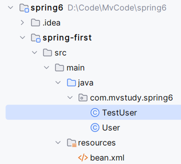

**bean.xml内容**

```xml
<?xml version="1.0" encoding="UTF-8"?>
<beans xmlns="http://www.springframework.org/schema/beans"
       xmlns:xsi="http://www.w3.org/2001/XMLSchema-instance"
       xsi:schemaLocation="http://www.springframework.org/schema/beans http://www.springframework.org/schema/beans/spring-beans.xsd">

    <bean id="user" class="com.mvstudy.spring6.User"></bean>
</beans>
```

# IoC容器

Inversion of Control，使用IoC容器来管理所有Java对象的实例化和初始化，控制对象与对象之间的依赖关系。这是一种设计思想并非技术。

实现方法：依赖注入

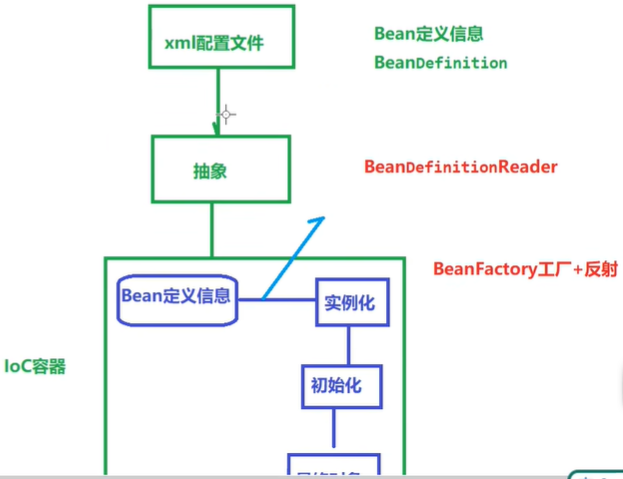

## BeanFactory容器

功能：为依赖注入（DI）提供支持。在资源宝贵的移动设备或者基于 applet 的应用当中， BeanFactory 会被优先选择。否则，一般使用的是 ApplicationContext。

```java
package com.mvstudy.spring6;

public class User {
    public int add(int a, int b) {
        return a+b;
    }

    public static void main(String[] args) {
        User user = new User();
        System.out.println(user.add(4,7));
    }
}
```

```java
package com.mvstudy.spring6;

import org.springframework.beans.factory.InitializingBean;
import org.springframework.beans.factory.xml.XmlBeanFactory;
import org.springframework.core.io.ClassPathResource;

public class TestUser {
    @Test
    public void testUserObject() {
        // 加载spring配置文件
        XmlBeanFactory factory = new XmlBeanFactory(new ClassPathResource("bean.xml"));
        // 获取实例
        User user = (User)factory.getBean("user");
    }
}
```

- `XmlBeanFactory factory = new XmlBeanFactory(new ClassPathResource("bean.xml"))`加载配置文件
- `User user = (User)factory.getBean("user");`获取实例

## ApplicationContext容器

容器中存放bean对象，使用map集合。加载配置文件中定义的bean，将所有bean集中在一起（以map的数据结构），当有请求的时候分配bean。

- **`FileStstemXmlApplicationContext`**：从 XML 文件中加载已被定义的 bean。需要提供给构造器 XML 文件的完整路径
- **`ClassPathXmlApplicationContext`**：从 XML 文件中加载已被定义的 bean。不需要提供 XML 文件的完整路径，只需正确配置 CLASSPATH 环境变量即可，因为容器会从 CLASSPATH 中搜索 bean 配置文件。
- **`WebXmlApplicationContext`**：在一个 web 应用程序的范围内加载在 XML 文件中已被定义的 bean。

```java
package com.mvstudy.spring6;

import org.junit.jupiter.api.Test;
import org.springframework.context.ApplicationContext;
import org.springframework.context.support.ClassPathXmlApplicationContext;

public class TestUser {
    @Test
    public void testUserObject() {
        // 加载spring配置文件
        ApplicationContext context =
                new ClassPathXmlApplicationContext("bean.xml");
        User user = (User)context.getBean("user");
        System.out.println(user.toString());
        System.out.println("3 + 5 = " + user.add(3, 5));
    }
}
```

```java
package com.mvstudy.spring6;

public class User {
    public int add(int a, int b) {
        return a+b;
    }

    public static void main(String[] args) {
        User user = new User();
        System.out.println(user.add(4,7));
    }
}
```


# Bean

bean 是一个被实例化，组装，并通过 Spring IoC 容器所管理的对象。这些 bean 是由用容器提供的配置元数据创建的

- 如何创建一个bean
- bean 的生命周期的详细信息
- bean 的依赖关系

这些所有的配置元数据转换成一组构成每个bean。bean的属性：

| 属性                     | 描述                                                         |
| :----------------------- | :----------------------------------------------------------- |
| class                    | 这个属性是强制性的，并且指定用来创建 bean 的 bean 类。       |
| name                     | 这个属性指定唯一的 bean 标识符。在基于 XML 的配置元数据中，你可以使用 ID 和/或 name 属性来指定 bean 标识符。 |
| scope                    | 这个属性指定由特定的 bean 定义创建的对象的作用域，它将会在 bean 作用域的章节中进行讨论。 |
| constructor-arg          | 它是用来注入依赖关系的，并会在接下来的章节中进行讨论。       |
| properties               | 它是用来注入依赖关系的，并会在接下来的章节中进行讨论。       |
| autowiring mode          | 它是用来注入依赖关系的，并会在接下来的章节中进行讨论。       |
| lazy-initialization mode | 延迟初始化的 bean 告诉 IoC 容器在它第一次被请求时，而不是在启动时去创建一个 bean 实例。 |
| initialization 方法      | 在 bean 的所有必需的属性被容器设置之后，调用回调方法。它将会在 bean 的生命周期章节中进行讨论。 |
| destruction 方法         | 当包含该bean的容器被销毁时，使用回调方法。                   |

## Spring配置元数据

把配置元数据提供给Spring容器的方法：

- 基于XML的配置文件
- 基于注解的配置
- 基于Java的配置

基于 XML 配置文件的例子，这个配置文件中有不同的 bean 定义，包括延迟初始化，初始化方法和销毁方法：

```xml
<?xml version="1.0" encoding="UTF-8"?>
 
<beans xmlns="http://www.springframework.org/schema/beans"
    xmlns:xsi="http://www.w3.org/2001/XMLSchema-instance"
    xsi:schemaLocation="http://www.springframework.org/schema/beans
    http://www.springframework.org/schema/beans/spring-beans-3.0.xsd">

	<!-- A simple bean definition -->
   <bean id="..." class="...">
       <!-- collaborators and configuration for this bean go here -->
   </bean>
 
   <!-- A bean definition with 延迟初始化 set on -->
   <bean id="..." class="..." lazy-init="true">
       <!-- collaborators and configuration for this bean go here -->
   </bean>
 
   <!-- A bean definition with 舒适化方法 method -->
   <bean id="..." class="..." init-method="...">
       <!-- collaborators and configuration for this bean go here -->
   </bean>
 
   <!-- A bean definition with 销毁方法 method -->
   <bean id="..." class="..." destroy-method="...">
       <!-- collaborators and configuration for this bean go here -->
   </bean>
 
   <!-- more bean definitions go here -->
 
</beans>
```

## Bean的作用域

| 作用域           | 描述                                                         |
| :--------------- | :----------------------------------------------------------- |
| `singleton`      | 该作用域将 bean 的定义的限制在每一个 Spring IoC 容器中的一个单一实例(默认)。 |
| `prototype`      | 该作用域将单一 bean 的定义限制在任意数量的对象实例。         |
| `request`        | 该作用域将 bean 的定义限制为 HTTP 请求。只在 web-aware Spring ApplicationContext 的上下文中有效。 |
| `session`        | 该作用域将 bean 的定义限制为 HTTP 会话。 只在web-aware Spring ApplicationContext的上下文中有效。 |
| `global-session` | 该作用域将 bean 的定义限制为全局 HTTP 会话。只在 web-aware Spring ApplicationContext 的上下文中有效。 |

### singleton 作用域

刚好创建一个由该 bean 定义的对象的实例。该单一实例将存储在这种单例 bean 的高速缓存中，以及针对该 bean 的**所有后续的请求和引用都返回缓存对象**。相当于是个**单例**

<small>Beans.xml</small>
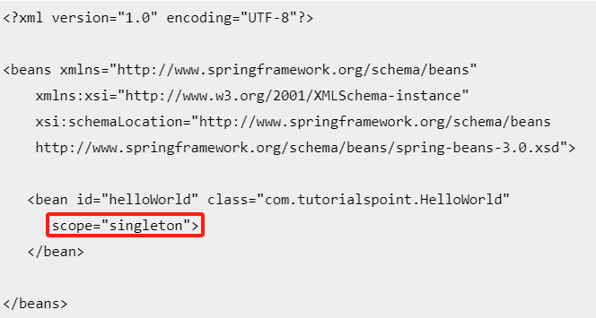

<small>MainApp.java</small>
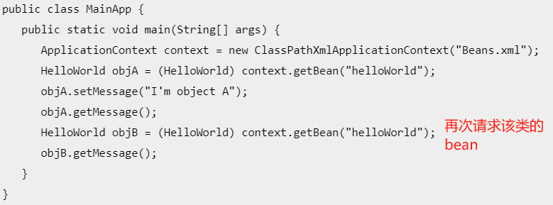

<small>HelloWorld.java</small>
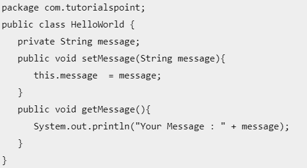

<small>输出结果：</small>


在main中请求了两次该类的bean，且只有第一次设置了其中的属性，但是返回的是属性相同的对象。

### prototype 作用域

如果作用域设置为 prototype，那么每次特定的 bean 发出请求时 Spring IoC 容器就创建对象的新的 Bean 实例。一般，满状态的 bean 使用 prototype 作用域和没有状态的 bean 使用 singleton 作用域。

```xml
<bean id="..." class="..." scope="prototype">
   <!-- collaborators and configuration for this bean go here -->
</bean>
```

## Bean 的生命周期

当一个 bean 被实例化时，它可能需要执行一些初始化使它转换成可用状态。同样，当 bean 不再需要，并且从容器中移除时，可能需要做一些清除工作。

- **`init-method`**：指定一个方法，实例化 bean 时，立即调用该方法
- **`destroy_method`**：指定一个方法，只有在从容器中一处bean时才能调用该方法

### 初始化回调

在基于 XML 的配置元数据的情况下，可以使用 **init-method** 属性来指定带有 void 无参数方法的名称。

<small>User.java</small>

```java
public class User {
    public int add(int a, int b) {
        return a+b;
    }
    public void init() {
        System.out.println("哎嗨嗨，鸡汤来罗");
    }
}
```

<small>TestUser.java</small>

```java
public class TestUser {
    @Test
    public void testUserObject() {
        // 加载spring配置文件
        ApplicationContext context =
                new ClassPathXmlApplicationContext("bean.xml");
        User user = (User)context.getBean("user");
        System.out.println(user.toString());
        System.out.println("3 + 5 = " + user.add(3, 5));
        User user1 = (User)context.getBean("user");
        System.out.println(user1.toString());
    }
}
```

<small>bean.xml</small>
`<bean id="user" class="com.mvstudy.spring6.User" init-method="init" scope="prototype"></bean>`

prototype作用域下每次请求User对象时都会调用其初始化回调，并且返回新的对象；
singleton作用域下只有第一次请求User对象时会创建对象并调用其初始化回调，返回的还是第一次请求时创建的对象。

### 销毁回调

在基于 XML 的配置元数据的情况下，你可以使用 **destroy-method** 属性来指定带有 void 无参数方法的名称。

在非 web 应用程序环境中使用 Spring 的 IoC 容器，如在丰富的客户端桌面环境中，那么在 JVM 中你要注册关闭 hook。这样做可以确保正常关闭，为了让所有的资源都被释放，可以在单个 beans 上调用 destroy 方法。

`AbstractApplicationContext`类的索引指向容器，调用`.registerShutdownHook()`即释放容器，此时即会调用销毁回调。

<u>释放容器之后创建出来的对象没有被释放，仍可继续使用</u>

### 默认的初始化和销毁方法

如果有太多具有相同名称的初始化或者销毁方法的 Bean，那么不需要在每一个 bean 上声明**初始化方法** 和**销毁方法** 。框架使用元素中的 **default-init-method** 和 **default-destroy-method** 属性提供了灵活地配置这种情况

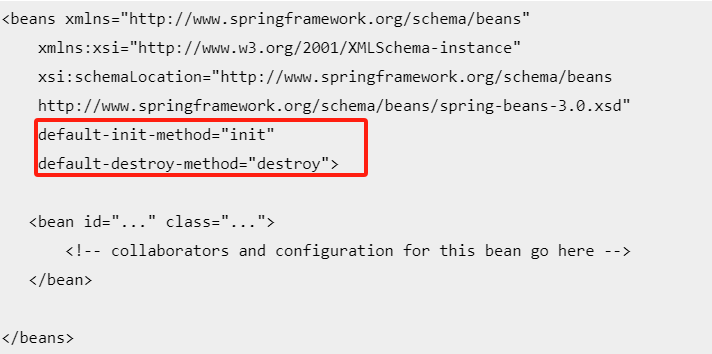

## Bean 后置处理器

Bean后置处理器（Bean Post-Processor）是Spring框架中的一个扩展点，它允许开发者在Bean初始化前后进行自定义的处理。具体来说，Bean后置处理器的作用主要体现在以下几个方面：

1. **初始化前后的自定义处理**：Bean后置处理器可以在Spring容器初始化Bean的前后进行拦截，从而执行一些自定义的逻辑。例如，可以在Bean初始化之前进行一些安全检查，或者在初始化之后进行一些额外的配置。
2. **属性的动态修改**：通过Bean后置处理器，可以在运行时动态地修改Bean的属性。这在某些情况下非常有用，比如当需要根据环境变化调整Bean的配置时。
3. **依赖关系的检查**：Bean后置处理器可以用来检查Bean之间的依赖关系是否正确，确保所有的依赖都已经满足。
4. **性能监控**：可以在Bean后置处理器中添加代码来监控Bean的初始化时间，从而对Spring容器的性能进行分析。
5. **自定义初始化方法**：虽然Spring提供了`@PostConstruct`注解来指定Bean的初始化方法，但是Bean后置处理器提供了一种更为灵活的方式来自定义初始化逻辑。
6. **Bean的替换**：在某些特殊情况下，可能需要用一个自定义的Bean来替换掉容器中的某个Bean，Bean后置处理器可以在Bean初始化后进行这种替换。

BeanPostProcessor 可以对 bean（或对象）实例进行操作，这意味着 Spring IoC 容器实例化一个 bean 实例，然后 BeanPostProcessor 接口进行它们的工作。

要实现一个Bean后置处理器，需要实现`org.springframework.beans.factory.config.BeanPostProcessor`接口，并重写其中的`postProcessBeforeInitialization`和`postProcessAfterInitialization`方法。然后，通过将实现类注册为Spring容器中的Bean，Spring容器在启动时会自动检测并应用这些后置处理器。

- `postProcessBeforeInitialization`：在初始化之前执行
- `postProcessAfterInitialization`：在初始化之后执行

**ApplicationContext** 会自动检测由 **BeanPostProcessor** 接口的实现定义的 bean，注册这些 bean 为后置处理器，然后通过在容器中创建 bean，在适当的时候调用它。

User.java

```java
package com.mvstudy.spring6;

public class User {
    private String massage;

    public void setMassage(String massage) {
        this.massage = massage;
    }

    public String getMassage() {
        return massage;
    }

    public void init() {
        System.out.println("诶嘿嘿，鸡汤来咯");
    }

    public void destroy() {
        System.out.println("都得死");
    }
}
```

InitUser.java

```java
package com.mvstudy.spring6;

import org.springframework.beans.BeansException;
import org.springframework.beans.factory.config.BeanPostProcessor;

public class InitUser implements BeanPostProcessor {
    @Override
    public Object postProcessBeforeInitialization(Object bean, String beanName) throws BeansException {
        System.out.println("BeforeInitialization: " + beanName);
        return bean;
    }

    @Override
    public Object postProcessAfterInitialization(Object bean, String beanName) throws BeansException{
        System.out.println("AfterInitialization: " + beanName);
        return bean;
    }
}
```

TestUser.java

```java
package com.mvstudy.spring6;

import org.junit.jupiter.api.Test;
import org.springframework.context.ApplicationContext;
import org.springframework.context.support.AbstractApplicationContext;
import org.springframework.context.support.ClassPathXmlApplicationContext;

public class TestUser {
    @Test
    public void testUserObject() {
        AbstractApplicationContext context =
                new ClassPathXmlApplicationContext("bean.xml");
        User user = (User)context.getBean("user");
        System.out.println(user.getMassage());
        context.registerShutdownHook();
    }
}
```

运行结果：
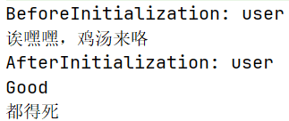

## Bean 定义继承

bean 定义可以包含很多的配置信息，包括构造函数的参数，属性值，容器的具体信息例如初始化方法，静态工厂方法名，等等。

子 bean 的定义继承父定义的配置数据。子定义可以根据需要重写一些值，或者添加其他值。

Spring Bean 定义的继承与 Java 类的继承**无关**，但是继承的概念是一样的。可以定义一个父 bean 的定义作为模板，其他子 bean 就可以从父 bean 中继承所需的配置。

当使用基于 XML 的配置元数据时，通过使用父属性，指定父 bean 作为该属性的值来表明子 bean 的定义。

bean.xml

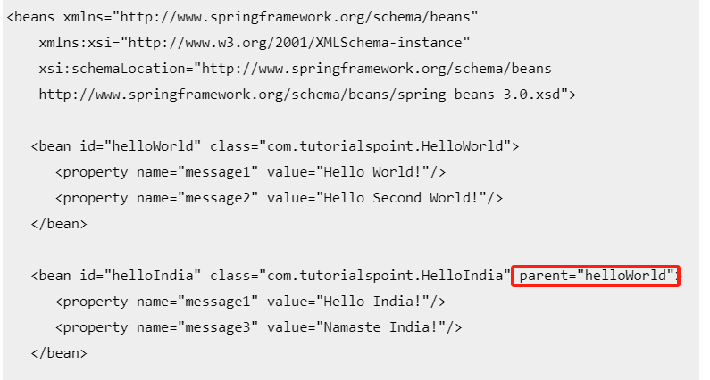

HelloWorld.java

```java
package com.tutorialspoint;
public class HelloWorld {
   private String message1;
   private String message2;
   public void setMessage1(String message){
      this.message1  = message;
   }
   public void setMessage2(String message){
      this.message2  = message;
   }
   public void getMessage1(){
      System.out.println("World Message1 : " + message1);
   }
   public void getMessage2(){
      System.out.println("World Message2 : " + message2);
   }
}
```

HelloIndia.java，值得注意的是这里的java定义中并没有继承关系

```java
package com.tutorialspoint;
 
public class HelloIndia {
   private String message1;
   private String message2;
   private String message3;
 
   public void setMessage1(String message){
      this.message1  = message;
   }
 
   public void setMessage2(String message){
      this.message2  = message;
   }
 
   public void setMessage3(String message){
      this.message3  = message;
   }
 
   public void getMessage1(){
      System.out.println("India Message1 : " + message1);
   }
 
   public void getMessage2(){
      System.out.println("India Message2 : " + message2);
   }
 
   public void getMessage3(){
      System.out.println("India Message3 : " + message3);
   }
}
```

MainApp.java

```java
package com.tutorialspoint;
 
import org.springframework.context.ApplicationContext;
import org.springframework.context.support.ClassPathXmlApplicationContext;
 
public class MainApp {
   public static void main(String[] args) {
      ApplicationContext context = new ClassPathXmlApplicationContext("Beans.xml");
 
      HelloWorld objA = (HelloWorld) context.getBean("helloWorld");
 
      objA.getMessage1();
      objA.getMessage2();
 
      HelloIndia objB = (HelloIndia) context.getBean("helloIndia");
      objB.getMessage1();
      objB.getMessage2();
      objB.getMessage3();
   }
}
```

运行结果：

```
World Message1 : Hello World!
World Message2 : Hello Second World!

India Message1 : Hello India!
India Message2 : Hello Second World!
India Message3 : Namaste India!
```

也就是说在java类的层面上两个类并不存在继承关系，只是具有部分相同的属性。

## Bean 定义模板

可以创建一个 Bean 定义模板，不需要花太多功夫它就可以被其他子 bean 定义使用。在定义一个 Bean 定义模板时，不需要指定**类**的属性，而应该指定值为 **true** 的**抽象**属性即**abstract**，如下：

```
<bean id="beanTeamplate" abstract="true">
	<property name="message1" value="Hello World!"/>
	<property name="message2" value="Hello Second World!"/>
	<property name="message3" value="Namaste India!"/>
</bean>
 
<bean id="helloIndia" class="com.tutorialspoint.HelloIndia" parent="beanTeamplate">
	<property name="message1" value="Hello India!"/>
	<property name="message3" value="Namaste India!"/>
</bean>
```

父 bean 自身**不能被实例化**，因为它是不完整的，而且它也被明确地标记为抽象的。当一个定义是抽象的，它仅仅作为一个纯粹的模板 bean 定义来使用的，充当子定义的父定义使用。


# 依赖注入

依赖注入（Dependency Injection，简称DI）是一种设计模式，用于解决软件组件之间的耦合问题。在依赖注入的核心思想中，不再由组件自身在内部创建或查找其所依赖的其他组件（也就是依赖），而是通过外部容器或框架在创建组件时注入所需的依赖。这样做的目的是为了降低组件间的耦合度，提高组件的可重用性和可测试性，从而促进代码的模块化。

**依赖**：

```java
public class TextEditor {
   private SpellChecker spellChecker;  
   public TextEditor() {
      spellChecker = new SpellChecker();
   }
}
```

这个示例代码就相当于创建了一个TextEditor和SpellChecker的依赖关系。

依赖注入主要包含以下几个**要素**：

1. **依赖**：指一个类（或组件）需要另一个类（或组件）来完成其功能。
2. **注入**：指依赖关系不是在类内部创建或查找，而是由外部容器（如Spring框架）在创建类实例时提供。
3. **容器**：负责管理对象的生命周期和依赖关系的外部系统，它负责创建对象实例并注入依赖。

依赖注入的**实现方式**主要有以下几种：

1. **构造器注入**：通过类的构造器传入依赖项，是最推荐的注入方式，因为它保证了依赖项的不可变性和必要性。
2. **Setter注入**：通过类的Setter方法或公共属性设置依赖项，这种方式允许可选的依赖项和运行时更改。
3. **接口注入**：通过实现特定的注入接口，如Spring框架中的`ApplicationContextAware`，容器通过调用接口方法注入依赖项。
4. **注解注入**：使用特定的注解（如Spring的`@Autowired`）来标记依赖项，容器根据注解自动注入。

**依赖注入的意义**

1. **降低耦合**：组件不需要知道如何创建或查找其依赖项，因此可以减少组件间的直接依赖。
2. **提高可测试性**：由于依赖项是通过外部注入的，可以很容易地替换为Mock对象，便于进行单元测试。
3. **增强灵活性**：通过改变注入的依赖项，可以轻松地改变组件的行为，而无需修改组件的代码。
4. **促进模块化**：组件更加关注自身的职责，而不是依赖项的管理，从而使得软件系统更加模块化。
5. **便于维护和扩展**：当系统需要变更或扩展时，依赖注入使得修改更加简单，因为依赖关系的变更通常只需要在容器配置中进行。

| 依赖注入类型                             | 描述                                                         |
| ---------------------------------------- | ------------------------------------------------------------ |
| `Constructor-based dependency injection` | 当容器调用带有多个参数的构造函数类时，实现基于构造函数的 DI，每个代表在其他类中的一个依赖关系。 |
| `Setter-based dependency injection`      | 通过在调用无参数的构造函数或无参数的静态工厂方法实例化 bean 之后容器调用 beans 的 setter 方法来实现. |

使用有强制性依存关系的构造函数和有可选依赖关系的 setter 是一个好的做法。

## Spring 基于构造器的依赖注入

TextEditor.java

```java  
package com.tutorialspoint;
public class TextEditor {
   private SpellChecker spellChecker;
   public TextEditor(SpellChecker spellChecker) {
      System.out.println("Inside TextEditor constructor." );
      this.spellChecker = spellChecker;
   }
   public void spellCheck() {
      spellChecker.checkSpelling();
   }
}
```

SpellChecker.java

```java
package com.totoriaspoint;
public class SpellChecker {
    public SpellChecker(){
      System.out.println("Inside SpellChecker constructor." );
   }
   public void checkSpelling() {
      System.out.println("Inside checkSpelling." );
   } 
}
```

MainApp.java

```java
package com.tutorialspoint;
import org.springframework.context.ApplicationContext;
import org.springframework.context.support.ClassPathXmlApplicationContext;
public class MainApp {
   public static void main(String[] args) {
      ApplicationContext context = 
             new ClassPathXmlApplicationContext("Beans.xml");
      TextEditor te = (TextEditor) context.getBean("textEditor");
      te.spellCheck();
   }
}
```

Beans.xml
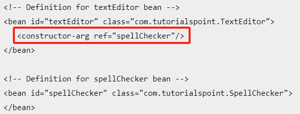

### 构造器参数解析

1. 如果存在不止一个参数时，当把参数传递给构造函数时，可能会存在歧义。
   比如，对于这个类：

```java
package x.y;
public class Foo {
   public Foo(Bar bar, Baz baz) {
      // ...
   }
}
```

这样的配置文件可以工作顺利：
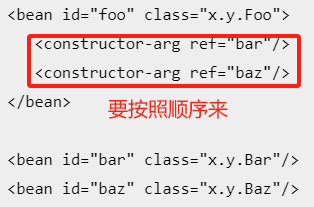

2. 有时需要传递给构造器不同类型的位置时。比如对于这个类：

```java
package x.y;
public class Foo {
   public Foo(int year, String name) {
      // ...
   }
}
```

使用 type 属性显式的指定了构造函数参数的类型，容器也可以使用与**简单类型**匹配的类型。如：
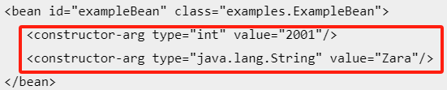

3. 使用 index 属性可以显式的指定构造函数参数的索引，如：
   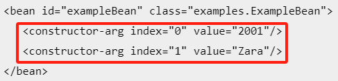

使用 **ref **属性可以向 bean 传递一个引用
使用 **type、value** 可以向 bean 可以进行直接值传递

这个方法相当于是在配置文件中向类的构造器传入参数。

## Spring 基于设值函数的依赖注入

当容器调用一个无参的构造函数或一个无参的静态 factory 方法来初始化 bean 后，通过容器在 bean 上调用设值函数，基于设值函数的 DI 就完成了。

**示例**：

TextEditor.java

```java
package com.tutorialspoint;
public class TextEditor {
   private SpellChecker spellChecker;
   // a setter method to inject the dependency.
   public void setSpellChecker(SpellChecker spellChecker) {
      System.out.println("Inside setSpellChecker." );
      this.spellChecker = spellChecker;
   }
   // a getter method to return spellChecker
   public SpellChecker getSpellChecker() {
      return spellChecker;
   }
   public void spellCheck() {
      spellChecker.checkSpelling();
   }
}
```

SpellChecker.java

```java
package com.tutorialspoint;
public class SpellChecker {
   public SpellChecker(){
      System.out.println("Inside SpellChecker constructor." );
   }
   public void checkSpelling() {
      System.out.println("Inside checkSpelling." );
   }  
}
```

MainApp.java

```java
package com.tutorialspoint;
import org.springframework.context.ApplicationContext;
import org.springframework.context.support.ClassPathXmlApplicationContext;
public class MainApp {
   public static void main(String[] args) {
      ApplicationContext context = 
             new ClassPathXmlApplicationContext("Beans.xml");
      TextEditor te = (TextEditor) context.getBean("textEditor");
      te.spellCheck();
   }
}
```

Beans.xml
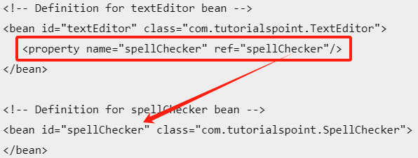

这个方式相当于是在配置文件中直接给类的属性赋值。

### 使用 p-namespace 实现 xml 配置

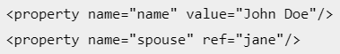
经过简化后↓
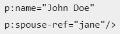

如果这个属性不是一个直接的值而是另一个bean的引用则需要使用 **-ref**

## 注入内部 Beans

Java 内部类是在其他类的范围内被定义的，同理，**inner beans** 是在其他 bean 的范围内定义的 bean。因此 元素内 元素被称为内部bean

```xml
<bean id="outerBean" class="...">
	<property name="target">
		<bean id="innerBean" class="..."/>
	</property>
</bean>
```

TextEditor.java

```java
package com.tutorialspoint;
public class TextEditor {
   private SpellChecker spellChecker;
   // a setter method to inject the dependency.
   public void setSpellChecker(SpellChecker spellChecker) {
      System.out.println("Inside setSpellChecker." );
      this.spellChecker = spellChecker;
   }  
   // a getter method to return spellChecker
   public SpellChecker getSpellChecker() {
      return spellChecker;
   }
   public void spellCheck() {
      spellChecker.checkSpelling();
   }
}
```

```xml
<bean id="textEditor" class="com.tutorialspoint.TextEditor">
	<property name="spellChecker">
		<bean id="spellChecker" class="com.tutorialspoint.SpellChecker"/>
	</property>
</bean>
```

由此可见，其实在java层面，并不是内部类的定义方式。

## 注入集合

如果你想传递多个值，如 Java Collection 类型 List、Set、Map 和 Properties 就需要用到注入集合。

| 元素      | 描述                                                        |
| :-------- | :---------------------------------------------------------- |
| `<list>`  | 它有助于连线，如注入一列值，允许重复。                      |
| `<set>`   | 它有助于连线一组值，但不能重复。                            |
| `<map>`   | 它可以用来注入名称-值对的集合，其中名称和值可以是任何类型。 |
| `<props>` | 它可以用来注入名称-值对的集合，其中名称和值都是字符串类型。 |

Beans.xml

```java
<!-- results in a setAddressList(java.util.List) call -->
      <property name="addressList">
         <list>
            <value>INDIA</value>
            <value>Pakistan</value>
            <value>USA</value>
            <value>USA</value>
         </list>
      </property>
 
      <!-- results in a setAddressSet(java.util.Set) call -->
      <property name="addressSet">
         <set>
            <value>INDIA</value>
            <value>Pakistan</value>
            <value>USA</value>
            <value>USA</value>
        </set>
      </property>
 
      <!-- results in a setAddressMap(java.util.Map) call -->
      <property name="addressMap">
         <map>
            <entry key="1" value="INDIA"/>
            <entry key="2" value="Pakistan"/>
            <entry key="3" value="USA"/>
            <entry key="4" value="USA"/>
         </map>
      </property>
 
      <!-- results in a setAddressProp(java.util.Properties) call -->
      <property name="addressProp">
         <props>
            <prop key="one">INDIA</prop>
            <prop key="two">Pakistan</prop>
            <prop key="three">USA</prop>
            <prop key="four">USA</prop>
         </props>
      </property>
 
   </bean>
 
</beans>
```

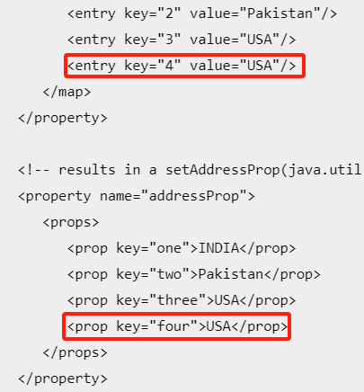

MainApp.java

```java
public class MainApp {
   public static void main(String[] args) {
      ApplicationContext context = 
             new ClassPathXmlApplicationContext("Beans.xml");
      JavaCollection jc=(JavaCollection)context.getBean("javaCollection");
      jc.getAddressList();
      jc.getAddressSet();
      jc.getAddressMap();
      jc.getAddressProp();
   }
}
```

JavaCollection.java

```java
public class JavaCollection {
	List addressList;
	Set  addressSet;
	Map  addressMap;
	Properties addressProp;
    public List getAddressList() {
        System.out.print("List Elements :"  + addressList);
        return addressList;
    }
    public Set getAddressSet() {
        System.out.println("Set Elements :"  + addressSet);
        return addressSet;
    }
    public Map getAddressMap() {
        System.out.println("Map Elements :"  + addressMap);
        return addressMap;
	}
    public Properties getAddressProp() {
        System.out.println("Property Elements :"  + addressProp);
        return addressProp;
    }
}
```

运行结果：

```
List Elements :[INDIA, Pakistan, USA, USA]
Set Elements :[INDIA, Pakistan, USA]
Map Elements :{1=INDIA, 2=Pakistan, 3=USA, 4=USA}
Property Elements :{two=Pakistan, one=INDIA, three=USA, four=USA}
```

### 注入bean引用

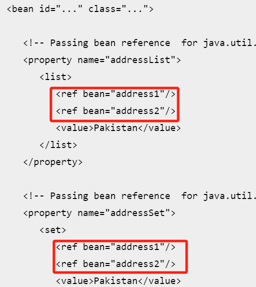

### 注入 null 和空字符串的值

- `<property name="email" value=""/>`：传递一个空字符串作为值
- `<property name="email"><null/></property>`：传递一个NULL值

## Beans 自动装配

允许开发者在不显式编程的情况下自动注入Bean的依赖关系。在 bean 中相关属性为 `auto-wire`

### 自动装配模式

| 模式          | 描述                                                         |
| ------------- | ------------------------------------------------------------ |
| `no`          | 默认的设置，意味着没有自动装配，应该使用显式的 bean 引用来连线 |
| `byName`      | 根据属性名自动装配。Spring容器尝试将其属性与在配置文件中被定义为相同名称的 beans 的属性进行连接。 |
| `byType`      | 根据属性数据类型自动装配。如果属性的类型匹配配置文件中的一个确切的 bean，将会尝试匹配和连接属性的类型。如果不止存在一个这样的 bean，则会抛出异常。 |
| `constructor` | 类似与 `byType` 适用于构造器参数类型。Spring容器会尝试使用与Bean的构造函数参数类型相匹配的已定义Bean来自动装配依赖项。如果配置文件中没有一个构造器参数类型的bean则会抛出错误。 |
| `autodetect`  | 首先尝试根据 `constructor` 使用自动装配，如果不执行的话就使用 `byType` 自动装配 |

当依赖是集合数据类型时，可以使用 **`byType`** 或者 **`constructor`** 自动装配模式来连接。

### 自动装配的局限性

自动装配始终在同一个项目中使用时，它的效果最好。如果通常不使用自动装配，它可能会使开发人员混淆的使用它来连接只有一个或两个 bean 定义。

1. **不确定性**

自动装配可能会引入不确定性，特别是当有多个Bean匹配同一类型时。如果没有明确指定需要装配的Bean，Spring容器可能会选择一个意想不到的Bean，这可能导致应用程序行为不符合预期。

2. **难以追踪和调试**

由于自动装配是在运行时由容器自动完成的，有时候很难追踪和理解哪些Bean被创建以及它们是如何相互关联的。这可能会使得调试和维护变得更加困难。

3. **过度依赖**

自动装配可能导致过度依赖Spring容器，使得组件之间的耦合度增加。这可能会减少组件的可重用性和可测试性，因为它们可能不再能够在没有Spring容器的情况下独立运行。

4. **性能问题**

在某些情况下，自动装配可能会导致性能问题。例如，如果配置了大量自动装配的Bean，容器启动时可能会进行大量的查找和匹配操作，这可能会影响应用程序的启动时间。

5. **配置覆盖**

在`application.properties`或`application.yml`中配置的属性可能会覆盖自动装配的Bean，这可能会导致自动装配的行为不如预期。

6. **限制了硬编码**

虽然自动装配减少了硬编码的需要，但它也限制了对原始类型（如`int`、`long`、`boolean`等）和`String`、`Classes`等进行自动装配的能力。这是因为这些类型的值通常需要特定的处理，而自动装配机制可能无法处理这些情况。

7. **容器中的多个Bean定义**

如果容器中有多个Bean定义，可能需要对`setter`和构造器参数进行类型匹配才能完成依赖注入。对于`array`、`collection`和`map`类型的依赖，这不是问题，但对于单一值的依赖，可能会导致不明确的情况，如果没有唯一的Bean定义，可能会抛出异常。

| 限制         | 描述                                                         |
| ------------ | ------------------------------------------------------------ |
| 重写的可能性 | 可以使用总是重写自动装配的 `<constructor-arg&gt>` 和 `<property>` 设置来指定依赖关系。 |
| 原始数据类型 | 不能自动装配简单类型，比如字符串和类等                       |
| 混乱的本质   | 自动装配不如显式装配精确，所以尽量使用显式装配               |

### byName 自动装配

XML 配置文件中 beans 的 *auto-wire* 属性设置为 *byName*，尝试将它的属性与配置文件中定义为相同名称的 beans 进行匹配和连接。找不到时会报错。

未使用自动装配时：

```xml
<bean id="testEditor" class="x.y.TextEditor">
    <property name="spellChecher" ref="spellchecker" />
    <property name="name" value="Feneric Text Editor" />
</bean>

<bean id="spellChecker" class="x.y.SpellChecker"></bean>
```

使用自动装配 byName ：

```xml
<bean id="testEditor" class="x.y.TextEditor" autowire="byName">
    <property name="name" value="Feneric Text Editor" />
</bean>

<bean id="spellChecker" class="x.y.SpellChecker"></bean>
```

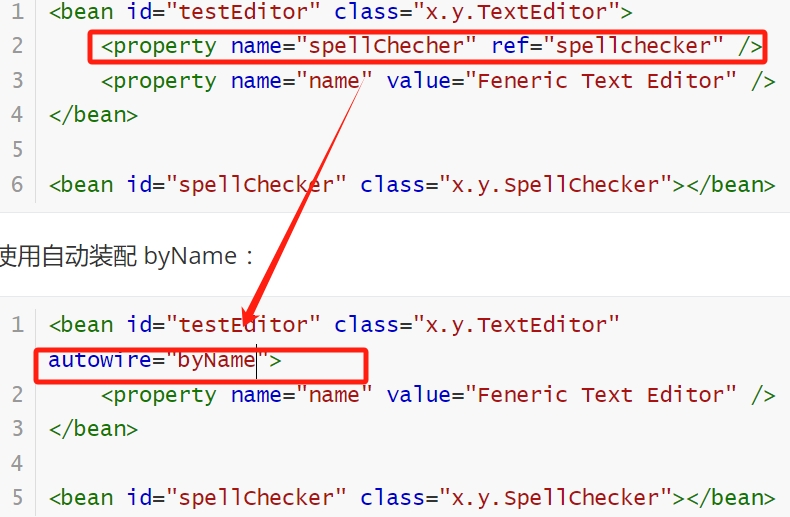

### byType 自动装配

 **type** 恰好与配置文件中 beans 名称中的一个相匹配，它将尝试匹配和连接它的属性。如果找到匹配项，它将注入这些 beans，否则，它将抛出异常。

TextEditor.java

```java
package x.y;
public class TextEditor {
    private String name;
    private SpellChecker spellChecker;
   	// ……
}
```

SpellChecker.java

```java
package x.y;
public class TextEditor {
   	// ……
}
```

Beans.xml

```xml
<bean id="textEditor" class="x.y.TextEditor" auto-wire="byType">
	<property name="name" value="666"/>
</bean>
<bean id="spellChecker" class="x.y.SpellChecker" />
```

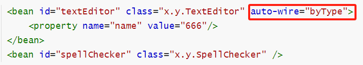

### Spring 由构造器自动装配

与 *byType* 非常相似，但这里的**类型匹配**应用于**构造器参数**。在 XML 配置文件中 bean 的 *autowire* 属性设置为 *constructor* 。然后，它尝试把它的构造函数的参数与配置文件中 beans 名称中的一个进行匹配和连线。如果找到匹配项，它会注入这些 bean，否则，它会抛出异常。

TextEditor.java

```java
package x.y;
public class TextEditor {
    private SpellChecker spellChecker;
	private String name;
	public TextEditor( SpellChecker spellChecker, String name ) {
        this.spellChecker = spellChecker;
        this.name = name;
    }
    // ……
}
```

SpellChecker.java

```java
package x.y;
public class SpellChecker {
    // ……
}
```

未使用自动装配时的配置文件：

```xml
<bean id="textEditor" class="x.y.TextEditor">
	<constructor-arg  ref="spellChecker" />
	<constructor-arg  value="Generic Text Editor"/>
</bean>
<bean id="spellChecker" class="x.y.SpellChecker"></bean>
```

使用根据构造器的自动装配的配置文件：

```xml
<bean id="textEditor" class="com.x.y.TextEditor" autowire="constructor">
    <constructor-arg value="Generic Text Editor"/>
</bean>
<bean id="spellChecker" class="x.y.SpellChecker"></bean>
```

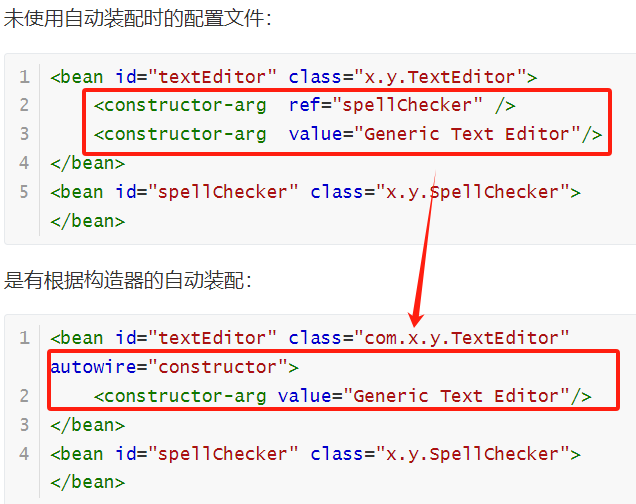


## 基于注解的配置

从 Spring 2.5 开始就可以使用**注解** 来配置依赖注入。而不是采用 XML 来描述一个 bean 连线，你可以使用相关类，方法或字段声明的注解，将 bean 配置移动到组件类本身。

注解连线在默认情况下在 Spring 容器中不打开。因此，在可以使用基于注解的连线之前，需要在 Spring 配置文件中启用。
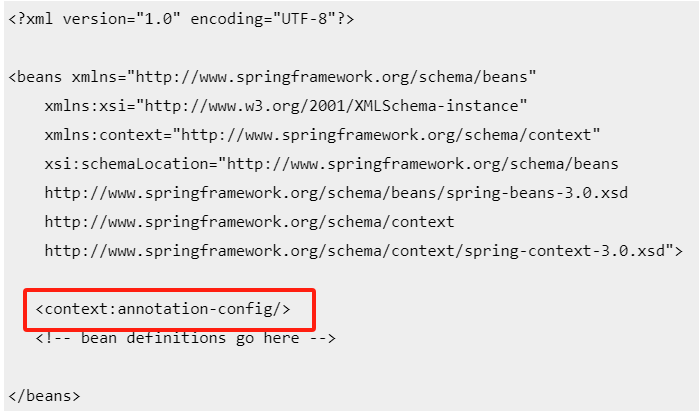

| 注解                 | 描述                                                         |
| -------------------- | ------------------------------------------------------------ |
| `@Require`           | 应用于 bean 属性的 setter 方法                               |
| `@autowired`         | 可应用于：setter方法、非setter方法、构造器、属性             |
| `@qualifier`         | 通过指定确切的将被连线的 bean，@Autowired 和 @Qualifier 注解可以用来删除混乱。 |
| `JSR-250 Annotation` | pring 支持 JSR-250 的基础的注解，其中包括了 @Resource，@PostConstruct 和 @PreDestroy 注解。 |

### @Required 注释

应用于 bean 属性的 setter 方法，它表明受影响的 bean **属性在配置时必须放在 XML 配置文件中**，否则容器就会抛出一个BeanInitializationException 异常。

Student.java

```java
package x.y;
public class Student {
    private Integer age;
    private String name;
    @Required
    public void setAge(Integer age) {
        this.age = age;
    }
    public Integer getAge() {
        return age;
    }
    @Required
    public void setName(String name) {
        this.name = name;
    }
    public String getName() {
        return name;
    }
}
```

Beans.xml

```xml
<bean id="student" class="x.y.Student">
	<property name="name"  value="Zara" />
	<property name="age"  value="11" />
</bean>
```

### @Autowired 注解

对在哪里和如何完成自动连接提供了更多的细微的控制。

可以在 setter 方法中被用于自动连接 bean，就像 @Autowired 注释，容器，一个属性或者任意命名的可能带有多个参数的方法。

#### setter 方法中的 @Autowired

当 Spring遇到一个在 setter 方法中使用的 @Autowired 注释，它会在方法中视图执行 **byType** 自动连接，而在配置文件中不再需要写出。

TextEditor.java

```java
package com.tutorialspoint;
import org.springframework.beans.factory.annotation.Autowired;
public class TextEditor {
	private SpellChecker spellChecker;
	@Autowired
  	public void setSpellChecker( SpellChecker spellChecker ){
    	this.spellChecker = spellChecker;
	}
   	public SpellChecker getSpellChecker( ) {
        return spellChecker;
   	}
   	public void spellCheck() {
    	spellChecker.checkSpelling();
   	}
}
```

Beans.xml

```xml
<bean id="textEditor" class="com.tutorialspoint.TextEditor"></bean>
<!-- 因为会byType自动装配，所以不用些 -->
<bean id="spellChecker" class="com.tutorialspoint.SpellChecker"></bean>
```

#### 属性中的 @Autowired

在属性中使用 **@Autowired** 注释，然后在配置类定义文件中不再需要 setter 方法，Spring 会将这些传递过来的值或者引用自动分配给那些属性。

TextEditor.java

```java
package x.y;
public class TextEditor {
    @Autowired
    private SpellChecker spellChecker;
    public TextEditor() {
        System.out.println("Inside TextEditor constructor." );
    }
    public SpellChecker getSpellChecker() { 
        return spellChecker;
    }
    public void spellCheck(){
      	spellChecker.checkSpelling();
    }
}
```

Beans.xml

```xml
<bean id="textEditor" class="com.tutorialspoint.TextEditor">
</bean>

<!-- 会自动连接，所以在TextEditor中不需要写 -->
<bean id="spellChecker" class="com.tutorialspoint.SpellChecker">
</bean>
```

#### 构造器的 @Autowired

在构造器上注@Autowired后，当创建 bean 时，即使在 XML 文件中没有使用 元素配置 bean ，构造函数也会被自动连接。

TextEditor.java

```java
package x.y;
public class TextEditor {
   	private SpellChecker spellChecker;
  	@Autowired
   	public TextEditor(SpellChecker spellChecker){
      	System.out.println("Inside TextEditor constructor." );
      	this.spellChecker = spellChecker;
   	}
   	public void spellCheck(){
      	spellChecker.checkSpelling();
   	}
}
```

Beans.xml

```xml
<bean id="textEditor" class="com.tutorialspoint.TextEditor"></bean>

<!-- Definition for spellChecker bean -->
<bean id="spellChecker" class="com.tutorialspoint.SpellChecker">
</bean>
```

### @Autowired 的（required=false）选项

默认情况下，@Autowired 注释意味着依赖是必须的，它类似于 @Required 注释，然而，你可以使用 @Autowired 的 **（required=false）** 选项关闭默认行为。

即使你不为 age 属性传递任何参数，下面的示例也会成功运行，但是对于 name 属性则需要一个参数。因为除了只有 Student.java 文件被修改以外，它和 @Required 注释示例是相似的。

```java
package com.tutorialspoint;
import org.springframework.beans.factory.annotation.Autowired;
public class Student {
   	private Integer age;
   	private String name;
   	@Autowired(required=false)
   	public void setAge(Integer age) {
   	   this.age = age;
    }
    public Integer getAge() {
      	return age;
   	}
   	@Autowired
   	public void setName(String name) {
      	this.name = name;
   	}   
   	public String getName() {
      	return name;
   	}
}
```

### @ Qualifier 注解

当创建多个具有相同类型的bean时，并且想要用一个属性只为它们其中的一个进行装配，则可以使用 **@Qualifier** 注释和 **@Autowired** 注释通过指定哪一个真正的 bean 将会被装配来消除混乱。

Student.java

```
package com.tutorialspoint;
public class Student {
   	private Integer age;
   	private String name;
   	public void setAge(Integer age) {
   	   	this.age = age;
   	}   
   	public Integer getAge() {
      	return age;
	}
   	public void setName(String name) {
      	this.name = name;
   	}  
   	public String getName() {
      	return name;
   	}
}
```

Profile.java

```java
package com.tutorialspoint;
import org.springframework.beans.factory.annotation.Autowired;
import org.springframework.beans.factory.annotation.Qualifier;
public class Profile {
   	@Autowired
   	@Qualifier("student1")  // 指定bean
   	private Student student;
   	public Profile(){
      	System.out.println("Inside Profile constructor." );
   	}
   	public void printAge() {
      	System.out.println("Age : " + student.getAge() );
   	}
   	public void printName() {
      	System.out.println("Name : " + student.getName() );
   	}
}
```

Beans.xml

```xml
<context:annotation-config/>
<bean id="profile" class="com.tutorialspoint.Profile"></bean>

<bean id="student1" class="com.tutorialspoint.Student">
    <property name="name"  value="Zara" />
    <property name="age"  value="11"/>
</bean>

<bean id="student2" class="com.tutorialspoint.Student">
    <property name="name"  value="Nuha" />
    <property name="age"  value="2"/>
</bean>
```

### Spring JSR-250 注解

Spring还使用基于 JSR-250 注释，它包括 @PostConstruct， @PreDestroy 和 @Resource 注释

### @PostConstruct 和 @PreDestroy 注释

定义一个 bean 的安装和卸载，我们使用 **init-method** 和/或 **destroy-method** 参数简单的声明一下 。init-method 属性指定了一个方法，该方法在 bean 的实例化阶段会立即被调用。同样地，destroy-method 指定了一个方法，该方法只在一个 bean 从容器中删除之前被调用。

可以使用 **@PostConstruct** 注释作为初始化回调函数的一个替代，**@PreDestroy** 注释作为销毁回调函数的一个替代。

HelloWorld.java

```java
package com.tutorialspoint;
import javax.annotation.*;
public class HelloWorld {
   	private String message;
   	public void setMessage(String message){
      	this.message  = message;
   	}
   	public String getMessage(){
      	System.out.println("Your Message : " + message);
      	return message;
   	}
   	@PostConstruct
   	public void init(){
      	System.out.println("Bean is going through init.");
    }
    @PreDestroy
   	public void destroy(){
      	System.out.println("Bean will destroy now.");
   	}
}
```

Beans.xml

```xml
<context:annotation-config/>

<bean id="helloWorld" 
    class="com.tutorialspoint.HelloWorld"
    init-method="init" destroy-method="destroy">
    <property name="message" value="Hello World!"/>
</bean>
```

#### @ Resource 注解

可以在字段中或者 setter 方法中使用 **@Resource** 注释，它和在 Java EE 5 中的运作是一样的。@Resource 注释使用一个 ‘name’ 属性，该属性以一个 bean 名称的形式被注入。可以说，它遵循 **by-name** 自动连接语义

```java
package com.tutorialspoint;
import javax.annotation.Resource;
public class TextEditor {
   	private SpellChecker spellChecker;
   	@Resource(name= "spellChecker")
   	public void setSpellChecker( SpellChecker spellChecker ){
      	this.spellChecker = spellChecker;
   	}
   	public SpellChecker getSpellChecker(){
      	return spellChecker;
   	}
   	public void spellCheck(){
      	spellChecker.checkSpelling();
   	}
}
```

如果没有明确地指定一个 ‘name’，默认名称源于字段名或者 setter 方法。在字段的情况下，它使用的是字段名；在一个 setter 方法情况下，它使用的是 bean 属性名称。


# 基于 Java 的配置

## @Configuration 和 @Bean 注解

带有 **@Configuration** 的注解类表示这个类可以使用 Spring IoC 容器作为 bean 定义的来源。**@Bean** 注解告诉 Spring，一个带有 @Bean 的注解方法将返回一个对象，该对象应该被注册为在 Spring 应用程序上下文中的 bean。

HelloWorldConfig.java

```java
package com.tutorialspoint;
import org.springframework.context.annotation.*;
@Configuration
public class HelloWorldConfig {
   	@Bean 
   	public HelloWorld helloWorld(){
      	return new HelloWorld();
   	}
}
```

这段代码等同于：

```xml
<beans>
   <bean id="helloWorld" class="com.tutorialspoint.HelloWorld" />
</beans>
```

在这里，**带有 @Bean 注解的方法名称作为 bean 的 ID**，它创建并返回实际的 bean。你的配置类可以声明多个 @Bean。一旦定义了配置类，你就可以使用 *AnnotationConfigApplicationContext* 来加载并把他们提供给 Spring 容器，如：

```java
public static void main(String[] args) {
   	ApplicationContext ctx = 
   	new AnnotationConfigApplicationContext(HelloWorldConfig.class); 
   	HelloWorld helloWorld = ctx.getBean(HelloWorld.class);
   	helloWorld.setMessage("Hello World!");
   	helloWorld.getMessage();
}
```

可以加载各种配置类，如：

```java
public static void main(String[] args) {
   	AnnotationConfigApplicationContext ctx = 
   	new AnnotationConfigApplicationContext();
   	ctx.register(AppConfig.class, OtherConfig.class);
   	ctx.register(AdditionalConfig.class);
   	ctx.refresh();
   	MyService myService = ctx.getBean(MyService.class);
   	myService.doStuff();
}
```

**示例**

HelloWorldConfig.java

```java
package com.tutorialspoint;
import org.springframework.context.annotation.*;
@Configuration
public class HelloWorldConfig {
   	@Bean 
   	public HelloWorld helloWorld(){
   	   	return new HelloWorld();
   	}
}
```

HelloWorld.java

```java
package com.tutorialspoint;
 
public class HelloWorld {
   private String message;
 
   public void setMessage(String message){
      this.message  = message;
   }
 
   public void getMessage(){
      System.out.println("Your Message : " + message);
   }
}
```

## 注入 Bean 的依赖性

当 @Beans 依赖对方时，表达这种依赖性非常简单，只要有一个 bean 方法调用另一个，如下所示：

```java
package com.tutorialspoint;
import org.springframework.context.annotation.*;
@Configuration
public class AppConfig {
   	@Bean
   	public Foo foo() {
       	return new Foo(bar());
   	}
   	@Bean
   	public Bar bar() {
      	return new Bar();
   	}
}
```

## @Import 注解

**@import** 注解允许从另一个配置类中加载 @Bean 定义。考虑 ConfigA 类，如下：

```java
@Configuration
public class ConfigA {
    @Bean
   	public A a() {
      	return new A(); 
   	}
}
```

可在另一个Bean声明中导入上述Bean声明，如下：

```java
@Configuration
@Import(ConfigA.class)
public class ConfigB {
   	@Bean
   	public B a() {
      	return new A(); 
   	}
}
```

然后当实例化上下文对象时，不需要同时指定 ConfigA.class 和 ConfigB.class，只有 ConfigB 类需要提供，如下：

```
public static void main(String[] args) {
   	ApplicationContext ctx = 
   			new AnnotationConfigApplicationContext(ConfigB.class);
   // now both beans A and B will be available...
   	A a = ctx.getBean(A.class);
   	B b = ctx.getBean(B.class);
}
```

## 生命周期回调

@Bean 注解支持指定任意的初始化和销毁的回调方法：

```java
public class Foo {
   	public void init() {
      	// initialization logic
   	}
   	public void cleanup() {
      	// destruction logic
   	}
}
 
@Configuration
public class AppConfig {
   	@Bean(initMethod = "init", destroyMethod = "cleanup" )
   	public Foo foo() {
      	return new Foo();
   	}
}
```

还可以重写带有 @Scope 注解的该方法，设置为并非单实例：

```java
@Configuration
public class AppConfig {
   	@Bean
   	@Scope("prototype")
   	public Foo foo() {
      	return new Foo();
   	}
}
```


# Spring 中的事件处理

 Spring 的核心是 **ApplicationContext** ，它负责管理 beans 的完整生命周期。当加载 beans 时，ApplicationContext 发布某些类型的事件。例如，当上下文启动时，*ContextStartedEvent* 发布，当上下文停止时，*ContextStoppedEvent* 发布。

通过 *ApplicationEvent* 类和 *ApplicationListener* 接口来提供在 *ApplicationContext* 中处理事件。如果一个 bean 实现 *ApplicationListener* ，那么每次 *ApplicationEvent* 被发布到 ApplicationContext 上，那个 bean 会被通知。

Spring 提供的标准事件：

| Spring内置事件          | 描述                                                         |
| ----------------------- | ------------------------------------------------------------ |
| `ContextRefreshedEvent` | *ApplicationContext* 被**初始化或刷新**时，该事件被发布。这也可以在 *ConfigurableApplicationContext* 接口中使用 refresh() 方法来发生。 |
| `ContextStartedEvent`   | 当使用 *ConfigurableApplicationContext* 接口中的 **start()** 方法启动 *ApplicationContext* 时，该事件被发布。<br />可以调查你的数据库，或者在接受到这个事件后重启任何停止的应用程序。 |
| `ContextStoppedEvent`   | 当使用 *ConfigurableApplicationContext* 接口中的 **stop()** 方法停止 *ApplicationContext* 时，发布这个事件。可以在接受到这个事件后做必要的清理的工作。 |
| `ContextClosedEvent`    | 当使用 *ConfigurableApplicationContext* 接口中的 **close()** 方法关闭 *ApplicationContext* 时，该事件被发布。一个已关闭的上下文到达生命周期末端；它不能被刷新或重启。 |
| `RequestHandledEvent`   | 这是一个 web-specific 事件，告诉所有 bean HTTP 请求已经被服务。 |

Spring 的事件处理是单线程的，所以如果一个事件被发布，直至并且除非所有的接收者得到的该消息，该进程被阻塞并且流程将不会继续。因此，如果事件处理被使用，在设计应用程序时应注意。

## 监听上下文事件

一个 bean 应该实现只有一个方法 **onApplicationEvent()** 的 *ApplicationListener* 接口实现上下文的监听。

**示例**

HelloWorld.java

```java
package com.tutorialspoint;
public class HelloWorld {
   	private String message;
   	public void setMessage(String message){
      	this.message  = message;
   	}
    public void getMessage(){
      	System.out.println("Your Message : " + message);
   	}
}
```

CSteartEventHandler.java

```java
package com.tutorialspoint;
import org.springframework.context.ApplicationListener;
import org.springframework.context.event.ContextStartedEvent;
public class CStartEventHandler 
   	implements ApplicationListener<ContextStartedEvent>{
   	public void onApplicationEvent(ContextStartedEvent event) {
      	System.out.println("ContextStartedEvent Received");
   	}
}
```

CStopEventHandle.java

```java
package com.tutorialspoint;
import org.springframework.context.ApplicationListener;
import org.springframework.context.event.ContextStoppedEvent;
public class CStopEventHandler 
   	implements ApplicationListener<ContextStoppedEvent>{
   	public void onApplicationEvent(ContextStoppedEvent event) {
      	System.out.println("ContextStoppedEvent Received");
   	}
}
```

MainApp.java

```java
package com.tutorialspoint;
 
import org.springframework.context.ConfigurableApplicationContext;
import org.springframework.context.support.ClassPathXmlApplicationContext;
 
public class MainApp {
   	public static void main(String[] args) {
      	ConfigurableApplicationContext context = 
      	new ClassPathXmlApplicationContext("Beans.xml");
 
      	// Let us raise a start event.
      	context.start();
 
      	HelloWorld obj = (HelloWorld) context.getBean("helloWorld");
 
      	obj.getMessage();
 
      	// Let us raise a stop event.
      	context.stop();
   	}
}
```

Beans.xml

```xml
<bean id="helloWorld" class="com.tutorialspoint.HelloWorld">
	<property name="message" value="Hello World!"/>
</bean>
 
<bean id="cStartEventHandler" 
		class="com.tutorialspoint.CStartEventHandler"/>
 
<bean id="cStopEventHandler" 
        class="com.tutorialspoint.CStopEventHandler"/>
```

输出：

```
ContextStartedEvent Received
Your Message : Hello World!
ContextStoppedEvent Received
```


## 自定义事件

所有事件都是 ApplicationEvent 的子类，可以通过扩展 ApplicationEvent 创建自定义的事件类，这个类必须定义一个默认的构造器，当然可以委托构造。

定义事件类后可以从任何类中发布。

**示例**

CustomEvent.java

```java
package com.tutorialspoint;
public class CustomEvent extends ApplicationEvent{
	public CustomEvent(Object source) {
      	super(source);
   	}
   	public String toString(){
      	return "My Custom Event";
   	}
}
```

CustomEventPublisher.java

```java
package com.tutorialspoint;
public class CustomEventPublisher 
   	implements ApplicationEventPublisherAware {
   	private ApplicationEventPublisher publisher;
   	public void setApplicationEventPublisher
    		(ApplicationEventPublisher publisher){
      	this.publisher = publisher;
   	}
   	public void publish() {
      	CustomEvent ce = new CustomEvent(this);
      	publisher.publishEvent(ce);
   	}
}
```

CustomEventHandler.java

```java
package com.tutorialspoint;
import org.springframework.context.ApplicationListener;
public class CustomEventHandler 
   	implements ApplicationListener<CustomEvent>{
   	public void onApplicationEvent(CustomEvent event) {
      	System.out.println(event.toString());
   	}
}
```

MainApp.java

```java
package com.tutorialspoint;
import org.springframework.context.ConfigurableApplicationContext;
import org.springframework.context.support.ClassPathXmlApplicationContext;
public class MainApp {
   	public static void main(String[] args) {
      	ConfigurableApplicationContext context = 
      	new ClassPathXmlApplicationContext("Beans.xml");      
      	CustomEventPublisher cvp = 
      			(CustomEventPublisher) context.getBean("customEventPublisher");
      	cvp.publish();  
      	cvp.publish();
   	}
}
```

Beans.xml

```xml
<bean id="customEventHandler" 
	class="com.tutorialspoint.CustomEventHandler"/>
 
<bean id="customEventPublisher" 
	class="com.tutorialspoint.CustomEventPublisher"/>
```


# Spring 框架的 AOP

Spring 框架的一个关键组件是**面向方面的编程** (AOP)框架。面向方面的编程需要把程序逻辑分解成不同的部分称为所谓的关注点。跨一个应用程序的多个点的功能被称为**横切关注点** ，这些横切关注点在概念上独立于应用程序的业务逻辑。有各种各样的常见的很好的方面的例子，如日志记录、审计、声明式事务、安全性和缓存等。

在 OOP 中，关键单元模块度是类，而在 AOP 中单元模块度是方面。依赖注入帮助你对应用程序对象相互解耦和，AOP 可以帮助你从它们所影响的对象中对横切关注点解耦。

**AOP术语**

| 项目            | 描述                                                         |
| --------------- | ------------------------------------------------------------ |
| `Aspect`        | 一种特殊的类，定义了横切关注点的模块化。主要作用是将系统中的横切关注点（cross-cutting concerns）与业务逻辑分离开来，使得这些关注点可以被集中管理和重用。 |
| `Join point`    | 横切关注点（cross-cutting concern）可能发生的地方。          |
| `Advice`        | Advice（通知）是指与特定Join Point（连接点）相关联的行为。   |
| `Pointcut`      | Pointcut（切点）是对程序执行的特定位置的描述，它定义了Advice（通知）应该在何处执行。Pointcut使得AOP框架能够识别并定位到特定的Join Point（连接点），从而在这些点上应用相应的Advice。 |
| `Introduction`  | Introduction（引入）是一种高级特性，它允许开发者在不修改现有类代码的情况下，为这些类引入新的方法和属性。这种机制是通过代理实现的，即创建一个目标类的代理，这个代理可以在不改变原有方法和属性的基础上，增加新的方法和属性。 |
| `Target object` | Target Object（目标对象）是指那些被一个或多个切面（Aspect）所通知（Advice）的对象。是AOP代理机制中的核心对象，它是被代理的原始对象，也就是最终执行业务逻辑的实体。 |
| `Weaving`       | 将切面（Aspect）与目标对象（Target Object）结合起来，创建一个被增强过的对象（即代理对象）。在这个过程中，切面的Advice（通知）会被应用到目标对象的Join Point（连接点）上，从而实现横切关注点的模块化管理和动态行为的插入。 |

**通知的类型**

| 通知类型                         | 描述                                   |
| -------------------------------- | -------------------------------------- |
| 前置通知aop:before               | 一个方法执行之前执行通知               |
| 后置通知aop:after                | 一个方法执行之后不考虑其结果执行通知   |
| 返回后通知aop:after-returning    | 一个方法执行成功完成时执行通知         |
| 抛出异常后通知aop:after-throwing | 在一个方法执行之后抛出异常时才执行通知 |
| 环绕通知aop:around               | 在建议方法调用之前之后都执行通知       |

## 自定义切面

Spring 支持 **@AspectJ annotation style** 的方法和**基于模式** 的方法来实现自定义方面

| 方法             | 描述                                                         |
| :--------------- | :----------------------------------------------------------- |
| XML Schema based | 方面是使用常规类以及基于配置的 XML 来实现的。                |
| @AspectJ based   | @AspectJ 引用一种声明方面的风格作为带有 Java 5 注释的常规 Java 类注释。 |

## 基于 AOP 的 xml 框架

使用前需要导入spring-aop架构：

```xml
<?xml version="1.0" encoding="UTF-8"?>
<beans xmlns="http://www.springframework.org/schema/beans"
	xmlns:xsi="http://www.w3.org/2001/XMLSchema-instance" 
    xmlns:aop="http://www.springframework.org/schema/aop"
    xsi:schemaLocation="http://www.springframework.org/schema/beans
    http://www.springframework.org/schema/beans/spring-beans-3.0.xsd 
    http://www.springframework.org/schema/aop 
    http://www.springframework.org/schema/aop/spring-aop-3.0.xsd ">

   <!-- bean definition & AOP specific configuration -->

</beans>
```

还需要在应用程序的 CLASSPATH 中使用以下 AspectJ 库文件。这些库文件在一个 AspectJ 装置的 ‘lib’ 目录中是可用的，否则你可以在 Internet 中下载它们。

- aspectjrt.jar
- aspectjweaver.jar
- aspectj.jar
- aopalliance.jar

### 声明 aspect

aspect 使用元素声明，支持 bean 使用 ref 属性引用：

```xml
<aop:config>
   <aop:aspect id="myAspect" ref="aBean">
   ...
   </aop:aspect>
</aop:config>
<bean id="aBean" class="...">
...
</bean>
```

### 声明切入点 pointcut

切入点有助于确定使用不同建议执行的感兴趣的连接点（即方法）。在处理基于配置的 xml 架构时，切入点将会按照如此定义：

```xml
<aop:config>
   	<aop:aspect id="myAspect" ref="aBean">
   	<aop:pointcut id="businessService"
      	expression="execution(* com.xyz.myapp.service.*.*(..))"/>
   	...
   	</aop:aspect>
</aop:config>
<bean id="aBean" class="...">
...
</bean>
```

如下定义一个名为“businessService”的切入点，该切入点将与com.tutorialspoint 包下的 Student 类中的 getName() 方法相匹配：

```xml
<aop:config>
   <aop:aspect id="myAspect" ref="aBean">
   <aop:pointcut id="businessService"
      expression="execution(* com.tutorialspoint.Student.getName(..))"/>
   ...
   </aop:aspect>
</aop:config>
<bean id="aBean" class="...">
...
</bean>
```

### 声明建议、通知

可以使用 <aop:{ADVICE NAME}> 元素在一个 中声明五个建议中的任何一个，如下所示

```
<aop:config>
   	<aop:aspect id="myAspect" ref="aBean">
      	<aop:pointcut id="businessService"
         	expression="execution(* com.xyz.myapp.service.*.*(..))"/>
      	<!-- a before advice definition -->
      	<aop:before pointcut-ref="businessService" method="doRequiredTask"/>
      	<!-- an after advice definition -->
      	<aop:after pointcut-ref="businessService" method="doRequiredTask"/>
      	<!-- an after-returning advice definition -->
      	<!--The doRequiredTask method must have parameter named retVal -->
      	<aop:after-returning pointcut-ref="businessService" returning="retVal" method="doRequiredTask"/>
      <!-- an after-throwing advice definition -->
      <!--The doRequiredTask method must have parameter named ex -->
      	<aop:after-throwing pointcut-ref="businessService"
         	throwing="ex"
         	method="doRequiredTask"/>
      <!-- an around advice definition -->
      	<aop:around pointcut-ref="businessService" 
         	method="doRequiredTask"/>
   	...
   	</aop:aspect>
</aop:config>
<bean id="aBean" class="...">
...
</bean>
```

语法：`<aop:通知类型 pointcut-ref="切入点id" method="方法名">`

可以对不同的建议使用相同的 **doRequiredTask** 或者不同的方法。这些方法将会作为 aspect 模块的一部分来定义。

**示例**

Logging.java

```java
package com.tutorialspoint;
public class Logging {
   	/* 
   	 * This is the method which I would like to execute
     * before a selected method execution.
    */
   	public void beforeAdvice(){
      	System.out.println("Going to setup student profile.");
   	}
   	/** 
     * This is the method which I would like to execute
     * after a selected method execution.
    */
   	public void afterAdvice(){
      	System.out.println("Student profile has been setup.");
   	}
   	/** 
    * This is the method which I would like to execute
    * when any method returns.
    */
    public void afterReturningAdvice(Object retVal){
       System.out.println("Returning:" + retVal.toString() );
    }
   	/**
    * This is the method which I would like to execute
    * if there is an exception raised.
    */
   	public void AfterThrowingAdvice(IllegalArgumentException ex){
      	System.out.println("There has been an exception: " + ex.toString());   
   	}  
}
```

Student.java

```java
package com.tutorialspoint;
public class Student {
   	private Integer age;
   	private String name;
   	public void setAge(Integer age) {
      	this.age = age;
   	}
   	public Integer getAge() {
      	System.out.println("Age : " + age );
      	return age;
   	}
   	public void setName(String name) {
      	this.name = name;
   	}
   	public String getName() {
      	System.out.println("Name : " + name );
      	return name;
   	}  
   	public void printThrowException(){
       	System.out.println("Exception raised");
       	throw new IllegalArgumentException();
   	}
}
```

MainApp.java

```java
ackage com.tutorialspoint;
import org.springframework.context.ApplicationContext;
import org.springframework.context.support.ClassPathXmlApplicationContext;
public class MainApp {
   	public static void main(String[] args) {
      	ApplicationContext context = 
             	new ClassPathXmlApplicationContext("Beans.xml");
      	Student student = (Student) context.getBean("student");
      	student.getName();
      	student.getAge();      
      	student.printThrowException();
   	}
}
```

Beans.xml

```xml
<?xml version="1.0" encoding="UTF-8"?>
<beans xmlns="http://www.springframework.org/schema/beans"
    xmlns:xsi="http://www.w3.org/2001/XMLSchema-instance" 
    xmlns:aop="http://www.springframework.org/schema/aop"
    xsi:schemaLocation="http://www.springframework.org/schema/beans
    http://www.springframework.org/schema/beans/spring-beans-3.0.xsd 
    http://www.springframework.org/schema/aop 
    http://www.springframework.org/schema/aop/spring-aop-3.0.xsd ">

   <aop:config>
      <aop:aspect id="log" ref="logging">
         <aop:pointcut id="selectAll" 
         expression="execution(* com.tutorialspoint.*.*(..))"/>
         <aop:before pointcut-ref="selectAll" method="beforeAdvice"/>
         <aop:after pointcut-ref="selectAll" method="afterAdvice"/>
         <aop:after-returning pointcut-ref="selectAll" 
                              returning="retVal"
                              method="afterReturningAdvice"/>
         <aop:after-throwing pointcut-ref="selectAll" 
                             throwing="ex"
                             method="AfterThrowingAdvice"/>
      </aop:aspect>
   </aop:config>

   <!-- Definition for student bean -->
   <bean id="student" class="com.tutorialspoint.Student">
      <property name="name"  value="Zara" />
      <property name="age"  value="11"/>      
   </bean>

   <!-- Definition for logging aspect -->
   <bean id="logging" class="com.tutorialspoint.Logging"/> 
      
</beans>
```

运行结果：

```
Going to setup student profile.
Name : Zara
Student profile has been setup.
Age : 11
Exception raised
.....
other exception content
```

基于AOP的@AspecttJ

@AspectJ 指的是声明 aspects 的一种风格。通过在你的基于架构的 XML 配置文件中包含以下元素，@AspectJ 支持是可用的：`<aop:aspectj-autoproxy/>`

还需要在应用程序的 CLASSPATH 中使用以下 AspectJ 库文件。这些库文件在一个 AspectJ 装置的 ‘lib’ 目录中是可用的，可以在 Internet 中下载它们。

- aspectjrt.jar
- aspectjweaver.jar
- aspectj.jar
- aopalliance.jar

### 声明一个 aspect

和其他任何正常的 bean 一样，除了它们将会用 @AspectJ 注释之外，它和其他类一样可能有方法和字段：

```java
package org.xyz;
import org.aspectj.lang.annotation.Aspect;
@Aspect
public class AspectModule {
}
```

然后在xml配置文件中与其他bean一样正常配置即可

```xml
<bean id="myAspect" class="org.xyz.AspectModule">
   <!-- configure properties of aspect here as normal -->
</bean>
```

### 声明一个 piint-cut

**切入点** 有助于确定使用不同建议执行的感兴趣的连接点（即方法）。在处理基于配置的 XML 架构时，切入点的声明有两个部分：

- 一个切入点表达式决定了我们感兴趣的哪个方法会真正被执行。
- 一个切入点标签包含一个名称和任意数量的参数。方法的真正内容是不相干的，并且实际上它应该是空的。

如：一个名为 ‘businessService’ 的切入点，该切入点将与 com.tutorialspoint 包下的类中可用的每一个方法相匹配：

```java
import org.aspectj.lang.annotation.Pointcut;
@Pointcut("execution(* com.xyz.myapp.service.*.*(..))") // expression 
private void businessService() {}  // signature
```

一个名为 ‘getname’ 的切入点，该切入点将与 com.tutorialspoint 包下的 Student 类中的 getName() 方法相匹配：

```java
import org.aspectj.lang.annotation.Pointcut;
@Pointcut("execution(* com.tutorialspoint.Student.getName(..))") 
private void getname() {}
```

### 声明 advice

使用 @{ADVICE-NAME} 注释声明五个建议中的任意一个，如下所示。这假设你已经定义了一个切入点标签方法 businessService()：

```java
@Before("businessService()")
public void doBeforeTask(){
 ...
}
@After("businessService()")
public void doAfterTask(){
 ...
}
@AfterReturning(pointcut = "businessService()", returning="retVal")
public void doAfterReturnningTask(Object retVal){
  // you can intercept retVal here.
  ...
}
@AfterThrowing(pointcut = "businessService()", throwing="ex")
public void doAfterThrowingTask(Exception ex){
  // you can intercept thrown exception here.
  ...
}
@Around("businessService()")
public void doAroundTask(){
 ...
}
```

###  

# JDBC 框架

使用普通的 JDBC 数据库时，会需要写一些不必要的代码来处理异常、打开和关闭数据库连接等。

 Spring JDBC 框架负责所有的低层细节，从开始打开连接，准备和执行 SQL 语句，处理异常，处理事务，到最后关闭连接。

所以当从数据库中获取数据时，所做的是定义连接参数，指定要执行的 SQL 语句，每次迭代完成所需的工作。

Spring JDBC 提供了几种方法和数据库中相应的不同的类与接口。

## JdbcTemplate 类

执行 SQL 查询、更新语句和存储过程调用，执行迭代结果集和提取返回参数值。

也捕获 JDBC 异常并转换它们到 org.springframework.dao 包中定义的通用类、更多的信息、异常层次结构。

*JdbcTemplate* 类的实例是*线程安全* 配置的。所以可以配置 JdbcTemplate 的单个实例，然后将这个共享的引用安全地注入到多个 DAOs 中。

常见的做法是在 Spring 配置文件中配置数据源，然后共享数据源 bean 依赖注入到 DAO 类中，并在数据源的设值函数中创建了 JdbcTemplate。

## 配置数据源

在数据库 **TEST** 中创建一个数据库表 **Student** 。

```SQL
CREATE TABLE Student(
   	ID   INT NOT NULL AUTO_INCREMENT,
   	NAME VARCHAR(20) NOT NULL,
   	AGE  INT NOT NULL,
   	PRIMARY KEY (ID)
);
```

现在，需要提供一个数据源到 JdbcTemplate 中，所以它可以配置本身来获得数据库访问。可以在 XML 文件中配置数据源，如下所示：

```xml
<bean id="dataSource"
class="org.springframework.jdbc.datasource.DriverManagerDataSource">
   	<property name="driverClassName" value="com.mysql.jdbc.Driver"/>
   	<property name="url" value="jdbc:mysql://localhost:3306/TEST"/>
   	<property name="username" value="root"/>
   	<property name="password" value="password"/>
</bean>
```

## 数据访问对象 DAO

DAOs 提供一种方法来读取数据并将数据写入到数据库中，它们应该通过一个接口显示此功能，应用程序的其余部分将访问它们。

### 执行 SQL 语句

```java
// 查询整数类型
String SQL = "select count(*) from Student";
int rowCount = jdbcTemplateObject.queryForInt( SQL );

// 查询long类型
SQL = "select count(*) from Student";
long rowCount = jdbcTemplateObject.queryForLong( SQL);

// 一个使用绑定变量的简单查询：
SQL = "select age from Student where id = ?";
int age = jdbcTemplateObject.queryForInt(SQL, new Object[]{10});
// 这里使用了?作为占位符，以便在执行查询时动态地插入参数值。
// new Object[]{10}是一个对象数组，包含了一个元素，即你要绑定到SQL查询中?占位符的值。在这个例子中，数组中的10将替换SQL语句中的?，所以实际执行的SQL语句是select age from Student where id = 10。
```

```java
String SQL = "select name from Student where id = ?";
String name = jdbcTemplateObject.queryForObject(SQL, new Object[]{10}, String.class);
```

- 第一个参数`SQL`是你要执行的SQL查询语句。
- 第二个参数`new Object[]{10}`是一个对象数组，包含了一个元素，即你要绑定到SQL查询中`?`占位符的值。在这个例子中，数组中的`10`将替换SQL语句中的`?`，所以实际执行的SQL语句是`select name from Student where id = 10`。
- 第三个参数`String.class`指定了返回对象的类型。在这个例子中，我们期望查询结果是一个字符串，因此指定了`String.class`。

查询并返回一个对象：

```java
String SQL = "select * from Student where id = ?";
Student student = jdbcTemplateObject.queryForObject(SQL, 
                  new Object[]{10}, new StudentMapper());
public class StudentMapper implements RowMapper<Student> {
   	public Student mapRow(ResultSet rs, int rowNum) throws SQLException {
      	Student student = new Student();
      	student.setID(rs.getInt("id"));
      	student.setName(rs.getString("name"));
      	student.setAge(rs.getInt("age"));
      	return student;
   }
}
```

查询并返回多个对象：

```java
String SQL = "select * from Student";
List<Student> students = jdbcTemplateObject.query(SQL,
                         new StudentMapper());
public class StudentMapper implements RowMapper<Student> {
   	public Student mapRow(ResultSet rs, int rowNum) throws SQLException {
      	Student student = new Student();
      	student.setID(rs.getInt("id"));
      	student.setName(rs.getString("name"));
      	student.setAge(rs.getInt("age"));
      	return student;
   	}
}
```

在表中插入一行：

```java
String SQL = "insert into Student (name, age) values (?, ?)";
jdbcTemplateObject.update( SQL, new Object[]{"Zara", 11} );
```

更新表中的一行：

```java
String SQL = "update Student set name = ? where id = ?";
jdbcTemplateObject.update( SQL, new Object[]{"Zara", 10} );
```

从表中删除一行：

```java
String SQL = "delete Student where id = ?";
jdbcTemplateObject.update( SQL, new Object[]{20} );
```

### 执行 DDL 语句

可以使用 *jdbcTemplate* 中的 **execute(..)** 方法来执行任何 SQL 语句或 DDL 语句，如：

```java
String SQL = "CREATE TABLE Student( " +
   "ID   INT NOT NULL AUTO_INCREMENT, " +
   "NAME VARCHAR(20) NOT NULL, " +
   "AGE  INT NOT NULL, " +
   "PRIMARY KEY (ID));"
jdbcTemplateObject.execute( SQL );
```

### Spring 中 SQL 的存储过程

**SimpleJdbcCall** 类可以用于调用包含 IN 和 OUT 参数的存储过程。


# 事务管理

数据库事务是一个被视为单一的工作单元的操作序列。这些操作应该要么完整地执行，要么完全不执行。事务管理是一个重要组成部分，RDBMS 面向企业应用程序，以确保数据完整性和一致性。事务的概念可以描述为具有以下四个关键属性说成是 **ACID**（同数据库）：

- **原子性：** 事务应该当作一个单独单元的操作，这意味着整个序列操作要么是成功，要么是失败的。
- **一致性：** 这表示数据库的引用完整性的一致性，表中唯一的主键等。
- **隔离性：** 可能同时处理很多有相同的数据集的事务，每个事务应该与其他事务隔离，以防止数据损坏。
- **持久性：** 一个事务一旦完成全部操作后，这个事务的结果必须是永久性的，不能因系统故障而从数据库中删除。

Spring 框架在不同的底层事务管理 APIs 的顶部提供了一个抽象层。Spring 的事务支持旨在通过添加事务能力到 POJOs 来提供给 EJB 事务一个选择方案。Spring 支持编程式和声明式事务管理。EJBs 需要一个应用程序服务器，但 Spring 事务管理可以在不需要应用程序服务器的情况下实现。

## 局部事务、全局事务

