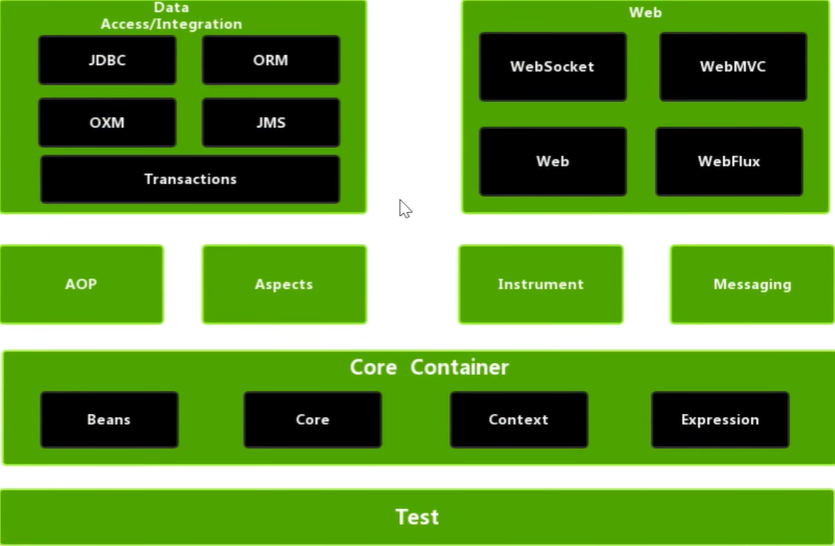

Spring是一种Java EE轻量级开源框架，目的是用于简化Java企业级应用的开发。

广义的Spring：Spring技术栈

狭义的Spring：Spring Framework

Spring框架是一个分层、面向切面的额解决方案，是Spring技术栈的核心。两个最核心模块：IoP、AOP

### Spring Framework的特点

- **非侵入**：本身结构小，对领域模型可以做到零污染，对功能性组件也只需要几个简单的注解进行标记完全不会破坏原有的结构。
- **控制反转**：IoC（Inversion of Control），把自己创建资源、向环境索取资源编程将资源准备好，我们享受资源注入
- **面向切面编程**：AOP（Aspect Oriented Programming），在不修改源代码的基础上增强代码功能。
- **容器**：IoC是一个容器，包含并且管理组件对象的生命周期，替程序员屏蔽了组件创建过程中的大量细节，提高开发效率。
- **一站式**：在IoC和AOP的基础上可以整合各种开源框架和优秀类库。

**示例**