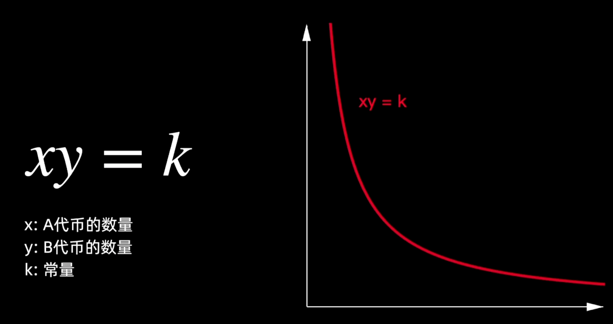
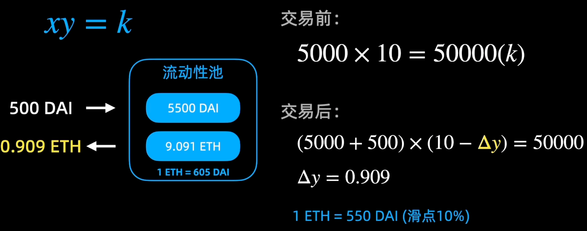
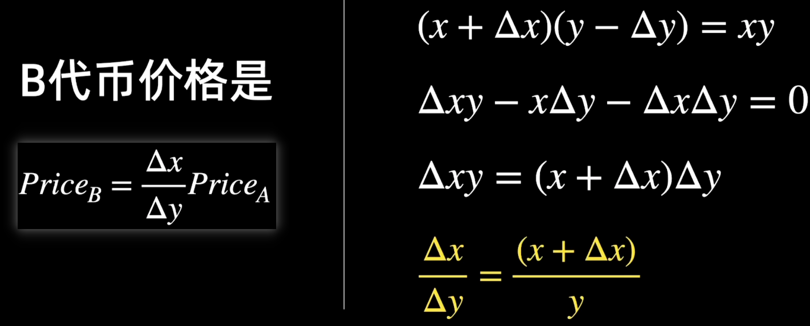
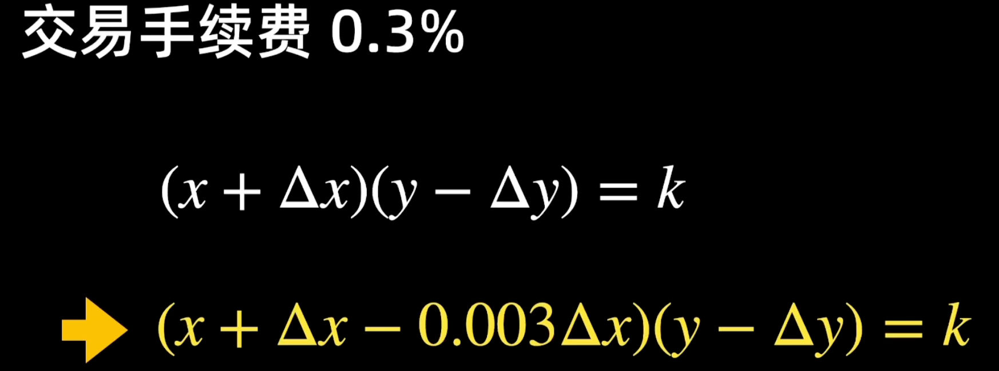
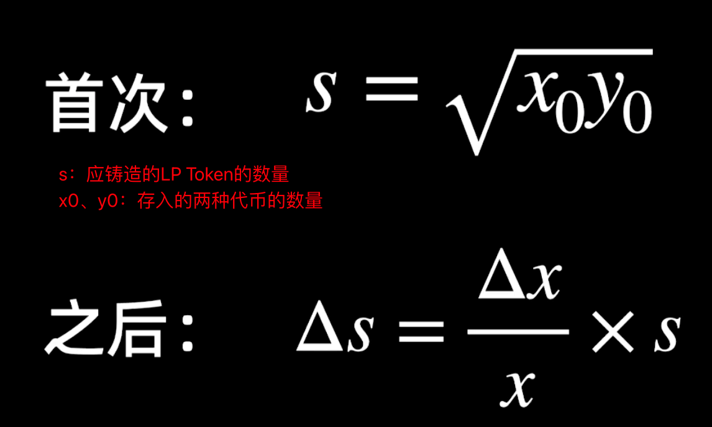
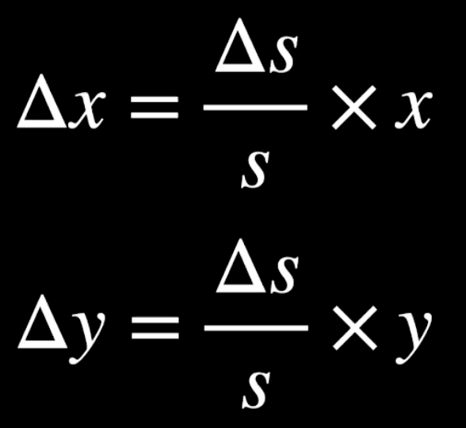
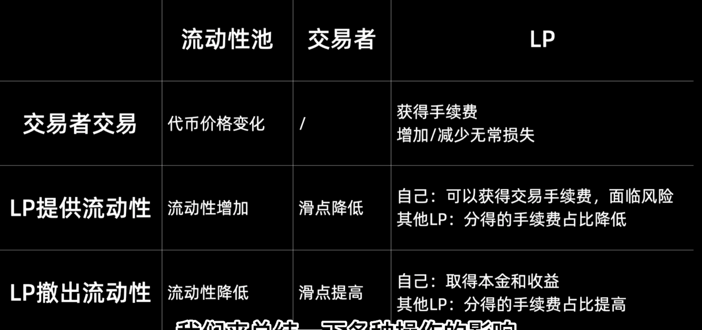
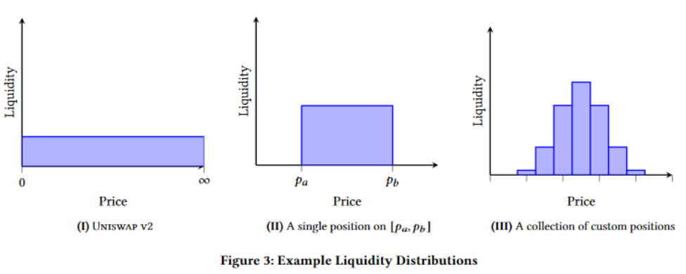

# **比特币**、区块链

2008 中本聪 去中心化的电子记账方式

- 去中心：交易记录并不托管给一家机构

每条交易记录都广播给所有其他用户

区块：1mb，交易记录的数据打包，4000条左右

问题：

1. 以谁为准

   - 工作量证明（一个很难的数学题，答对者可打包 ➡️ 挖矿，答题方式只能穷举）
   - 挖矿原理
     - 哈希函数（正向易反响难）：sha256
     - 数据块s：头部+账单集
       头部：字符串，包含前块头部、账单信息、时间、随机数

       $$
       Hash = Sha256(Sha256(s))
       $$

       Hash前n位为0
       谁答对了谁打包
       穷举即在随机数这一步尝试
     - 难度n：hash值前n位位零，n越大，一次尝试正确的概率越低，P=0.5^n；n值确定与矿机数量、运算速度有关（既定了10min打包一次）
2. 为什么要记账

   - 手续费收益（记账者）：A支付给B，记账者收取手续费
   - 打包者获得打包奖励（只能是一个人打包）：每10分钟打包一个，每次打包有一定数额的比特币奖励，该奖励数额每隔4年减半
3. 如何防伪、保密

   - 身份认证：密钥对
   - 余额检查：数据块是链表，可以找到用户相关的所有数据，顺着链表运算可得用户余额
   - 双重支付：同一商品不能同时卖给两个人
     一用户几乎同时广播了两条账单但是余额仅支持一条时，一个用户接收到1条账单同时会拒绝另一条，于是有的用户接收到a有的用户接收到b，当一个用户成为打包者时，会把接收到的账单打包到区块中，然后其他用户放弃接收到的账单
   - 防篡改：
     - 最长链原则：同时两个用户算对了且打包上链后，其他用户则随机算两个分支之一的新块，当又一新块打包到一个分支上时，会广播给其他用户，另一分之上的用户则会到更长的那一条分支上算新包
     - 当一个用户尝试篡改，即尝试在非尾部后新加数据块时，必须在新加的块后不断堆砌新包，使得新分支比旧分支长，显然这是几乎不可能的

区块链特点：去中心、可追溯、公开透明、不可篡改

# 以太坊

硬分叉：一次黑客事件，使得需要回溯到某一个节点，这与区块链的不可篡改性相矛盾，但之后也对硬分叉进行了限制和规范

以太币：功能多样、通货膨胀低、安全性（和比特币类似，攻击成本高）

# uniswapV2

DeFi：Decentralized Finance. 去中心化金融。通常运行在区块链网络。借贷、交易、支付、保险、稳定币等。公开透明。

Uniswap：加密货币交易所之一。

Decentralized Exchange（Dex）

传统金融模式

订单簿模式：交易所公布订单簿，展示最高买价和最低卖价，匹配者可快速交易。

在区块链网络中的痛点：链上操作延迟、链上操作需要手续费

**Uniswap核心——AMM**：Automated Market Maker: 自动做市商，类似一个去中心化的银行。

流动性池：储备一定量的两种代币，交易者可在其中存入其中一种代币，并获得对应价值的另一种代币

滑点：购买其中一种代币B时，花了**比原本价值略多**的A，多花的部分即**滑点**

流动性提供者：在流动性池中存入代币以实现流动性池的流动性，并可获得手续费。

k：k越大，池的流动性越好，提供的流动性越多

流动性提供者：同时提供一定比例的某两种代币

流动性份额LPS（流动性代币）：流动性提供者提供流动性时能获得一定流动性份额，以代币的形式表现，这种代币即流动性代币(LP token )。

流动性提供者可以随时撤出流动性，只需要将LP token归还，即可获得对应的本金和期间获得的手续费

撤出流动性时获得的代币总数量：其中已包含本金和手续费收益。

风险：

1. 无常损失：LP撤出流动性时，相较提供流动性时两种代币的比例可能存在一定差异，从而可能存在代币总价值损失。而且过程中LP持续获得手续费
2. 多代币敞口风险：LP提供流动性时，若只持有一种代币，则需要购买一定数量的另一种代币，从而增加了风险。

优点：

1. 实现简介：$xy=k$
2. 不需要撮合交易
3. 去中心化

缺点：

1. 资金利用率低
2. 对早起流动性提供者不公平：承担了更多风险，其他LP加入使得分成减少
3. LP面临风险

# UniswapV3

## 公式

V1、V2核心公式

$$
xy=k=l^2
$$

（x、y表示两种代币的数量）

这个公式对应曲线上一点与原点连成的直线为$y=px$ → $x = l / p^0.5$，$y = l * p^0.5$

该公式的局限性：

- 资金利用率较低：一般有既定的价格区间，而旧公式中x、y的值域为(0, +∞)，在以x、y分别为横纵轴的坐标系中，有效区域占全部面积的比例很小

V3公式：

$$
(x+x_{virtual})(y+y_{virtual})=k=l^2
$$

→

$$
x_{virtual} = l/p_{upper}^{0.5}、y_{virtual} = l*p_{lower}^{0.5}
$$

V3以$p_{upper}$和$p_{lower}$作为已知变量，所以在V3中添加流动性时，用户需要自己设置需要做市的价格区间，创建者不同、价格区间不同或手续费率不同都是不同的流动性头寸

## 手续费差异

V1、V2当中所有人价格区间都是(0,+♾️)，在任何价格时的交易都能给LP分区手续费；二V3中只有价格在设定的区间内的交易能给LP带来手续费收益

## 添加、撤出流动性

添加流动性时3个关注点：价格区间、费率水平、创建者

2种情况：

1. 价格在价格区间内
2. 价格在价格区间外：只能添加其中一种资产

限价单特性：随着价格从低到高，x全部转变为y

## 流动性分布

V2当中，流动性在各价格内呈均匀分布（图1）

V3中，流动性只在限定的价格区间内有分布（图2），随着不断地注入流动性，最终呈现在不同价格区间内有各自分布密度（图3）

## 交易

交易过程即用一种代币投入池中换取另一种代币，价格从低到高，不断消耗流动性

## 离散的价格点、tickspacing

在一条连续的轴上可以取无限多个点，但是现实情况下（尤其考虑计算机存储与运算成本），我们并不希望storage变量无限膨胀 → 价格轴必须是不连续的，即一个个离散的店的集合，交易的价格只能限定在这些点中。

同时，还需要考虑有的代币之间的价值差距确实很大，对应的池中价格可能存在非常小的情况，需要很精密的前后差，综合考虑之下，V3采用等幂数列，即：

$$
\sqrt{p(i)}=1.0001^i
$$

然后根据交易对的价格波动情况，制定了一个间隔价格点的规则，如费率未0.05%的一个交易对，可选的第一个是价格点t0，第二个是t10

## 三挡费率

分类根据交易对的波动性

| 费率  | tickspaceing | 建议使用场景     |
| ----- | ------------ | ---------------- |
| 0.05% | 10           | 稳定币交易对     |
| 0.3%  | 60           | 大多数交易对     |
| 1%    | 200          | 波动极大的交易对 |

## LiquidityNet和LiquidityGross

附加在某个tick上的属性

LiquidityGross：每当有流动性将tick设为价格区间，LiquidityGross都增。即LiquidityGross>0，则该tick已经初始化，正在被流动性使用。=0则该tick尚未初始化，没有流动性使用，计算时可以忽略

LiquidityNet：当价格穿过该tick时，处于激活的流动性需要变化的量

在注入或移除数量为 1的流动性时，具体规则如下

- 注入流动性，tick是价格下限，liguidityet增加1
- 注入流动性，tick是价格上限，liquidityNet减少1
- 移除流动性，tick是价格下限，liquidityiet减少1
- 移除流动性，tick是价格上限，lquidityet增加1

## 手续费分配

每笔交易的过程中，能够根据响应的交易量，对应相应的流动性头寸，将产生的手续费数量加上去。

直觉上：

- 交易开始，交易会在已有流动性的tick之间逐个进行，
- 当价格来到一个tick，记录这个tick的交易量，根据费率计算出该区间的总手续费
- 找出所有包含该tick流动性头寸，汇总数量
- 根据出资比例逐个分配手续费，将数值累加到每个头寸的待收取手续费的变量上

逻辑简单但是复杂度较高：

- 一个交易可能横跨多个tick
- 一个tick的计算可能涉及非常多的流动性头寸
- 每个流动性头寸的待收取手续费，是一个storage变量，逐个写入数值时

虽然解决了这两个问题：

- 在任意**区间内**，根据出资比例和参与时长保证分配的公平性
- 在不同的价格**区间之间**，根据出资比例和参与时长保证分配的公平性

以上3点 → 复杂度高 → 能耗高

### 区间内公平

不能使用遍历的方式，可以计算每流动性能够获得的手续费数量，→

$$
fee = \delta{l} * (fee_{global} / liquidity_{global})
$$

相关全局变量：

- feeGrowthGlobal: 交易发生时，把单位流动性赚取的手续费累加到这个变量，即这个变量随时间推移单调递增
- Liquidity：池内，价格区间包含当前价格的流动性数量。更新机制同LiquidityNet

$$
freegrowthglobal = \delta{free} / liquidity
$$

### 区间间公平

仍采用每流动性可收取手续费数量作为累加的增量

$$
feeGrowthInside = feeGrowthGlobal - feeGrowthOutside
$$

在tick上新增一个feeGrowthOutside变量，记录该tick作为边界时，区间外手续费总量

# UniswapV4

**对比uniswapV3**

gas fee更低、挖点低（TWAP）、支持原生Eth、LP自动斧头（LP在流动性池中的收益可自动复投）、超出价格范围可借贷、动态费用、交易池可定制、可实现限价单

