# 背景知识

## 范式建模

1. 第一范式（1NF）
   原子性：字段不可分。
   如10部华为手机应拆分为数量：10，品牌：华为，产品：手机
2. 第二范式（2NF）
   有主键，非主键字段依赖主键
3. 第三范式（3NF）
   非主键字段不能相互依赖
   
   严格的范式建模不允许数据、字段的重复，有利于数据的存储。

## 实体关系模型

实体：一行数据描述的主体对象；属性；关系：实体之间的关系等等

抽象实体→找出实体之间的关系→找出实体的属性→画出ER关系图

## 数据仓库

数据仓库的意义：

- 数据存储在互不兼容的系统重
- 关系型数据库一般不存储日志数据
- 决策者需要从商业角度观察数据，关系型数据库不适合

### 数据仓库

面向主题的、集成的、相对稳定的、反映历史变化的数据集合，其中的数据是有组织有结构的存储数据集合，用于对管理决策过程中的支持

**面向主题**

**集成**

**相对稳定**：可追溯

## 维度建模

主要面向分析场景的建模方式

维度建模中只存在两种表：事实表和维度表。

维度表有“主键唯一”的规则。

**事实表**由维度和度量组成，维度主要定性，度量主要定量
如地区ID、产品ID、月份、销售量、销售额这几个字段组成的事实表中，地区ID、产品ID等是为维度，销售量销售额为度量。
描述每一个地区的表为维度表。

事实表fact，维度表dim，事实表和维度表关联形成宽表

### 星形模型

事实表和所有的维度表之间只存在一层关联

### 雪花模型

事实表和最底层的额维度表之间存在不止一层关联。

星型模型违范式建模，雪花模型范式建模，星型模型的数据分析效率比雪花模型的高。

### 星座模型

# 数据仓库分层设计

操作数据层（ODS）：直接存放业务系统抽取过来的数据，讲不同业务系统中的数据汇聚在一起。

数据仓库层（DW）：

​	数据明细层（DWD，Data Warehouse Detail）：保证数据质量，在ODS层的基础上对数据进行加工处理，提供更干净的数据

​	数据中间层（DWM，Data Warehouse Middle）：对通用的诶度进行轻度聚合操作，计算相同的统计指标，方便复用

​	数据服务层（DWS，Data Warehouse Service）：快照主题业务组织主题宽表，用于OLAP分析

数据集市层（DM）：基于DW，整合汇总分析某一个主题的报表数据

**分层的意义**
	清晰的数据结构
	减少重复开发
	同意数据出口
	简化问题

**案例**

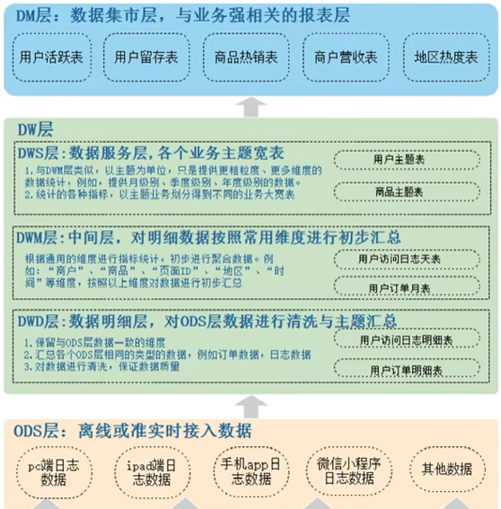

### 数据库与数据仓库的区别

数据库-OLTP：数据事务，数据仓库-OLAP：数据分析

| 功能       | 数据库                       | 数据仓库                       |
| ---------- | ---------------------------- | ------------------------------ |
| 数据范围   | 当前状态数据                 | 存储完整、反映历史变化的数据   |
| 数据变化   | 支持频繁的增删改查           | 可增加、查询，无更新、删除     |
| 应用场景   | 面向业务交易流程             | 面向分析、侧重决策分析         |
| 处理数据量 | 频繁、小批次、高并发、低延迟 | 非频繁、高吞吐、大批量、有延迟 |
| 设计理论   | 遵循数据库三范式，避免冗余   | 违范式，适当冗余               |
| 建模方式   | ER实体关系建模（范式建模）   | 范式建模+维度建模              |

### 大数据框架演变

#### 传统离线大数据架构

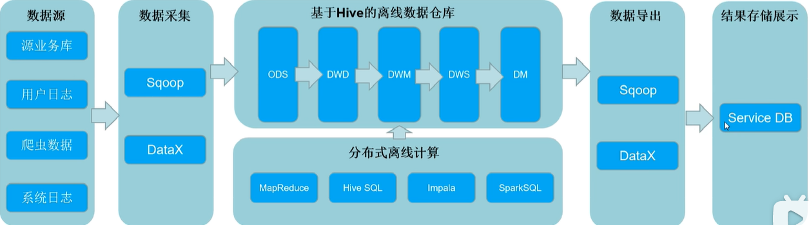

缺点：不能处理流式数据。搞不定实时数据的同步

#### lambda架构（离线处理+实时链路）

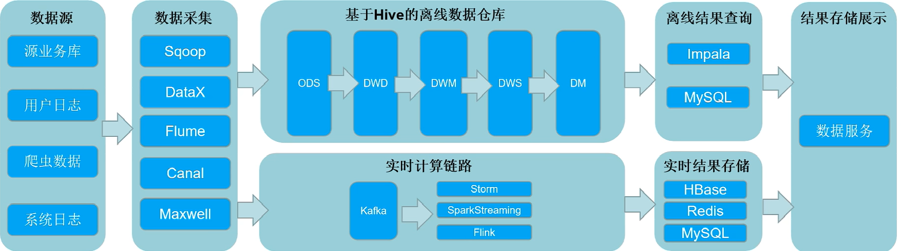

缺点：重复开发，缺乏代码、数据复用

#### 新lambda架构（离线数仓+实时数仓）

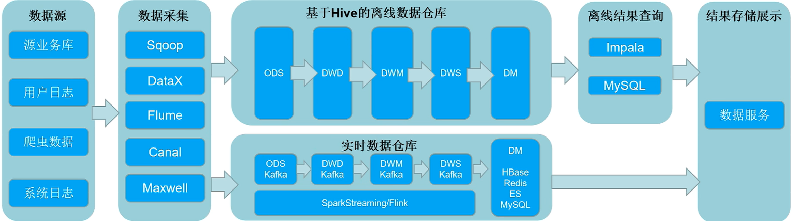

**缺点**：

1. 同样的需求需要开发两套一样的代码
2. 集群资源使用增多
3. 实时和离线结果的一致性不能保证
4. 随着数据量的增加离线数据仓库的T+处理需要的事件增加
5. 服务器存储占用大

#### Kappa架构（纯实时数仓）

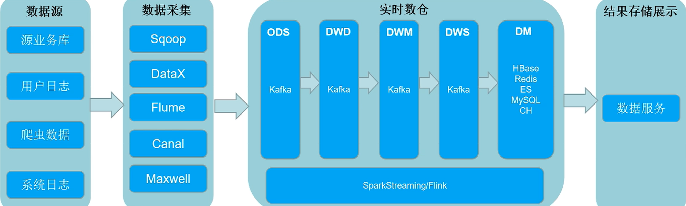

**缺点**：

1. Kafka无法支持海量数据存储
2. Kafka无法支持高效的OLAP（不支持SQL查询）
3. 无法复用数据血缘管理体系
4. Kafka不支持数据的更新，只支持追加

### 架构选择

1. 公司刚上大数据或者公司业务没有实时场景→传统离线大数据架构
2. 公司离线业务多，实时业务少→离线数仓+实时链路的lambda架构
3. 公司离线业务和实时业务都比较多→离线数仓+实时数仓的Lambda架构
4. 公司实时业务多，离线相对少→Kappa纯试试数仓架构

### 混合架构

大多数实时业务采用Kappa架构，关键核心业务使用离线全量计算方式（Lambda）

#### 批流一体

1. 架构角度：架构支持批（离线）和流（实时）数据
2. 计算框架处理角度支持批和流
3. SQL支持角度上做到批流一体
4. 存储层面上做到批流一体（用一般离线数据和实时数据的存储是不一样的）。海量存储、数据更新等等

**→数据湖**

### 湖仓一体实时数仓架构

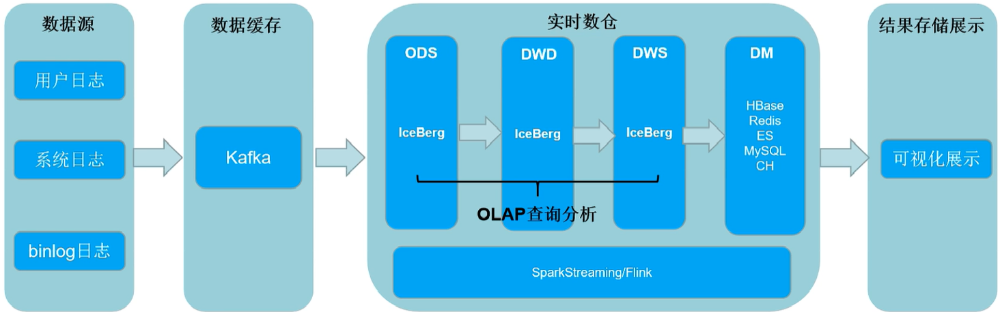

解决了这些问题：

- 支持存储统一
- 存储量大
- 任意分层都可以OLAP数据分析
- 复用同一套相同的血缘关系
- 实时数据更新

缺点：暂时发展不完善，存在比较多的BUG，速度不如Kafka

**Iceberg特点**

- 一种数据湖解决方案
- 格式表单表可以存储数十PB数据
- 支持实时、批量数据写入和读取，支持Spark、Flink计算引擎
- 支持SQL查询，支持增删改

### 实时数仓案例

**网易**

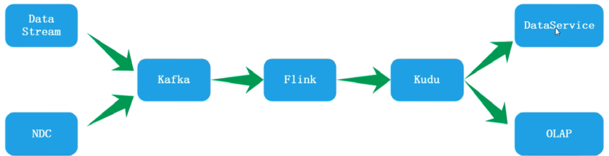

**顺丰**

顺丰主要业务流程

数据框架

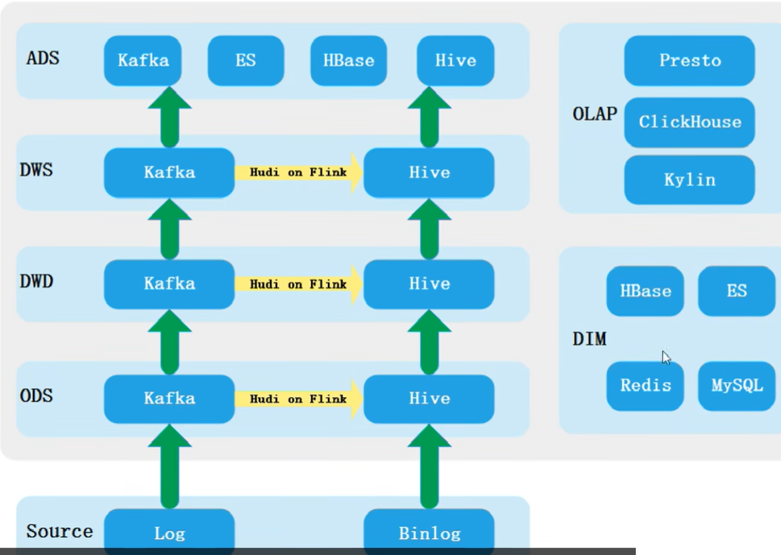

**腾讯**

业务链：QQ音乐、腾讯广告、腾讯看点、小程序、视频号

原有架构

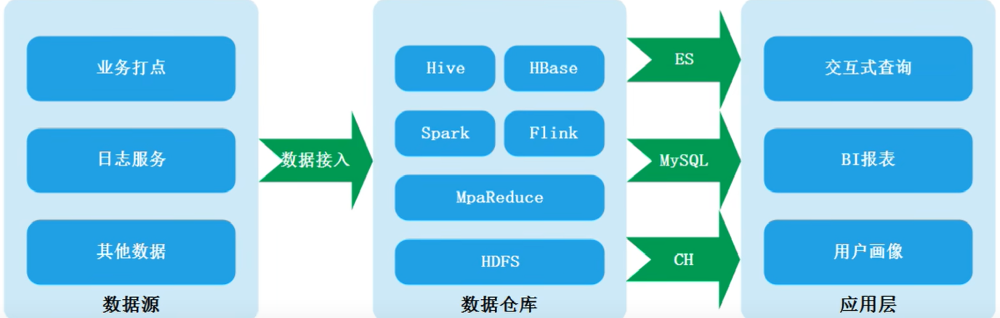

改造后架构

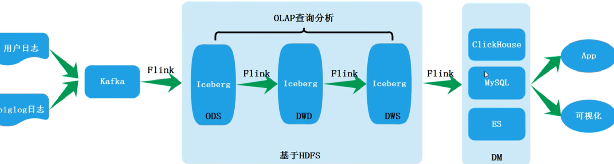

**滴滴**

自研的DDMQ支持SQL

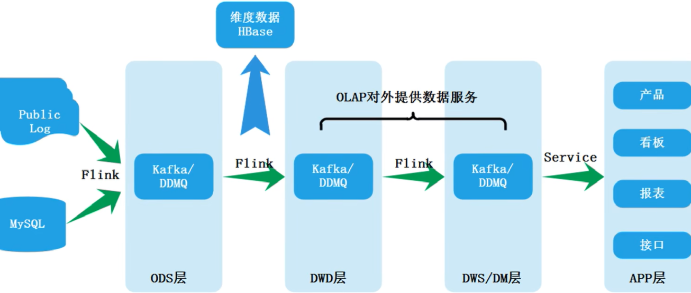

### Iceberg表格式、数据存储格式

可以理解为元数据（描述数据，如文件的属性）及数据文件的一种组织方式

Iceberg可以存储数据存储的位置，存在于上层计算和底层存储之间

数据+元数据+快照

**data files(数据文件):**
数据文件是Apache Iceberg表真实存储数据的文件，一般是在表的数据存储目录的data目录下，如果我们的文件格式选择的是parquet,那么文件是以“.parquet”结尾，例如:
00000-0-root 202112121926028036d316-9598-4e30-8e67-ce6c39f034da-job 1639237002345 0025-00001.parquet 就是一个数据文件。
Iceberg每次更新会产生多个数据文件(data files)。
**Snapshot(表快照):**
快照代表一张表在某个时刻的状态。每个快照里面会列出表在某个时刻的所有 data files 列表。data files是存储在不同的manifest files里面，manifest files是存储在一个Manifest list文件里面，而一个Manifest list文件代表一个快照。
**Manifest list(清单列表):**
manifest list是一个元数据文件，它列出构建表快照(Snapshot)的清单(Manifest file)。这个元数据文件中存储的是Manifestfile列表，每个Manifestfile占据一行。每行中存储了Manifestfile的路径、其存储的数据文件(data files)的分区范围，增加了几个数文件、制除了几个数据文件等信息，这些信息可以用来在查询时提供过滤，加快速度。
**Manifest file(清单文件):**
Manifest file也是一个元数据文件，它列出组成快照(snapshot)的数据文件(datafiles)的列表信息。每行都是每个数据文件的详细描述，包括数据文件的状态、文件路径、分区信息、列级别的统计信息(比如每列的最大最小值、空值数等)、文件的大小以及文件里面数据行数等信息。其中列级别的统计信息可以在扫描表数据时过滤掉不必要的文件。
Manifest file是以avro格式进行存储的，以“avro”后缀结尾，例如:8138fce4-40f7-41d7-82a5-922274d2abba-m0.avro.

 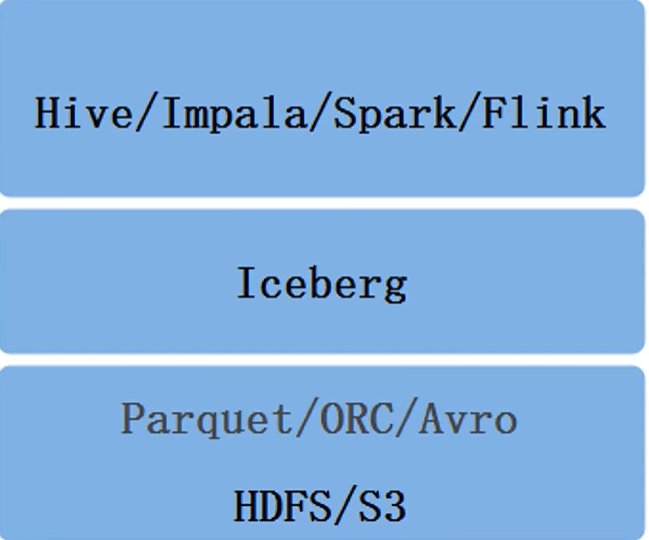

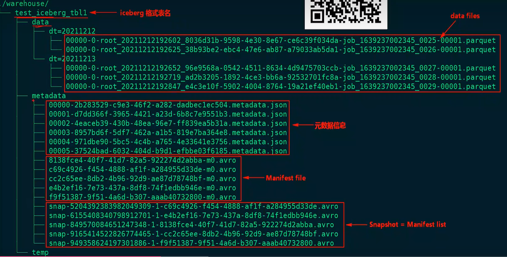

#### Iceberg数据查询原理

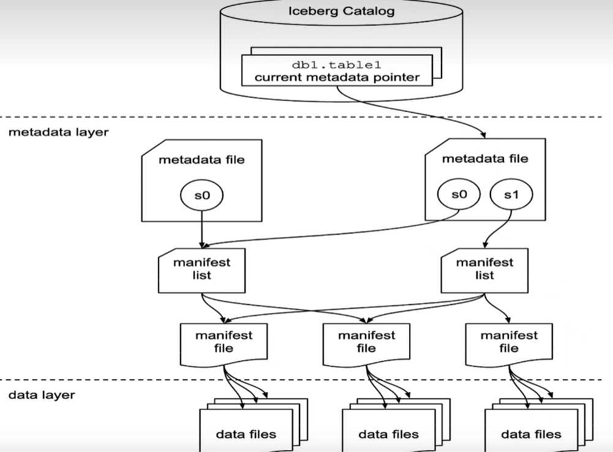

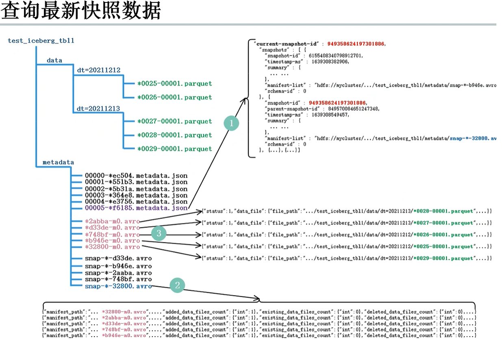

相当于Iceberg通过管理快照（日志文件）来实现查询的需求

#### Iceberg特点

- Iceberg支持实时/批量数据写入和读取，支持Spark/Flink计算引擎。
- Iceberg支持事务ACID,支持添加、删除、更新数据。
- 不绑定任何底层存储，支持Parquet、ORC、Avro格式兼容行存储和列存储。
- Iceberg支持隐藏分区和分区变更，方便业务进行数据分区策略。
- Iceberg支持快照数据重复查询，具备版本回滚功能。
- Iceberg扫描计划很快，读取表或者查询文件可以不需要分布式SQL引擎。
- Iceberg通过表元数据来对查询进行高效过滤。
- 基于乐观锁的并发支持，提供多线程并发写入能力并保证数据线性一致。

**分区与隐藏分区**

Iceberq支持分区来加快数据查询。在lceberg中设置分区后，可以在写入数据时将相似的行分组，在查询时加快查询速度。Iceberg中可以按照年、月、日和小时粒度划分时间戳组织分区。
在Hive中也支持分区，但是要想使分区能加快查询速度，需要在写SQL时指定对应的分区条件过滤数据，在Iceberg中写SQL查询时不需要再SQL中特别指定分区过滤条件，Iceberg会自动分区，过滤掉不需要的数据
在Iceberg中分区信息可以被隐藏起来，Iceberg的分区字段可以通过一个字段计算出来，在建表或者修改分区策略之后，新的数据会自动计算所属于的分区，在查询的时候同样不用关心表的分区是什么字段，只需要关注业务逻辑，Iceberg会自动过滤不需要的分区数据。
正是由于Iceberg的分区信息和表数据存储目录是独立的，便得Iceberg的表分区可以被修改，而且不会涉及到数据迁移。

**Iceberg表演化**

在Hive分区表中，如果把一个按照天分区的表改成按小时分区，那么没有办法在原有表上进行修改，需要创建一个按照小时分区的表，然后把数据加载到此表中。
Iceberq支持就地表演化，可以通过SQL的方式进行表级别模式演进，例如:更改表分区布局。Iceberg进行以上操作时，代价极低，不存在读出数据重新写入或者迁移数据这种费时费力的操作。

**模式演化**

Iceberg支持以下几种Schema的演化:

- ADD:向表或者嵌套结构增加新列。
- Drop:从表或嵌套结构中移除列。
- Rename:重命名表中或者嵌套结构中的列。
- Update:将复杂结构(Struct、Map<Key,Value>,list)中的基本类型扩展类型长度，比如:tinyint修改成int.
- Reorder:改变列的顺序，也可以改变嵌套结构中字段的排序顺序。

注意:
Iceberg schema的改变只是元数据的操作改变，不会涉及到重写数据文件。Map结构类型不支持Add和Drop字
段。
lceberg保证Schema演化是没有副作用的独立操作，不会涉及到重写数据文件，具体如下:

- 增加列时不会从另一个列中读取已存在的数据
- 删除列或者嵌套结构中的字段时，不会改变任何其他列的值，
- 更新列或者嵌套结构中字段时，不会改变任何其他列的值。
- 改变列或者嵌套结构中字段顺序的时候，不会改变相关联的值。

Iceberg实现以上的原因使用唯一的id来追踪表中的每一列，当添加一个列时，会分配新的ID，因此列对应的数据不会被错误便用。

**分区演化**

Iceberg分区可以在现有表中更新，因为Iceberg查询流程并不和分区信息直接关联。
当我们改变一个表的分区策略时,对应修改分区之前的数据不会改变,依然会采用老的分区策略,新的数据会采用新的分区策略,也就是说同一个表会有两种分区策略,旧数据采用旧分区策略,新数据采用新新分区策略, 在元数据里两个分区策略相互独立,不重合。
因此，在我们写SQL进行数据查询时,如果存在跨分区策略的情况,则会解析成两个不同执行计划

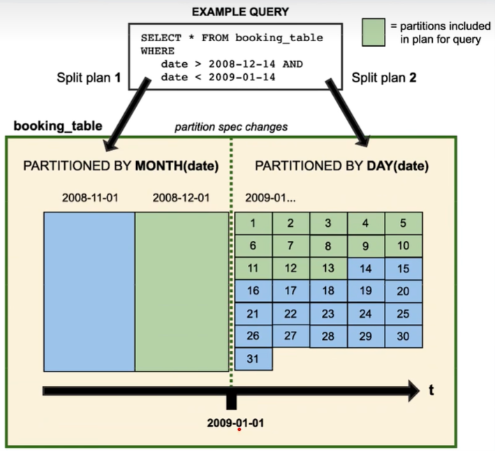
