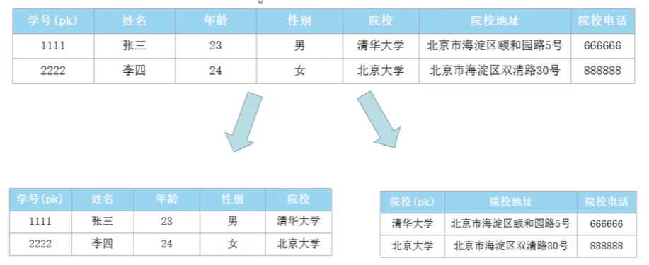
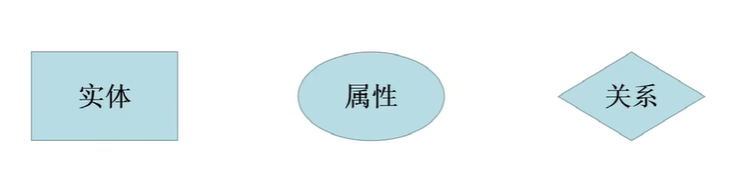
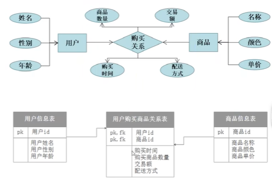
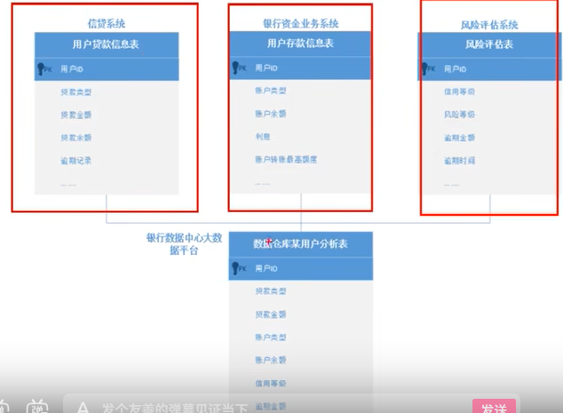
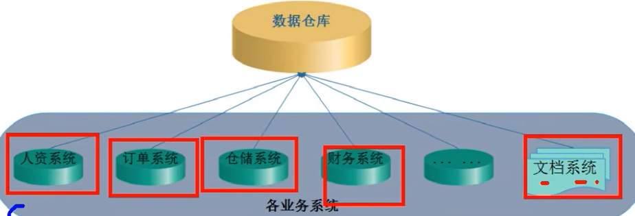
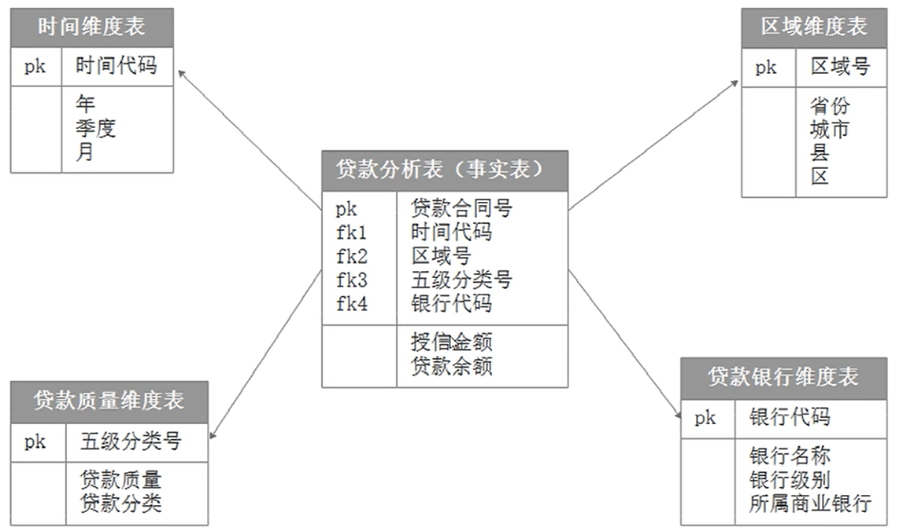
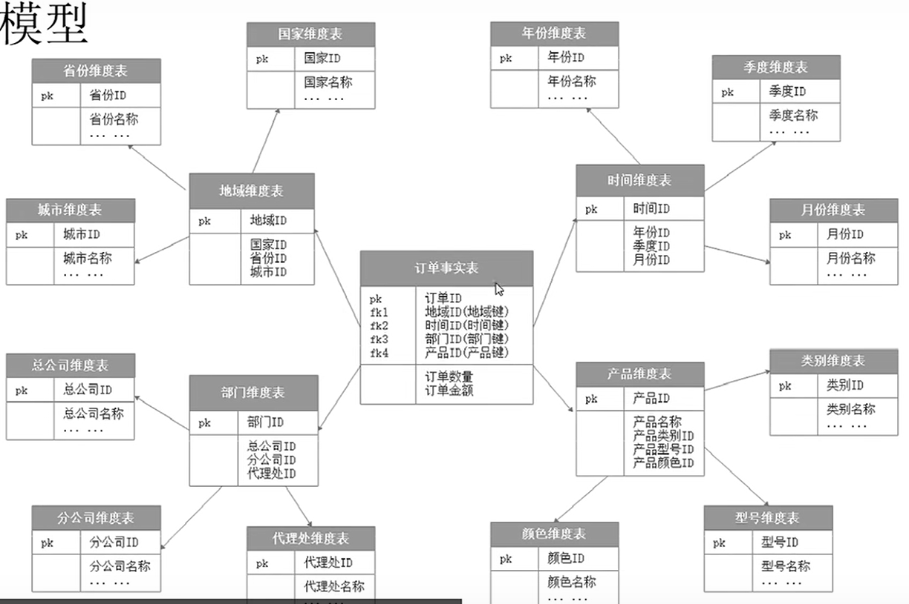
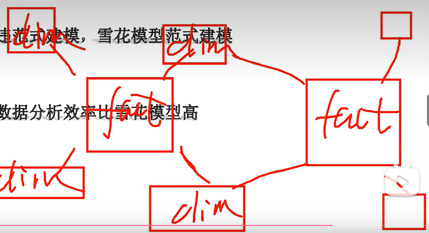

# 背景知识

## 范式建模

1. 第一范式（1NF）
   原子性：字段不可分。
   如10部华为手机应拆分为数量：10，品牌：华为，产品：手机
2. 第二范式（2NF）
   有主键，非主键字段依赖主键
3. 第三范式（3NF）
   非主键字段不能相互依赖
   
   严格的范式建模不允许数据、字段的重复，有利于数据的存储。

## 实体关系模型

实体：一行数据描述的主体对象；属性；关系：实体之间的关系等等

抽象实体→找出实体之间的关系→找出实体的属性→画出ER关系图

## 数据仓库

数据仓库的意义：

- 数据存储在互不兼容的系统重
- 关系型数据库一般不存储日志数据
- 决策者需要从商业角度观察数据，关系型数据库不适合

### 数据仓库

面向主题的、集成的、相对稳定的、反映历史变化的数据集合，其中的数据是有组织有结构的存储数据集合，用于对管理决策过程中的支持

**面向主题**

**集成**

**相对稳定**：可追溯

## 维度建模

主要面向分析场景的建模方式

维度建模中只存在两种表：事实表和维度表。

维度表有“主键唯一”的规则。

**事实表**由维度和度量组成，维度主要定性，度量主要定量
如地区ID、产品ID、月份、销售量、销售额这几个字段组成的事实表中，地区ID、产品ID等是为维度，销售量销售额为度量。
描述每一个地区的表为维度表。

事实表fact，维度表dim

### 星形模型

事实表和所有的维度表之间只存在一层关联

### 雪花模型

事实表和最底层的额维度表之间存在不止一层关联。

星型模型违范式建模，雪花模型范式建模，星型模型的数据分析效率比雪花模型的高。

### 星座模型

# 数据仓库分层设计

操作数据层（ODS）：直接存放业务系统抽取过来的数据，讲不同业务系统中的数据汇聚在一起。

数据仓库层（DW）：

​	数据明细层（DWD，Data Warehouse Detail）：保证数据质量，在ODS层的基础上对数据进行加工处理，提供更干净的数据

​	数据中间层（DWM，Data Warehouse Middle）：对通用的诶度进行轻度聚合操作，计算相同的统计指标，方便复用

​	数据服务层（DWS，Data Warehouse Service）：快照主题业务组织主题宽表，用于OLAP分析

数据集市层（DM）：基于DW，整合汇总分析某一个主题的报表数据

**分层的意义**
	清晰的数据结构
	减少重复开发
	同意数据出口
	简化问题
