数据库**三范式**

- 第一范式（1NF）：原子性，字段不可分
  如10部华为手机 → 数量10，品牌华为，商品类型手机
- 第二范式（2NF）：唯一性，有主键，非主键字段依赖主键字段
- 第三范式（3NF）：非主键字段不能相互依赖，如：
  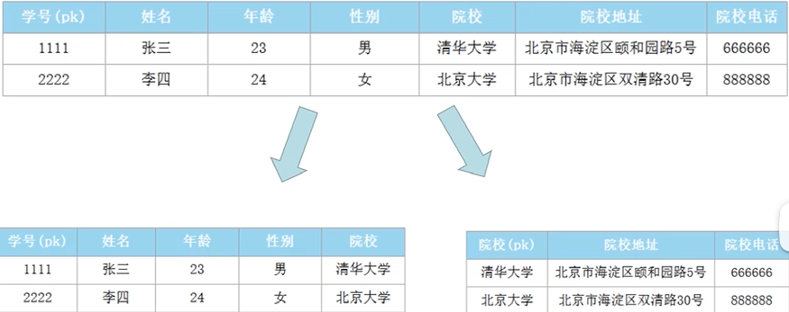

**ER实体关系模型**

- Entity-Relationship
  

- 步骤：

  - 抽象实体
  - 找出实体之间的关系
  - 找出实体的属性
  - 画出ER关系图
  - 设计数据库表

  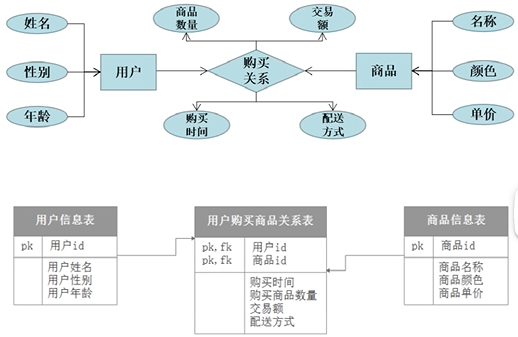

数据仓库的**必要性：**

- 数据存储在互不兼容的系统中
- 关系型数据库一般不存储日志数据
- 决策者需要从商业角度观察数据，关系型数据库不适合

**维度建模**：

- 事实表 = 维度列（定位） + 度量列（定量）
- 星型模型
  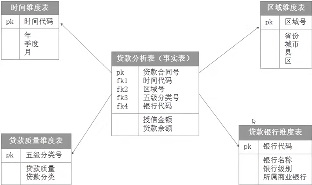
  数据冗余较多，但查询效率较高
- 雪花模型
  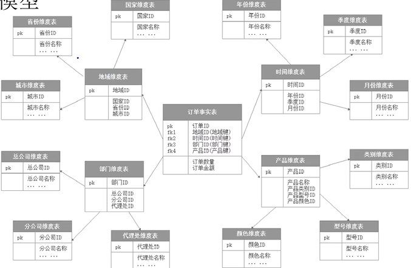
  范式性高，冗余变少了，表变多了，分析时关联次数变多 → 查询效率↓
- 星型模型违范式建模，雪花模型范式建模；星型模型数据分析效率比雪花模型高
  企业级数仓构建使用星型模型和星座模型居多

**数仓分层设计**

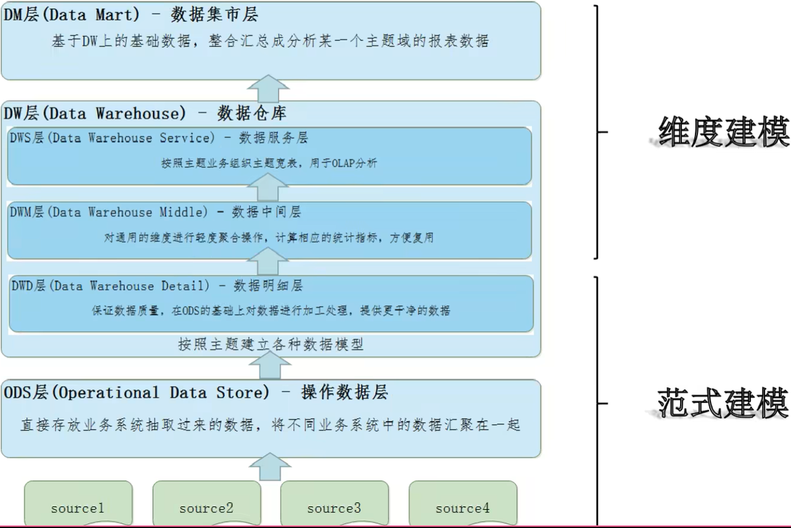

分层设计的好处：

- 数据结构清晰
- 减少重复开发
- 统一数据出口
- 简化问题

**数据库与数据仓库**

|            | 数据库                       | 数据仓库                       |
| ---------- | ---------------------------- | ------------------------------ |
| 数据范围   | 当前状态数据                 | 存储完整、反映历史变化的数据   |
| 数据变化   | 支持频繁的增删改查           | 可增加、查询，无更新、删除操作 |
| 应用场景   | 面向业务交易流程             | 面向分析、侧重决策分析         |
| 处理数据量 | 频繁、小批次、高并发、低延迟 | 非频繁、大批量、高吞吐、有延迟 |
| 设计理论   | 遵循数据库三范式、避免冗余   | 违范式、适当冗余               |
| 建模方式   | ER实体关系模型（范式建模）   | 范式建模+维度建模              |

**大数据架构演变**

- 传统离线大数据架构
  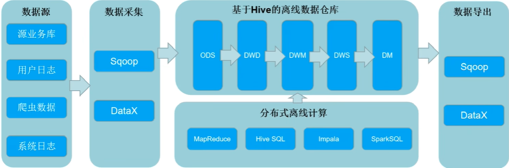
  问题：不能处理实时数据场景

- Lambda（离线处理+实时链路），传统实时开发
  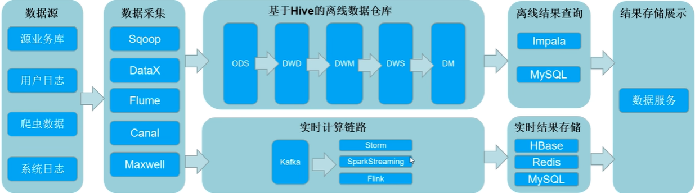
  问题：烟囱式开发，数据复用存在困难。（这个烟囱里的烟不能从别的烟囱冒出，每个烟囱都需要进行处理)

- Lambda（离线数仓+实时数仓）
  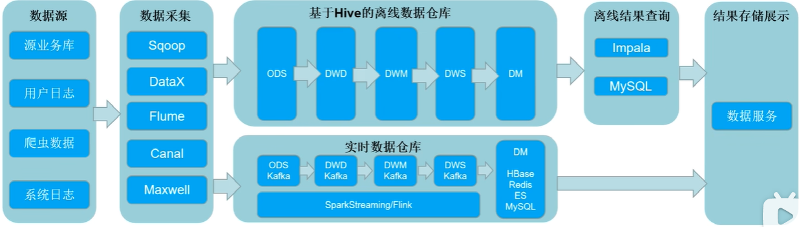
  问题：同样的需求需要开发两套一样的代码
  集群资源使用增多
  离线结果与实时结果不一致
  批量计算可能计算不完
  存储需求大

- Kappa架构（纯实时数仓）
  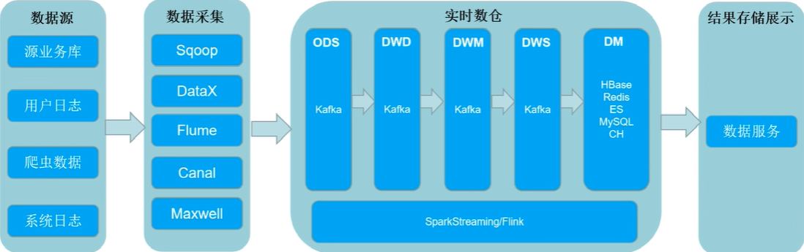
  Kafka无法支持海量数据存储
  Kafka无法支持高效的OLAP
  无法复用数据血缘管理体系
  Kafka不支持update

- 架构选择

  | 场景                         | 架构               |
  | ---------------------------- | ------------------ |
  | 刚上大数据或业务没有实时场景 | 传统离线大数据架构 |
  | 离线业务多，实时业务少       | 离线数仓+实时链路  |
  | 离线业务和实时业务都比较多   | 离线数仓+实时数仓  |
  | 公司实时业务多，离线相对少   | Kappa纯实时数仓    |

- 湖仓一体实时数仓架构
  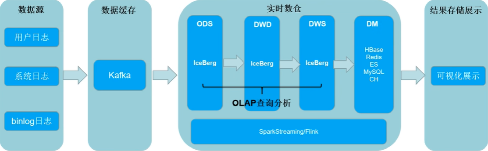
  存储统一
  存储量大
  任意分层都支持OLAP

**案例**

- 网易
  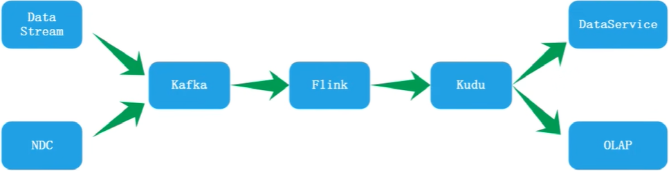

- 顺丰实时数仓
  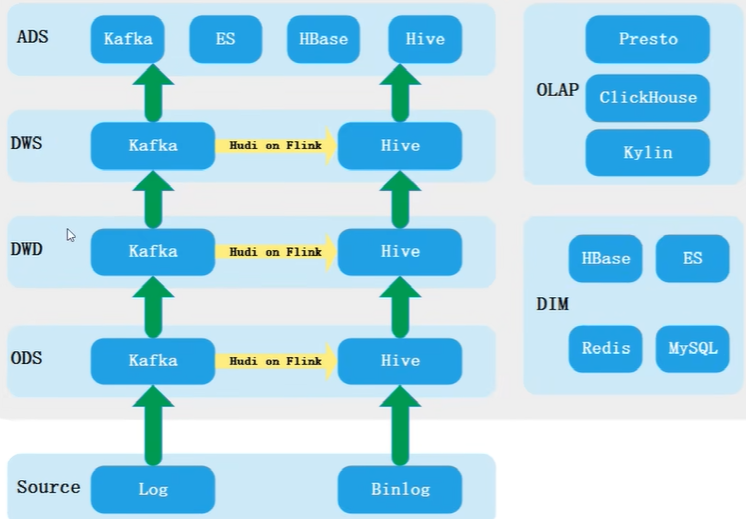

- 腾讯实时数仓
  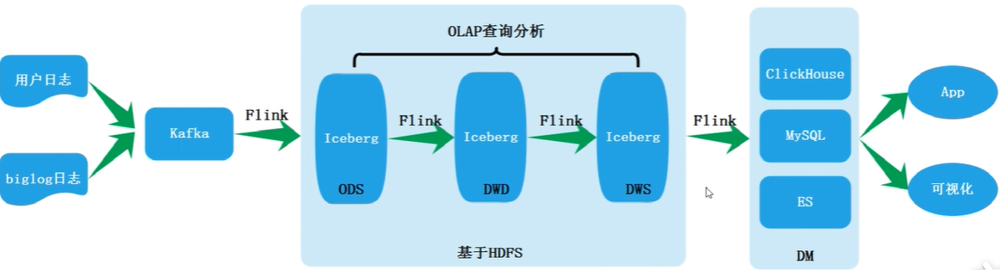
- DD实时数仓
  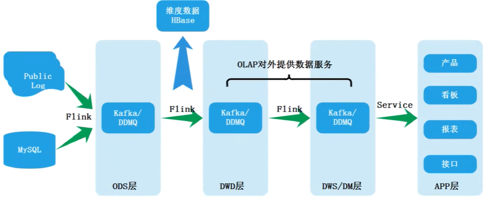
- 