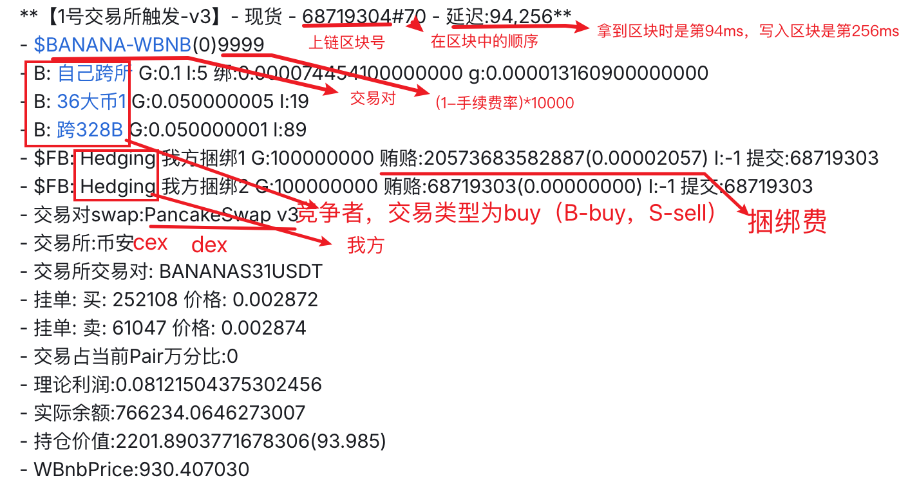
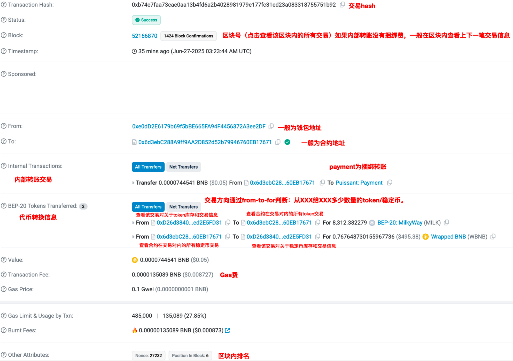
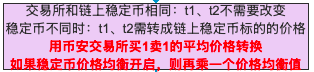
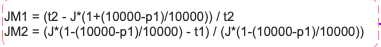

# 跨所套利

## 失败订单推送详情

## 链上查看订单详情

## CEX-DEX跨所套利

假设Token价格在CEX和DEX是**挂钩**的，而且CEX价格变化领先于DEX。假设成立的条件下，以Token在CEX的价格作为标的，在DEX执行差价交易：**CEX价格较低时，在DEX执行卖出；CEX价格较高时，在DEX买入**。价格脱钩，即假设不成立时，关闭交易避免损失。

### 目前运营系统后台数据

#### Token名单

**字段**：

- 最大持仓占比、最大虚拟持仓占比
- 最大稳定币库存u、最大token库存（最大交易对中）
- 价格阈值、dex最低利润判定值
- 捆绑比率百分比（捆绑系数，捆绑费占利润的百分比）、捆绑比率百分比后续订单（单个区块可能多笔订单，首笔订单失败后续订单使用这个捆绑比率）
- 卖捆绑比率百分比、卖捆绑比率百分比后续订单
- 最小捆绑费

#### 日报

**字段**

- 日期、**Token名称**、稳库存u
- 手续费率（万分比）
- 稳虚拟库存U、虚拟持仓价值、虚拟持仓配置、虚拟持仓占比
- 最大持仓价值、最大持仓
- 仓位指数（最大持仓或虚拟持仓配置*仓位指数=实际持仓），根据单量、涨跌自动调仓
- 当日利润、7日利润、总利润
- 交易次数、交易量、成功率
- 价格阈值（价差阈值）
- 捆绑系数
- 价格指数
- 今日总gas费
- 捆绑费

#### 交易记录

公司看板日报板块点击币种客跳转到该token交易记录，字段：

- 交易方向（BUY/SELL）、时间、区块号、交易对
- token最大交易对稳定币库存
- 稳定币库存、token库存
- 稳定币持仓、稳定币持仓价值
- token上笔持仓、token上笔持仓价值
- token持仓、token持仓价值
- 持仓占比、虚拟持仓占比
- 单笔盈亏、今日交易对盈亏
- 成交均价
- token变化量、稳定币变化量
- 交易占比（交易额占交易对池）
- gas费、捆绑费
- 状态(成功/失败)

# 运营学习笔记

**后台操作常见类型**

- 价格阈值
  交易量活跃、价格波动较小时，可降低，增加提单。
  订单多而利润低时可调高，减少支出和无常损失。
- 捆绑比调整
  每小时观察成功率，成功率低于50%的token在失败订单推送群计算竞争者捆绑参数，覆盖较多的捆绑比率百分比。
- 是否只卖
- 虚拟持仓
  自变量：cex、dex成交量和差价，交易量和差价↑ → 持仓可 ↑

**群观察及操作**

- 成功推送

  - 某token订单激增 → 观察是否有单笔利润。
  - 无推送 → 查看链上合约是否有交易，若无 → 推送开发
  - 所有token普遍成功率低 → 重启，若无效则上报

- 失败推送

  - 某token失败激增 → 调整捆绑系数
  - 无竞争者失败订单连续出现 → 重启，若无效则上报

- 运营预警

  - 1小时无订单token，观察并及时关闭

    观察内容：

    - 比价：看波动、看交互

      波动小且正常交互 → 未触发 → 正常现象

      脱钩：减仓甚至只卖

      波动大 → 捆绑

  - 合约稳定币余额不足 → 余额列表手动买币

  - gas费钱包余额不足 → 联系财务

- 亏损预警

  - 连续亏损 → 及时查看 → 调整参数 或 只卖

- 活跃交易对

  - 及时查看是否需要开启
  - 已开启且达到预设值 → 持仓调整

**交易看板总览观察**

- 价格曲线

  价格波动 → 及时加仓、调整触发阈值 → 更频繁的提单

- 利润曲线

  利润增长缓慢或下跌，订单量稳定上证 → 减仓、调高触发

- 订单量

  涨幅较低 → 是否正常提单 → 是否价格脱钩，若脱钩 → 及时清仓（手动卖出）

**后台关注**

- 成功率

- 钱包余额列表

  合约内最后交易时间超过1小时的token及时观察是否需要手动卖币清仓并关闭token

- 交易所pair白名单

  添加新币时查看是否采集到，未采集→对冲采集群发送update

- 交易所数据采集

- 竞争者日报

  每小时观察主要竞争者盈亏；竞争者订单量较大的token及时开启

# 流程图整理

## 跨所1

**问题**

- t1、t2：交易所价格，t1为买价，t2为卖价
  
- 1、2的含义？买和卖？
  JM：价差，考虑手续费；1买2卖
- 

**思考**

- 卖价 = t_1\*(1-p)，买价 = t_2\*(1+p)。t_1：挂单买价；t_2：挂单卖价；p：手续费率
- 最多可卖 = min(最高价格对应挂单量，持仓量)；对应收稳币 = 最多可卖 * 卖价，卖价参考同上
  最多可买 = 稳定币余额 / 买价。买价参考同上
- sqrtPriceX96：价格的平方根 * 2^96

**整理**

关键：手续费、买税、卖税、滑点、最小交易额

交易所买价t1、卖价t2，流动性池稳定币库存a、token库存b

Dex买价(a/b)\*(1+(10000-p1)/10000)、dex卖价(a/b)\*(1-(10000-p1)/10000)

# Polymarket

底层算法：对于做市场和普通用户

做市商奖励、收益

收入来源：事件结算、结算前看涨跌交易

polycure机器人：模仿、复制交易员的策略
