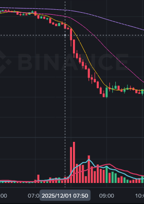
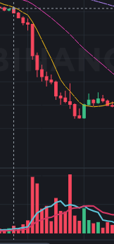
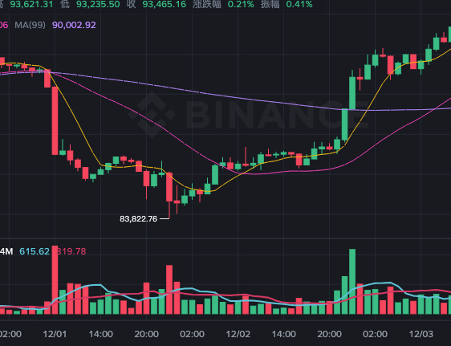

# 市场观察

## 12.1 8:00 市场观察

**BTC**

7:50至8:55，从90.7k一路跌到87k

**SOL**

7:00至8:45，137跌到128

**BNB**

7:45至8:55，880跌到835

BTC虽然是最大的主流币，但是这次的观察中，反而是SOL的走在最前面，可能是偶然；

12月的第一天，同时是一个周一，可能考虑第一个工作日机构比较活跃。这一次跌的比较厉害，主要原因可能与此前两天央行发布的针对币圈的政策文件有关，而机构周末不上班所以工作日才开始跌。

然而，跌势并未保持多久，可能政策方面并不是主要原因。

# 一点思考

## 20251203

需要学的东西还很多，目前比较紧要的是区块链原理、竞争机制、捆绑平台排序逻辑。流程图软件使用Axure RP。之后可以尝试学习javascribe（学会阅读合约软件）、区块链开发，比如学着自己写合约、手动调用合约进行交易，以更深入理解区块链原理以及盈利、竞争机制。

学习乐器：尤克里里、电钢、小阮

## 20251205

策略的关键点：

- 怎么有利可图、怎么套利，有什么成本
- 什么情况触发，达到多少触发
- 交易多少

交易之后：

赚没赚，赚了多少
