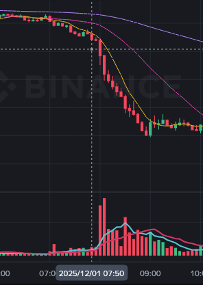
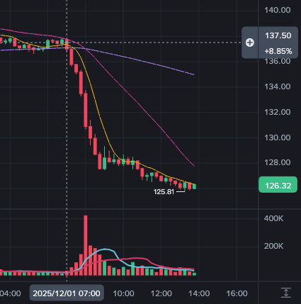
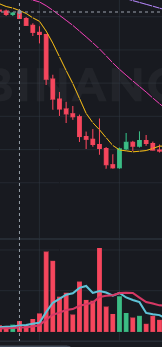
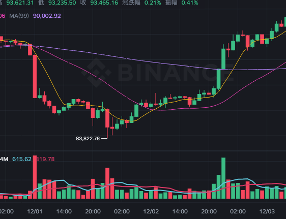

# 市场观察

## 12.1 8:00 市场观察

**BTC**

7:50至8:55，从90.7k一路跌到87k

**SOL**

7:00至8:45，137跌到128

**BNB**

7:45至8:55，880跌到835

BTC虽然是最大的主流币，但是这次的观察中，反而是SOL的走在最前面，可能是偶然；

12月的第一天，同时是一个周一，可能考虑第一个工作日机构比较活跃。这一次跌的比较厉害，主要原因可能与此前两天央行发布的针对币圈的政策文件有关，而机构周末不上班所以工作日才开始跌。

然而，跌势并未保持多久，可能政策方面并不是主要原因。

# 一点思考

## 20251203

需要学的东西还很多，目前比较紧要的是区块链原理、竞争机制、捆绑平台排序逻辑。流程图软件使用Axure RP。之后可以尝试学习javascribe、Solidity（学会阅读合约源码）、区块链开发，比如学着自己写合约、手动调用合约进行交易，以更深入理解区块链原理以及盈利、竞争机制。

学习乐器：尤克里里、电钢

## 20251205

策略的关键点：

- 怎么有利可图、怎么套利，有什么成本
- 什么情况触发，达到多少触发
- 交易多少

交易之后：

赚没赚，赚了多少

# 20251208

uniswapV4初始：不同于V2、V3具有统一、简明的数学公式规则（xy=k、(x+virtual_x)(y+virtual_y)=k）V4主要高度可定制性，即每个池/交易对可能具有不同的规则。此外实现了限价单、动态手续费等功能。

Uniswap V4 的目标是成为 DeFi 的“基础层操作系统”，通过 **Hook 系统**将创新权力下放给开发者。它不再是一个固定不变的协议，而是一个**可编程的流动性框架**。

## 公平性方面的思考

与规则固定的V2/V3不同，V4通过Hook引入了无限的自定义逻辑。这意味着：

1. **规则多变**：每个池的收费模式、订单执行逻辑都可能不同，由Hook合约定义。
2. **风险点转移**：传统的安全风险（如合约漏洞）之外，增加了**逻辑设计风险**。一个设计不当的Hook可能在规则上就对某一方不公平。
3. **透明度要求更高**：用户必须理解特定池的Hook规则，而不仅仅是通用的AMM公式。

在Uniswap V4中确保公平性，**从被动信任协议转变为主动验证规则**。关键在于：**理解该特定池的Hook规则**，**验证其安全性与设计**，并**利用工具监督执行**。

## 去中心化方面的思考

虽然V4的可编程性，使得开发者可以相对更自由的定义交易对，当类似于公平性疑问，参与交易的用户可能也会对公平提出质疑，从而更倾向于相对“权威”的开发者或者机构发布的交易对。

## 交易成本方面

### 执行成本减少

**手续费**：V2交易手续费固定，V3设置多档位，V4交易手续费可通过hook动态调整

**gas费**：单例+闪电几张使得gas费得到显著降低

### 决策成本增加

V2、V3当中，交易对的规则统一（乘积恒定公式），交易员在决策时需要考虑的主要因素在于token的基本面和潜力，以及交易对流动性、交易量、参与者数量等；

但V4的高度自由、自定义设计，要求每一个参与者理解池的逻辑和基本规则

## 量化机构基于和挑战

**V4不仅显著增加了策略研究和实施的直接成本，更重要的是彻底改变了竞争的维度和门槛**

| 对比维度         | **V2 / V3 时代**                                             | **V4 时代**                                                  | **对量化机构的影响**                                         |
| :--------------- | :----------------------------------------------------------- | :----------------------------------------------------------- | :----------------------------------------------------------- |
| **策略分析对象** | **统一的AMM数学模型**。核心是围绕**恒定乘积公式**或**集中流动性曲线**进行计算。 | **每个池独特的Hook逻辑**。需要理解自定义的费用模型、订单执行逻辑、动态参数等。 | **研究成本指数级上升**：从分析“一个市场”变为分析“无数个规则各异的小市场”。 |
| **策略普适性**   | **高**。一套成熟的套利、做市策略稍作参数调整，可适用于绝大多数主流池。 | **极低**。为A池设计的策略可能完全无法用于B池。策略必须高度定制化。 | **开发成本飙升**：需要为不同类型的Hook建立不同的策略模型，无法大规模复用。 |
| **核心风险来源** | 主要是市场风险（价格波动）和所有池共有的、可预见的合约风险（如V3的闪贷攻击向量）。 | 增加了**每个池特有的设计风险**和**逻辑漏洞风险**。一个看似套利的机会，可能是Hook设计的陷阱。 | **风控成本剧增**：必须对每个目标池的Hook代码和规则进行独立的安全与逻辑评估。 |
| **竞争壁垒**     | 主要依靠**更快的交易执行（抢跑）**、**更优的Gas优化**和**更精准的模型**。 | 增加了 **“规则理解深度”**和**“定制化策略开发速度”** 的竞争。 | **重塑行业格局**：小型团队难以覆盖所有优质池，具备强大研发和安全审计能力的机构将获得更深护城河。 |
| **数据复杂度**   | 主要分析价格、流动性分布、交易量等标准链上数据。             | 必须解析并监控与Hook相关的**自定义事件和状态变化**（如费用率切换、流动性条件调整）。 | **基础设施成本增加**：需要升级数据管道，以捕获、解析和预警Hook特定事件。 |

V4将量化交易的战场，从以**微观执行速度（毫秒级抢跑）** 为核心的竞赛，部分转向了以 **“宏观认知速度（快速理解与建模新规则）”** 和 **“深度定制能力”** 为核心的竞赛。

关键问题不再是“成本是否增加”，而是 **“如何系统化地建立一套框架，以持续、高效地分析和征服这些新的、自定义的金融微生态（V4池）”** 。这将成为未来DeFi量化领域最核心的竞争力。
